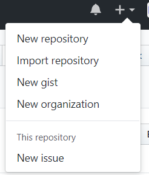
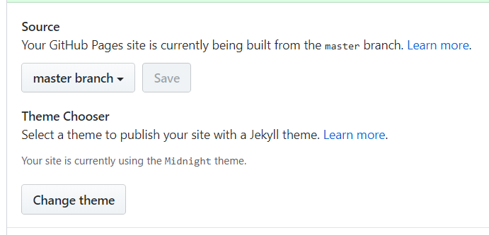

# 如何在GitHub上写博客

## 博客是一个仓库(repository)

**新建仓库(New repository)**，博客里面的文件将存放于此

完毕后，在仓库的**Setting**里面找到**GitHub Pages**，在**Source**一栏选择**master branch**，即使用master分支作为我们的博客。这样我们可以在其他分支对博客进行不完全的修改而不影响博客的正常访问

点击master branch右侧的**Save**保存刚才的Source设置

如果不想自己写html/css等文件来控制网页风格，可以在Source设置下面的**Theme chooser**中选择一个主题，以后就可以直接使用[MarkDown](https://guides.github.com/features/mastering-markdown/)写博客

## 如何进入我的博客

在刚才的操作完成之后，当前仓库的Setting-GitHub Pages里面会显示**Your site  published at xxxx**，点击链接即可访问

## 博客首页显示什么内容

如果仓库中有名为**index**的文件(html和md都可以)，则系统会优先选择此文件作为博客首页。如果没有index，系统会选择**README**文件作为首页

参考:[如何用github page搭建博客？ - 我是蛋蛋的回答 - 知乎](https://www.zhihu.com/question/59088760/answer/161640592)

[返回主页](index.md)