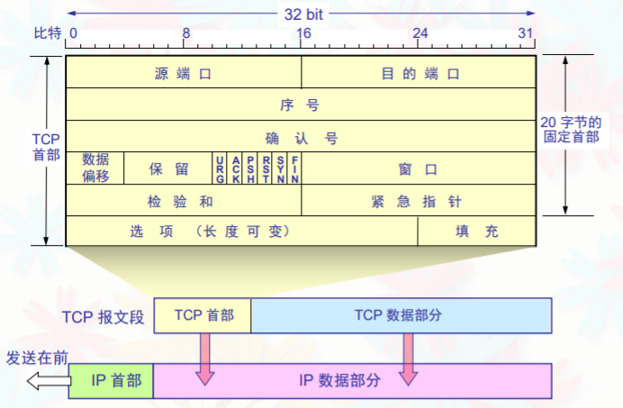
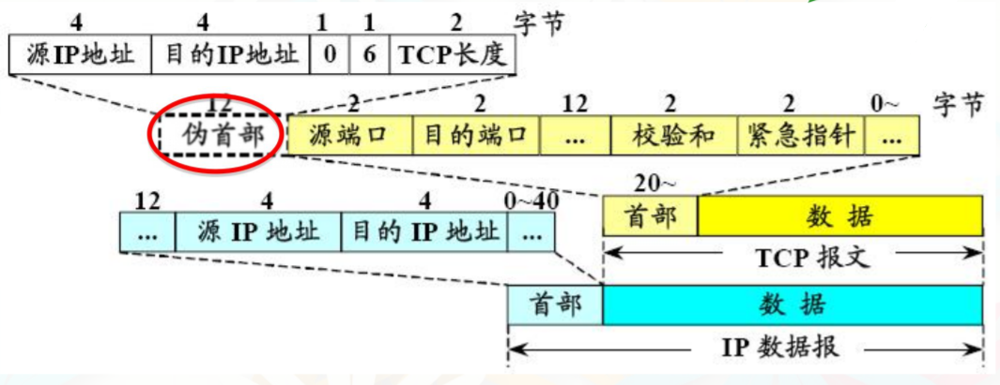
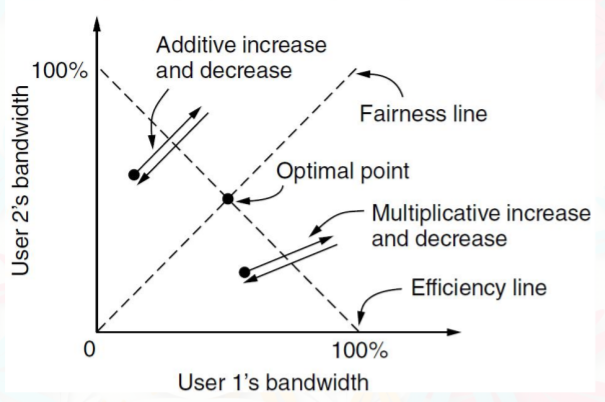
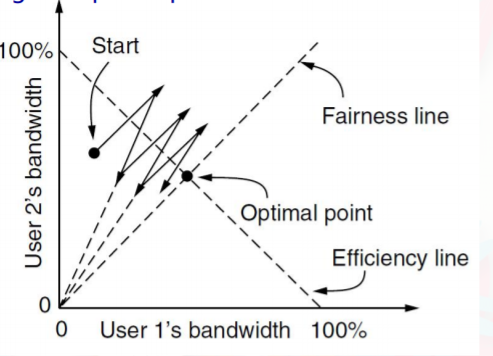
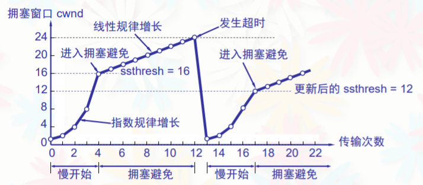
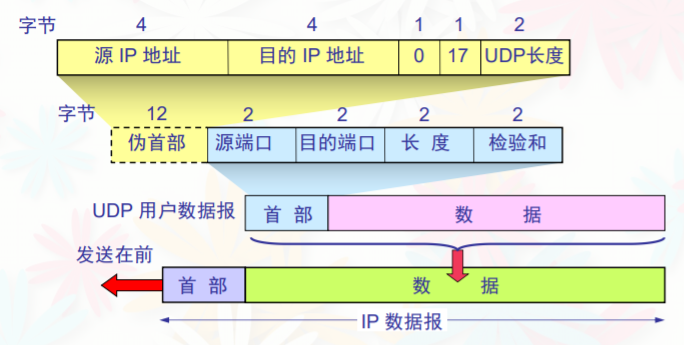

# 计算机网络 目录

- [第一章 概述](Chapter1.md)
- [第二章 物理层](Chapter2.md)
- [第三章 数据链路层](Chapter3.md)
- [第四章 MAC子层](Chapter4.md)
- [第五章 网络层](Chapter5.md)
- [第六章 传输层](Chapter6.md)
- [第七章 应用层](Chapter7.md)

# 第六章 传输层

## 端口

用于区分应用层的不同进程

端口号16位

一个IP地址和一个端口号绑定一个套接字(socket)。不允许两个套接字监听同一端口

## 连接的建立与释放

三次握手建立连接
1. Client请求连接(seq = x)
2. Server确认请求(seq = y, ACK = x)
3. Client确认请求并发送数据(seq = x + 1, ACK = y)

如果Client发送了重复的请求，Server回复后Client需要用REJECT来释放重复链接

三次握手+定时器释放连接

## TCP

传输控制协议(Transmission Control Protocol)

- 面向连接的服务
- 全双工点对点通信
- **完全可靠**（无丢失、重复、乱序）
	- 具有**自动重传**机制，就算某机器断网重连了，原有通信也可以继续进行
	- 一个TCP连接中一端崩溃或突然中断时称为**半开连接**，TCP设置了定时器定时探测是否出现了半开连接
- 可靠的连接建立与释放

### 协议头

长度可变。计算时默认按照20字节计算

- 源端口 & 目的端口
	- 两字节/16位
- 序号
	- 通信双方需要商定**初始序号**
	- 4字节/32位
	- 数据字段每有一个字节，序号+1
- 确认号ACK
	- 4字节/32位
	- **期望收到**的下一个报文段数据的第一个字节的序号
	- 比如收到的包的序列号是x，那么回复的ACK确认号应该是x+1
	- 采用了捎带确认和累计确认技术
- 数据偏移
	- 4位
	- 因为TCP头长度不定，数据偏移用来说明数据部分在TCP包内的位置
	- 单位为4字节/32位
- 保留字段
	- 6位，应该置0
- 紧急比特URG
	- 置1时紧急指针字段有效
- 确认比特ACK
	- 置1时确认号ACK字段有效
- 推送比特PSH
	- 置1时接收方一旦受到包就上交应用层而不填满缓冲区
- 复位比特RST
	- 置1时表明传输出错，释放连接并重连
- 同步比特SYN
	- 置1时表明这是连接请求或连接接收报文
- 终止比特FIN
	- 置1时用来释放连接
- 窗口字段
	- 2字节/16位
	- 通知对方自己的接收窗口，使对方调整发送的数据量
	- 单位为字节
- 校验和
	- 2字节/16位
	- 校验**首部与数据**
	- 计算时要在TCP报文段前面加上12字节的**伪首部**，伪首部仅参与校验和的计算，不向上向下传递
	- 计算方式和IP校验和计算方式相同

- 紧急指针
	- 2字节/16位
	- 指出本报文段中的紧急数据的最后一个字节的序号
- 选项字段
	- 长度可变
	- TCP只规定了一个选项 - 最大报文段长度MSS(Maximum Segment Size)
	- 告知对方本机的缓存的接受能力
	- **默认值为536**，单位为字节
	- **来自IP网络层的限制**，IP包头的**总长度字段(Total Length)**16位限制一个IP包内最多65535字节，减去IP协议头和TCP协议头，最大为65535-20-20=**65495字节**
	- **来自数据链路层（以太网）MTU的限制，最大为1460字节**

### TCP连接的建立和释放

- 建立连接
	- 三次握手
	- 主动请求连接的进程为**客户(Client)**
	- 被动接受连接的进程为**服务器(Server)**
- 释放连接
	- TCP是全双工通信，拥有两个单向连接，需要分别释放
	- 四次握手，每释放一个单向连接需要两次握手

TCP连接建立过程（三次握手）：
1. Client: SYN SEQ=x
2. Server: SYN SEQ=y ACK=x+1
3. Client: (DATA) SEQ=x+1 ACK=y+1

TCP连接释放过程（两次握手\*2）：
1. Host1: FIN=1 Seq=x
2. Host2: ACK=x+1

### TCP的传输策略

基于**确认**和**可变窗口**

窗口大小为0时不能发送TCP段，但是允许以下两个例外
1. 紧急数据
2. 为了防止死锁，发送方可以发送1字节的TCP段，以便让接收方重新声明确认号和窗口大小

### 提升TCP传输效率的方法 - Nagle算法与Clark算法

**Nagle算法**：
- 应用程序向传输实体发送数据时，传输实体发送**第一个字节**并缓存所有后面的字节，直到收到接收方对第一个字节的确认
- 收到确认后把已缓存的所有字节发送出去，在收到确认前继续缓存上层发来的字节
- 如果缓存的数据填满**一半的窗口**或是**最大数据段MSS**时也可以发送

**愚笨窗口综合症(Silly window syndrome)**：假设应用程序每次只从传输层实体读出一个字节，那么传输层每次只能再接收一个字节，传输层给发送方发送一个窗口更新段，发送方就会一个字节一个字节地发，效率低

**Clark算法**：只有接收方具备**一半的空缓存**或**MSS的空缓存**时才发送窗口更新段

所以**发送方**应使用**Nagle算法**避免发送太小的数据段，**接收方**应使用**Clark算法**避免请求太小的数据段

## TCP拥塞控制

关键词
- 发送窗口
- 接收窗口rwnd
- 拥塞窗口cwnd
- 阈值
- 慢启动(slow start)算法
- 拥塞避免(congestion avoidance)算法

### 最大最小公平性

尽可能给某个用户分配速率，但是不能从速率比这个用户低的其他用户身上剥夺速率。即降低速率高的来提升速率低的

### AIMD法则

如下图，应尽量调节两个用户的带宽分配至**效率线**和**公平线**的交点，即**最优点**

AIMD控制法则：Additive Increase Multiplicative Decrease，加法增乘法减，这样可以收敛到最优点

### 发送窗口上限值

发送窗口的大小应为接收窗口和拥塞窗口的最小值，即`min(rwnd, cwnd)`

- `rwnd < cwnd`时接收方的接受能力限制发送速率
- `rwnd > cwnd`时网络的拥塞限制发送速率

### 慢启动(slow start)算法

**慢启动算法一点都不慢**

在接收窗口足够大，即发送窗口等于拥塞窗口时，拥塞窗口从1开始**二进制指数上升**

### 拥塞避免(congestion avoidance)算法

如果拥塞窗口大于阈值，则拥塞窗口线性增长，直至发生丢包超时

超时后，新阈值设为超时时拥塞窗口的一半，拥塞窗口大小重置为1（即一个MSS），然后再执行慢启动算法

如果接收窗口小，发送窗口等于接收窗口，只要不丢包，拥塞窗口继续增长

### 快速重传

实例：发送端发送了1、2、3、4四个报文段，接收端接收到了1、2，回复ACK2和ACK3（这里的ACK序号应该等于希望收到的序号），如果3丢了，接收方收到4发现3丢了，于是再次发送ACK3。发送端的计时器还没有超时，认定网络可能拥塞导致3还在网络中传输，所以继续发5、6。接收端收到5、6后又发了两次ACK3，这样发送端会收到很多重复的ACK3

快速重传：发送端一旦连续收到三个重复的ACK就断定报文丢失并重发而不等待计时器超时

### 例题

假设TCP的拥塞窗口在18KB时发生了超时，那么接下来的5次突发传输结束后拥塞窗口应该为多大？假设MSS=1KB，接收窗口无限大

拥塞窗口18KB超时，则阈值被设置为9KB，下一次发送数据时拥塞窗口为1KB（慢启动阶段），第二次突发传输时拥塞窗口为2KB，第三次为4KB，第四次为8KB，第五次拥塞窗口试图增长到16KB发现超过了阈值9KB，所以第五次拥塞窗口为9KB，进入拥塞避免阶段。第五次之后拥塞窗口应该为10KB

## TCP定时器管理

传输层RTT的方差很大，不好设置定时器。定时器需要动态变化

### 平滑往返时间SRTT

Jacobson算法：设置平滑因子`α`为一个0到1的常数，此算法维护一个变量`SRTT(Smoothed Round-Ttrip Time平滑往返时间)`，假设`R`为当前测量得到的往返时延，使用如下公式更新SRTT：

`SRTT(new) = αSRTT(old) + (1-α)R`

典型情况下α取7/8。这类公式被称为**指数加权移动平均(EWMA, Exponentially Weighted Moving Average)**。显然α的值越大，过去的SRTT的权值就越重，曲线就越光滑

### TCP计时器的设置

TCP计时器的RTO(Retransmission Time-Out超时重传时间)应略大于上面计算出的SRTT，即

`RTO = β * SRTT`

β为大于1的系数。早期的TCP标准将β的值取2

### Karn算法

如果报文段重传了，就不知道接收方返回的确认是在确认重传的包还是在确认在网络中停滞之后到达接收方的包

Karn算法就是在计算SRTT的时候不计算重传的包的RTT

修正的Karn算法：每重传一次就把重传时间增大一些，即`新的重传时间 = γ * 旧的重传时间`

γ的典型值为2

### 防止半开连接

一个TCP连接中的一端崩溃或突然中断时称为**半开连接**。设置定时器定时探测是否出现半开连接的情况

## UDP

用户数据报协议(User Datagram Protocol)

- 无连接服务
- UDP只在IP数据包服务的基础上添加了**端口**功能与**差错检测**功能
- 提供不可靠交付
- 不需要建立连接
- 不需要维护复杂的连接状态表
- 只有**8个字节的首部**开销
- 网络拥塞不会降低源主机的发送速率，源主机发送速率恒定

校验和的计算和TCP一样。记得加上伪首部

UDP的差错检测和TCP的相同

## 实时传输协议 - RTP

Real-time Transport Protocol

- 应用层协议
- 将几个实时数据流复用到一个UDP分组流中
- 可以单播传递也可以多播传递
- 没有流控制、差错控制、确认，不需要重传

RTCP协议：辅助RTP实现实时传输的控制协议，负责处理反馈、同步和用户界面等，不传输任何实际的用户数据，只交互控制信息

觉得有用？欢迎[打赏](../../../donate.md)

:)

[返回主页](../../../index.md)