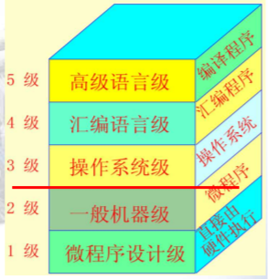

# 计算机组成原理 目录

- [第一章 计算机系统概论](Chapter1.md)
- [第二章 运算方法与运算器](Chapter2.md)
- [第三章 存储系统](Chapter3.md)
- [第四章 指令系统](Chapter4.md)
- [第五章 中央处理器](Chapter5.md)
- [第六章 总线系统](Chapter6.md)
- [第七章 外围设备](Chapter7.md)
- [第八章 输入与输出系统](Chapter8.md)

# 第一章 计算机系统概论

## 计算机的演变史

- 第0代 机械时代 (BC-1940)
- 第1代 电子管时代 (1943-1959)
	- 耗电高 体积大
	- 定点计算
	- 机器语言 汇编语言
- 第2代 晶体管时代 (1960-1968)
	- 集中处理变为分级处理
	- 定点计算改为浮点计算
	- 高级语言
- 第3代 集成电路时代 (1969-1977)
	- 存储容量大 运算速度快 几十到几百万次每秒
- 第4代 超大规模集成电路时代 (1978-现在)
- 第5代 量子计算机？光计算机？生物计算机？

## 重要人物与贡献

- 摩尔
	- 摩尔定律：集成电路芯片中晶体管的数量大体上每2年翻一番
- 冯诺依曼
	- 冯诺依曼结构：指令与数据放在同一个存储器（如果指令和数据放在不同存储器，称为哈佛结构）。存储器+输入+输出+运算器+控制器

## 计算机性能指标

- 吞吐量：表征一台计算机在某一时间间隔内能够处理的信息量
-  响应时间：表征从输入有效到系统产生响应之间的时间度量，用时间单位来度量
- 利用率：在给定的时间间隔内系统被实际使用的时间所占的比率，用百分比表示
- 处理机字长：指处理机运算器中一次能够完成二进制数运算的位数。如32位、64位等
- 总线宽度：通常指处理器与存储器之间进行互连的内部总线的位数
- 存储器容量：存储器中所有存储单元的总容量。通常用KB、MB、GB和TB表示。B表示Byte(字节)。
- 存储器带宽：单位时间内从存储器读出的字节数，一般用字节数/秒表示。
- 主频/时钟周期：CPU的工作节拍受主时钟控制，主时钟不断产生固定频率的时钟，主时钟的频率f 称为CPU的主频。度量单位是MHz（兆赫兹）、GHz（吉赫兹）。主频的倒数称为CPU时钟周期T，T=1/f，度量单位是微秒、纳秒
- （程序的）CPU执行时间：执行某个程序所占用的CPU时间
	- `程序的CPU执行时间 = 程序占用的CPU时钟周期数 * CPU时钟周期`
- CPI(Clock Per Instruction)（程序的）指令平均周期数：程序的每条指令平均占用的CPU周期数量
	- `CPI = 执行程序花费的CPU周期总量 / 程序包含的指令数量`
- MIPS(Million Instruction Per Second)每秒百万指令数，显然等于每秒指令数除一百万
- MFLOPS(Million Floating-point Operations Per Second)每秒百万次**浮点**操作次数，用来衡量计算机浮点操作性能

## 计算机系统的层次结构

1. 微程序（或硬布线）级M1，硬件直接执行微指令
2. 一般机器级（传统机器级）M2，使用M1的微程序解释并执行每一条机器指令（或由硬件直接执行机器指令）
3. 操作系统级M3，用于对计算机系统的软硬件资源进行管理和调度。使用M2的机器语言解释操作系统程序
4. 汇编语言级M4，汇编语言是为了便于编写与阅读程序而设计的语言，用汇编程序把汇编语言翻译成能够被操作系统调用的指令
5. 高级语言级M5，用编译程序把代码编译成汇编语言

即，高层翻译器把高层语言翻译成低层语言，交给低层执行。一层一层翻译下去

觉得有用？欢迎[打赏](../../../donate.md)

:)

[返回主页](../../../index.md)