# 计算机组成原理 目录

- [第一章 计算机系统概论](Chapter1.md)
- [第二章 运算方法与运算器](Chapter2.md)
- [第三章 存储系统](Chapter3.md)
- [第四章 指令系统](Chapter4.md)
- [第五章 中央处理器](Chapter5.md)
- [第六章 总线系统](Chapter6.md)
- [第七章 外围设备](Chapter7.md)
- [第八章 输入与输出系统](Chapter8.md)

# 第六章 总线系统

## 概念

解决外部设备种类多样的问题。使用相同的总线标准的外设可以在不同计算机之间兼容

缺点：成为信息通道的瓶颈。总线带宽限制了整条总线的吞吐量

总线的层次结构：

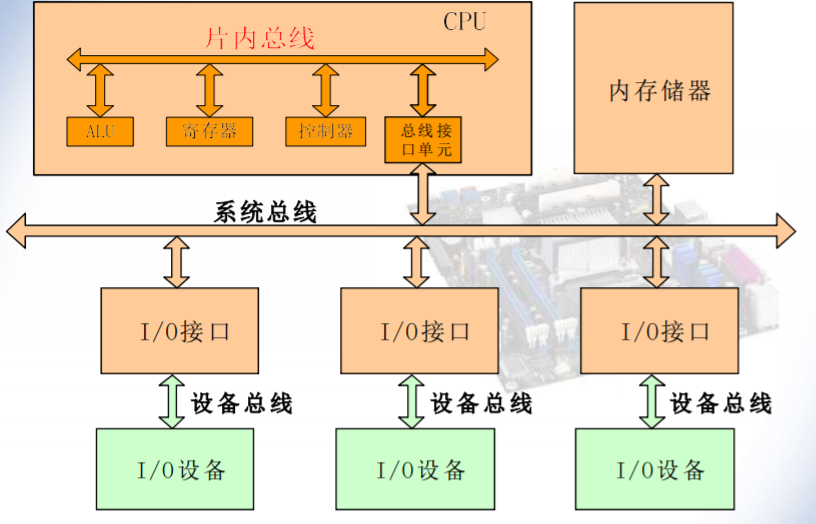

早期总线内部结构：

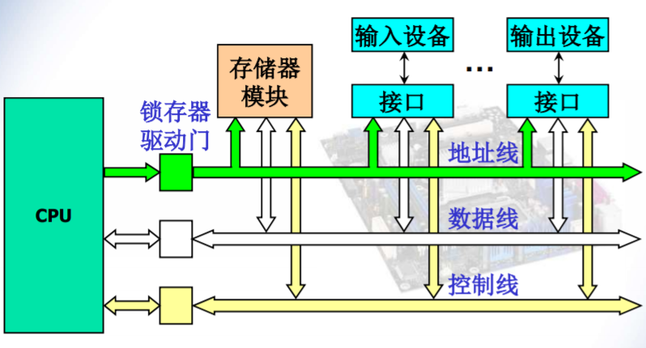

当代总线内部结构：

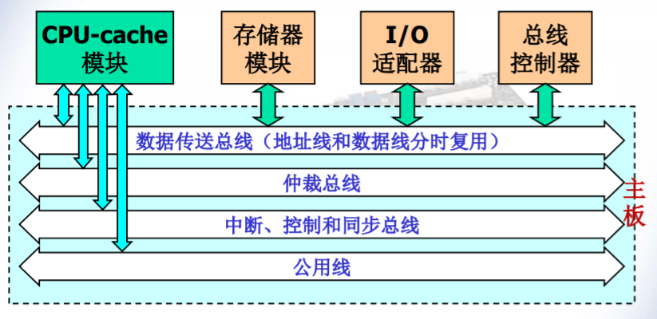

## 总线的性能指标

- 总线宽度 - **数据线**的条数
- 总线传输率（总线带宽） - 每秒传输最大字节或比特数
- 总线定时协定 - 同步方式、异步方式、半同步方式、分离方式
- 信号线数 - 地址线、数据线、控制线的总和

## 总线接口

计算机传输信息有两种基本方式：
- 串行传送
- 并行传送

处于速度与效率上的考虑，**总线使用并行传送**

### 串行传送

只需要一根传输线，长距离传输有优势。但是速度慢

### 并行传送

每一位数据需要一根传输线

地址和数据分时传送，即总线的**分时复用**

总线上的多个部件分时共享总线

### 接口的基本功能

- 控制
- 缓冲
- 状态控制
- 转换数据
- 程序中断

## 总线仲裁

### 主设备与从设备

总线事务包括两个部分：
- 发起命令与地址
- 传输数据

主设备与从设备之间可以双向数据传输

只有主设备可以给从设备发出命令与地址，是总线事务的发起者

从设备是总线事务的响应者
- 主设备发出读命令时把数据发送到主设备
- 主设备发出写命令时接收主设备发来的数据并写入

### 仲裁基础

总线仲裁解决多个**主设备**争用总线的问题。因为在外设给CPU发送消息时外设是主设备

**总线占用期**：主设备持续控制总线的时间

总线仲裁的基本方式：
- 集中仲裁
	- 链式查询
	- 计数器定时查询
	- 独立请求方式
- 分布仲裁

集中仲裁由主设备统一管理，就像有红绿灯的十字路口的车辆统一受红绿灯的控制。分布仲裁就像没有红绿灯的十字路口，所有车辆先停下确认没有其他车辆后通行

### 链式查询方式

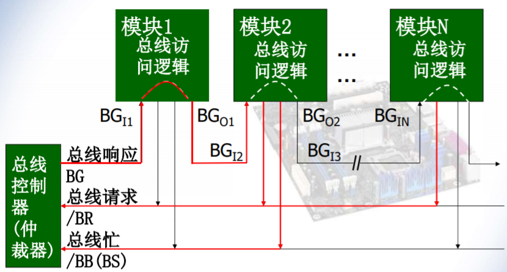

- 总线申请者通过置/BR=0发出总线申请
- 如果/BR=0且总线空闲(/BB=1)时，总线控制器置BG=1，响应总线请求
- 若模块没有申请总线却收到了BG=1则继续传递BG=1
- 若模块发出了总线申请，且/BR=0, /BB=1，此时收到了BG=1，则把BG置0（即不再向下传输），并把/BB置0，表示总线已被占用
- 使用完总线后把/BB置1表示归还总线

优点：
- 实现简单，只需要固定数量的控制线实现优先级控制
- 便于增删总线上的设备，总线控制器的结构与总线上的模块数量无关

缺点：
- **故障敏感**，某个模块故障之后，后面的模块都不能正常查询
- 仲裁速度慢，主设备越多时间越长
- 优先级不能改变，低优先级设备可能饿死

### 计数器定时查询方式

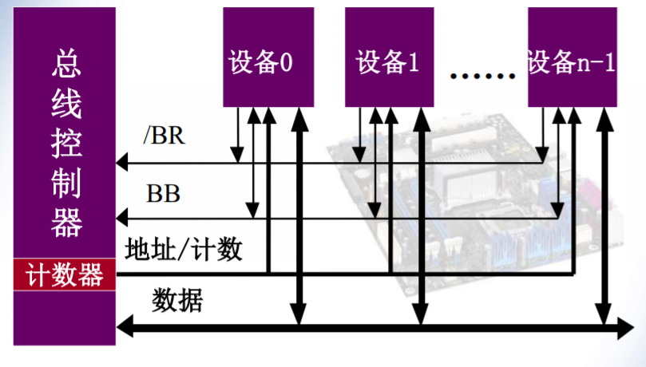

设备申请总线时，通过/BR发出总线请求，中央仲裁器接收到请求后在BB线为0（总线空闲）的情况下启动计数器开始计数，计数值通过一组地址线发给各设备，每个设备接口都有一个**设备地址判别电路**，当地址线上的计数值与总线请求的设备的设备地址一致时，该设备获得使用权，把BB线置1，计数器暂停计数

每次计数可以从0开始，也可以从暂停点开始。如果从0开始，类似于链式查询，优先级固定。如果从暂停点开始，各设备优先级相等。计数器的初值也可以由程序设置。这可以方便地更改优先级，这种灵活性是以增加地址线为代价的

### 独立请求方式

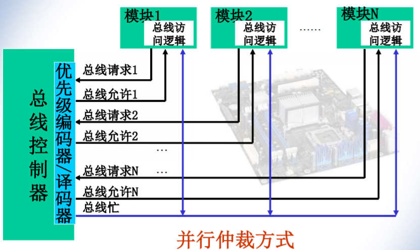

并行仲裁

优点：
- 速度快，与模块数无关
- 对优先级的控制灵活
- 对故障不敏感

缺点：
- 需要大量请求线和允许线
- 电路复杂
- 不容易增加设备

### 分布式仲裁方式

没有中央仲裁器，而是多个仲裁器竞争使用总线

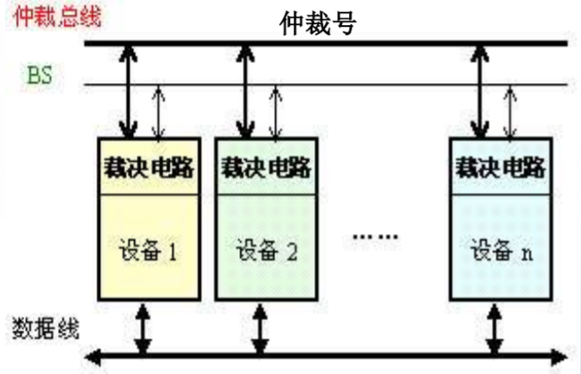

某设备需要使用总线时，将自身的**仲裁号**发到仲裁总线上，各设备通过仲裁总线互相比较仲裁号的大小，仲裁号最大的获得使用权

## 总线数据传输方式

### 基础

完成数据传输分四个阶段
- 申请阶段
	- 主设备提出申请，总线仲裁器决定总线使用权
- 寻址阶段
	- 获得总线的主设备发出存储器地址或IO端口地址，使模块启动
- 传输阶段
- 结束阶段
	- 主从设备的有关信息从总线上撤除，让出总线

总线传输的四种方式：
- 同步方式 - 使用统一的**时标**控制数据传送
- 异步方式 - 使用**应答**方式，无时标
- 半同步方式 - 结合同步与异步
- 分离方式 - 减少总线无效占用时间

### 同步方式

主从模块在**同一时钟**的控制下传送。完成一次数据传送的传输周期（即总线周期）是固定的

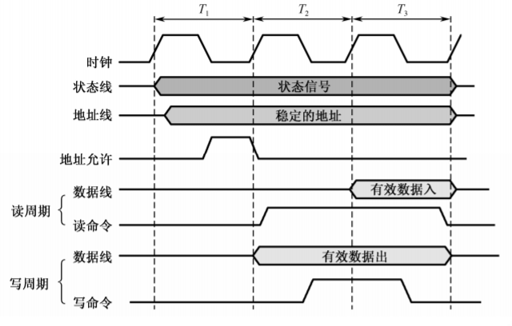

### 异步方式

应答式传输，使用**请求线(REQ)**和**应答线(ACK)**来协调传输过程而不依赖公共时钟信号

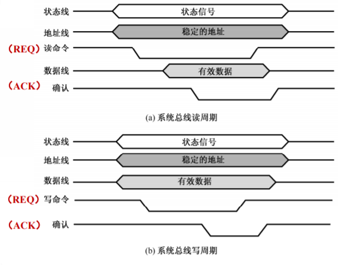

### 半同步方式

同步和异步的结合。有同步时钟，但**传输周期可变**，增加一条信号线(Ready)，主模块解释该信号线查看选中的模块是否准备好。如果未准备好则插入等待状态，延长总线传输周期

### 分离方式

把传输周期（总线周期）分为两个子周期
1. 主模块申请总线，发出地址、控制命令（读/写）。使用完后释放总线
2. 模块准备好数据后，申请总线，获准后把数据送至总线

特点：
- 模块准备数据时不占用总线
- 大大提高总线的利用率
- 适用于多个主模块的系统

## 总线的数据传输模式

### 读写操作

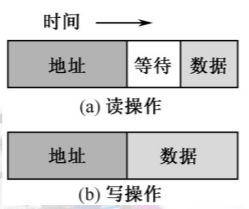

- 读操作是由**从方到主方**的数据传送
- 写操作是由**主方到从方**的数据传送

通常主方先以一个总线周期发出命令和从方地址，经过一定的延时再开始数据传送总线周期

为了提高利用率，主方寻址后可以让出总线控制权，以便其他主方完成更紧迫的操作而自己准备数据，然后重新竞争总线完成数据传送

### 块传送操作

- 只需给出块的起始地址，然后对固定块长度的数据逐一地读出或写入
- 对于CPU（主方）-存储器（从方）而言的块传送，常称为**突发式传送**，块长一般为存储器字长的4倍
- 由主方控制直到结束

例如一个64位数据线的总线，一次突发式传送可达256位，在超标量流水线中非常有用

### 写后读、读后写操作

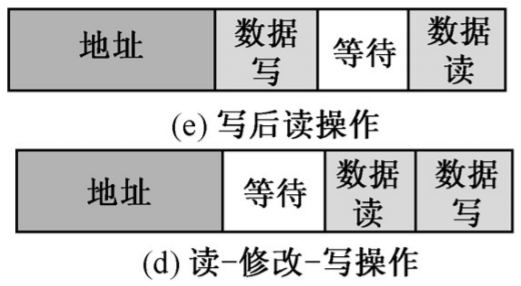

组合操作。**只给出一次地址**，先写后读或先读后写。前者处于**校验**的目的，后者用于多道程序系统中对共享资源的保护。主方掌管总线直到整个操作完成

### 广播、广集操作

通常数据传送只在一个主方和一个从方之间进行，但是有的总线允许**一个主方对多个从方进行写操作**，称为**广播**

与广播相反的称为**广集**，它将选定的多个从方数据在总线上完成AND或OR操作，用来检测多个中断源

## PCI总线体系

Peripheral Component Interconnect 周边器件互联

### 多总线结构与桥的概念

多层总线，各层之间使用**桥**进行连接

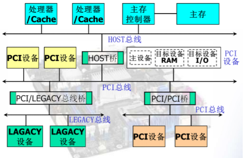

三种不同的总线和桥：
- **HOST**总线用于连接CPU、cache和主存。也称**前端总线**。可以连接多个CPU
- **PCI**总线用于连接各种**高速**PCI设备（显卡、网卡等），可以使主设备也可以是从设备
- **LAGACY**总线用于连接已有的**中低速设备**

**桥**是一个**总线转换部件**，可以**把一条总线的地址映射到另一条总线的地址空间**。PCI总线的三种桥都属于PCI设备。**被桥隔开后各个总线可以并行工作**

- 写操作时，桥**缓存**上层总线的写数据，然后在下层总线生成写周期与写数据（起到缓冲作用）
- 读操作时，桥可以早于上层总线，直接在下层总线进行预读

所以**桥可以使所有存取都按照CPU的需要出现在总线上**

### PCI信号

信号线120条，包括电源线、地线、保留信号线等。已经定义的信号线分为两类：
- 必备信号线
	- 主设备49条，从设备47条
- 可选信号线
	- 51条，用于64位扩展、中断请求、高速缓存支持等

### PCI总线周期

总线类型由主设备发出的控制信号代码指明

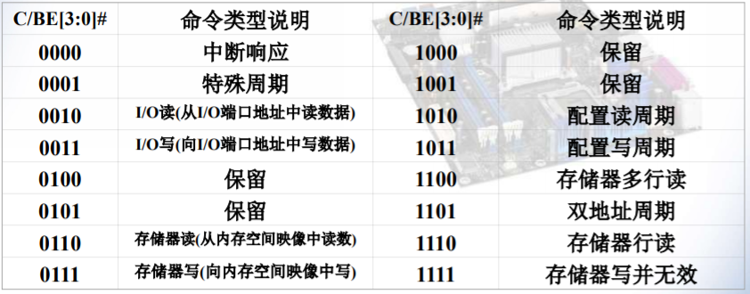

周期类型：
- 存储器读写总线周期
- 存储器写并无效周期
- 特殊周期
- 配置读写周期
- 双地址周期

### PCI总线仲裁

**集中式仲裁**，每个PCI**主设备**都有独立的REQ#（总线请求）和GNT#（总线授权）两条信号线与中央仲裁器相连（从设备没有）

总线仲裁器一般位于**桥接芯片**中

### 南北桥

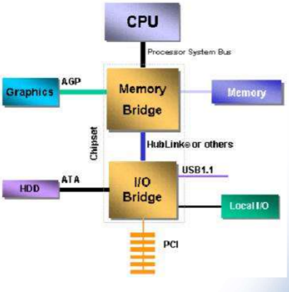

Host桥称为北桥，其他称为南桥

## 通用串行总线USB

Universal Serial Bus

### PC机IO方式的弊端

标准PC机外围设备接口是**非共享式接口**，IO接口支持单个设备的连接。同一时刻只有一个外围设备可以连接，灵活性低

为了添加一种新外设，通常是做一块专用的**扩展卡**查到扩展总线上，为新的外围设备建立一个连接通道。这种方案适应性差、扩展卡种类繁多、不能热插拔、成本高

### USB特点

根据平时我们对USB的使用不难发现

- 即插即用
	- 热插拔
	- 自动配置
- 独立供电
- 携带方便
- 标准统一
- 可连接多设备
- 成本低

不足：
- 实际串联3到4个设备以上就可能导致一些设备失效
- USB提供500mA的电力，对于高电耗的设备需要外接电源

觉得有用？欢迎[打赏](../../../donate.md)

:)

[返回主页](../../../index.md)