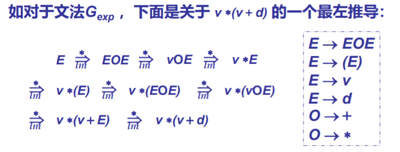
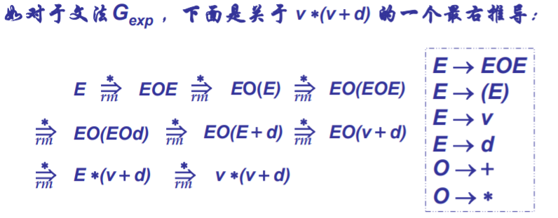
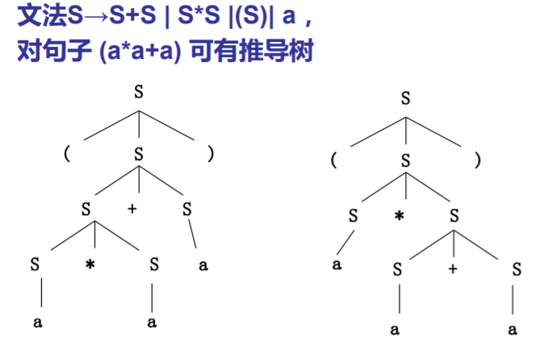
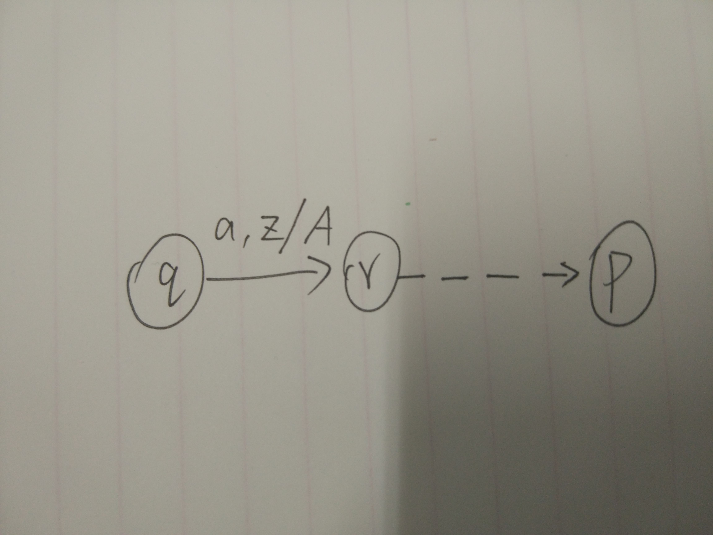

# 形式语言与自动机 目录

- [第一章 语言与文法](Chapter1.md)
- [第二章 有限自动机与右线性文法](Chapter2.md)
- [第三章 上下文无关文法与下推自动机](Chapter3.md)
- [第四章 图灵机](Chapter4.md)

# 第三章 上下文无关文法与下推自动机

## 复习

上下文无关文法，2型文法，生成式要求左侧只能为一个非终结符，对应的识别器为**下推自动机PDA(Push Down Automata)**

## 推导树与二义性

### 规约与推导

判断字符串是否属于某语言的方法：

- 规约
	- 自下而上
	- 把生成式的右部(body)替换为生成式的左部(head)
	- 把字符串中的符号用生成式替代，最后得到生成式的起始符号
- 推导
	- 自上而下
	- 把生成式的左部(head)替换为生成式的右部(body)
	- 从生成式的起始符号推导出字符串

**最左推导(leftmost derivations)**：每次推导只替换出现在最左边的非终结符

最左推导关系用符号表示，其传递闭包用表示

最左推导举例：



**最右推导(rightmost derivations)**：每次推导只替换出现在最右边的非终结符。

最右推导的符号等于上面最左推导的符号里面的l换成r

最右推导举例：



### 推导树

使用图的方法表示一个串的推导

推导树举例：



**边缘**：所有叶子节点从左向右组成的串称为推导树的边缘

显然某个推导树的边缘就是这个推导树生成的串

### 二义性

上面的例子可以看出同一个串可能会有多个推导树

定义：2型文法是二义的，当且仅当对于串ω，存在两棵不同的具有边缘为ω的推导树

如果文法是二义的，那么它所产生的某个串必然能从不同的最左（右）推导推出

**无消除二义性的一半算法**

## 上下文无关文法的变换

### 生成式的标准形式

**Chomsky范式(CNF - Chomsky Normal Form)**

生成式格式为

```
A -> BC
A -> a
A/B/C为非终结符
a为终结符
```

**Greibach范式(GNF - Greibach Normal Form)**

生成式格式为

```
A -> aω
A为非终结符
a为终结符
ω为非终结符串（可以为空）
```

意义：对每个2型语言都可以找到一个文法使产生式的右端以终结符开始。思想为**消除左递归**

### 算法1 找出生成符号

递归：
- 任何终结符都是生成符号
- 如果有生成式```A -> ω```，ω中的每一个符号都是生成符号，则A也是生成符号

### 算法2 找出可达符号

递归：
- 初始符号S是可达符号
- 如果有生成式```A -> ω```，A是可达符号，则ω中的所有非终结符为可达符号

如果要消除非生成符号和不可达符号，**必须先执行算法1再执行算法2，不能颠倒**，否则可能会导致无用符号没有被完全删除。

例：已知2型文法```F = ({S, A, B}, {a}, P, S)```，其中生成式P：

```
S -> AB
S -> a
A -> a
```

如果先执行算法2再执行算法1

1. 消除不可达符号：无
2. 消除非生成符号：B，因此删除生成式```S -> AB```

此时非生成符A变为不可达符号

### 算法3 消除ε产生式

目的：使文法规范化

定义：
- 可致空符号：可通过一系列变换生成空串的符号
- 无ε文法：生成式中无任何ε产生式，或只有一个可致空符号```S -> ε```且S不出现在任何生成式的右边

方法：若原文法生成式右侧存在致空符号，则无ε文法的生成式在拥有原生成式的基础上添加把致空符号视为空串得到的新生成式

举例：假设存在生成式```S -> ABCDE```，其中A、C、E可致空

将“把致空符号视为空串”编码为0，“把致空符号视为普通生成符号”编码为1，那么排列ACE应得到8种情况，从000到111

那么无ε文法将得到如下生成式：

```
S -> BD    (000)
S -> BDE   (001)
S -> BCD   (010)
S -> BCDE  (011)
S -> ABD   (100)
S -> ABDE  (101)
S -> ABCD  (110)
S -> ABCDE (111)
```

如果化简到最后初始符号S可致空且S出现在了生成式右边，则消除```S -> ε```，添加新符号```S'```，拥有如下生成式：

```
S' -> S | ε
```

消除ε产生式之后会产生非生成符号，需要再调用算法1

### 算法4 消除单产生式

单产生式：形如```A -> B```的产生式，其中AB为非终结符

目的：减少推导步数，规范文法

单元偶对(unit pairs)：称```(A, B)```是单元偶对当且仅当A可以仅使用单生成式生成B

思路：如果存在单元偶对```(A, B)```和非单生成式```B -> ω```，则加入生成式```A -> ω```

例题：2型文法```G = ({S, A, B}, {(, ), +, *, a}, P, S)```，其中生成式P：

```
S -> S + A | A
A -> A * B | B
B -> (S) | a
```

其中的单元偶对

- (S, A)
- (A, B)
- (S, B)

所以得到如下新生成式

```
(S, A) & A -> A * B => S -> A * B
(A, B) & B -> (S) => A -> (S)
(A, B) & B -> a => A -> a
(S, B) & B -> (S) => S -> (S)
(S, B) & B -> a => S -> a
```

### 小结

简化2型文法的步骤（注意顺序）

1. 消除ε产生式 - 算法3
2. 消除单产生式 - 算法4
3. 消除非生成符号 - 算法1
4. 消除不可达符号 - 算法2

### 算法5 消除左递归

左递归格式：```A -> Aω```

思想：假设存在生成式```A -> Aa | b```，显然A的正则式是```ba*```。所以消除左递归之后应存在如下生成式：

```
A -> b | bB
B -> aB | a
```

这样的正则式也是```ba*```

推广：假设存在如下生成式

```
A -> Aω1 | Aω2 | ... | Aωm | a1 | a2 | ... | an
```

则消除左递归后的文法应使用如下生成式取代上述生成式：

```
A -> a1B | a2B | ... anB | a1 | a2 | ... | an
B -> ω1B | ω2B | ... ωmB | ω1 | ω2 | ... | ωm
```

上述二者的正则式都是```(a1 + a2 + ... + an)(ω1 + ω2 + ... + ωm)*```

例题：已知如下生成式

```
S -> S + A | A
A -> A * B | B
B -> (S) | a
```

则新文法应含有如下生成式：

```
S -> AS' | A
S' -> + AS' | + A
A -> BA' | B
A' -> * BA' | * B
B -> (S) | a
```

## CNF & GNF

Chomsky范式(Chomsky Normal Form) & Greibach范式(Greibach Normal Form)

### 2型文法转换为等价CNF

CNF文法格式：```A -> BC | a```

构造CNF步骤：
1. 使用算法1、2、3、4消除ε生成式、无用符号、单生成式
2. 转换```A -> D1D2...Dn```：
	- 如果Di为终结符，则引入新生成式```Bi -> Di```，Bi是新的非终结符
	- 如果Di为非终结符，则令```Bi = Di```，原生成式变化为```A -> B1B2...Bn```。如果n大于2，则将其变为```A -> B1C1, C1 -> B2C2, ...```，其中Ci为新引入的非终结符

例题：已知```G = {A, B, S}, {a, b}, P, S)```是无ε、无循环、无无用符号、无单生成式的文法，生成式：

```
S -> aAB | BA
A -> BBB | a
B -> AS | b
```

解：```S -> BA, A -> a, B -> AS, B -> b```已经是CNF。把```S -> aAB```变换为```S -> C1C2, C1 -> a, C2 -> AB```，把```A -> BBB```变换为```A -> BC3, C3 -> BB```

### 2型文法转换为等价GNF

GNF生成式格式：```A -> aω```，其中ω为非终结符串（可以为空）

GNF构造步骤
1. 把2型文法变换为CNF
2. 对非终结符进行编号
3. 如果存在生成式```Ai -> Aj ω```其中Ai的编号大于Aj的编号，则把之前Aj的生成式代入，直到左侧非终结符Ai的编号小于右侧第一个非终结符的编号
4. 消左递归，对```An -> Anω```进行变换，得到An的无左递归生成式
5. 把An的无左递归生成式回代如编号小的非终结符的生成式

例题：已知CNF拥有如下生成式：

```
A -> BC
B -> CA | b
C -> AB | a
```

对非终结符进行编号：A - 1, B - 2, C - 3

在生成式```C -> AB```中左侧非终结符编号大于右侧第一个非终结符编号，把A的生成式代入得```C -> BCB | a```，仍然不满足条件。把B的生成式代入得```C -> CACB | bCB | a```

消除左递归，可得

```
C -> bCBC' | aC' | bCB | a
C' -> ACBC' | ACB
```

现在得到了C的生成式，回代入以C开头的生成式```B -> CA```，得到。。。略

就这样最后得到所有非终结符的生成式

## 下推自动机

PDA(Push Down Automaton)

PDA的形式定义：一个七元组```M = (Q, T, Γ, δ, q0, z0, F)```，其中

- Q 有限控制器状态集合
- T 有限输入字母表
- Γ 有限下推栈字母表
- δ 状态转移函数
- q0 初始状态
- z0 下推栈起始符号
- F 终态集合

转换函数的格式：```δ(q, a, Z) = {(p, ω)}```意为当前状态为q，当前栈顶为Z，接收字符a，转移为状态p，栈顶为ω。如果```ω = ε```则弹栈

规定ω中的最左符号位栈顶

下推自动机的图形表示：


- 确定的下推自动机DPDA
- 不确定的下推自动机NPDA

下推自动机的格局：一个三元组```(当前状态, 待处理串, 当前下推栈状态)```

下推自动机的两种接收方式：
- 终态接收，即接收串后走到终态
- 空栈接收，即接收串后下推栈为空（连初始栈顶也弹出来了）

空栈接收与终态接收是可以等价的

使用空栈接收时，终止状态可以为任意状态，此时F取φ

## 上下文无关文法与下推自动机

### 上下文无关文法构造等价下推自动机

构造出来的下推自动机是按照文法的最左推导方式工作

只需要一个状态q0即可

思路：对于生成式```A -> aBC | a```，自动机设置一个空转移函数```δ(q0, ε, A) = {(q0, aBC), (q0, a)}```，即A可以无条件地转移到```aBC | a```。然后对于所有终结符x，设置转移函数```δ(q0, x, x) = (q0, ε)```，即把非终结符从栈中弹出

例题：已知文法拥有如下生成式

```
E -> EOE | (E) | v | d
O -> + | *
```

则生成的PDA为```M = ({q}, {v, d, +, *, (, )}, {E, O, v, d, +, *}, δ, q, E, φ)```，其中δ定义为：

```
δ(q, ε, E) = {(q, EOE), (q, (E)), (q, v), (q, d)}
δ(q, ε, O) = {(q, +), (q, *)}
δ(q, v, v) = δ(q, d, d) = δ(q, +, +) = δ(q, *, *) = δ(q, (, () = δ(q, ), )) = {(q, ε)}
```

使用此自动机分析串```v * (v + d)```的过程为：

1. 首先自动机根据空转移在下推栈中构造出需要分析的串
2. 根据输入弹栈，串输入完毕时栈正好弹空

### 下推自动机构造等价上下文无关文法

思路：使串在文法中的一个最左推导对应于自动机中的一系列移动

**下面的描述，因为课件里面的描述非常迷，所以我按照我的理解进行了修改和补充，请参考着看**

采用形如```[q, z, p]```的非终结符，意为**一个串的集合**，里面的串满足：**从q状态出发，栈顶为z时，处理完串之后PDA将弹出栈顶z并变换到p状态**

以下图为例



我们有一个状态转移函数```δ(q, a, z) = (r, A)```

通过这个转移函数可以看出，如果一个串“从状态q出发，在栈顶为z时，处理完串之后可以把z弹出去并转移到状态p”，也就是```[q, z, p]```。那么这个串能够被拆分成两部分，第一部分是字符a，自动机在p状态且栈顶为z时接收这个字符a，并把栈顶从z变成A，第二步“从状态r出发，在栈顶为A时，处理完剩下的串之后可以把A弹出去并转移到状态p”，也就是```[r, A, p]```

也就是说，原本的串```[q, z, p]```被分成了```a```和```[r, A, p]```两部分，即得到生成式```[q, z, p] -> a[r, A, p]```

类似地，可以得到如下结论：

```
δ(q, a, z) = (r, ε) => [q, z, r] -> a
δ(q, a, z) = (r, ABCDE...) => [q, z, p] -> a[r, ABCDE..., p]
```

当然我们不希望栈顶是“ABCDE...”这么长，那么我们可以在从状态r到状态p的中间状态中选出“断点”状态（这个词是我瞎掰的）。比如：

```
[q, z, p] -> a[r, ABCDE...Z, p]
从r到q中间选择中间点q1, q2, ...q25
[q, z, p] -> a[r, A, q1][q1, B, q2]...[q25, Z, p]
```

显然已知```δ(q, a, z) = (r, ω)```的时候，因为不知道把串处理完了的时候到达的状态r是哪个状态，所以要把所有的状态作为“到达状态”遍历一遍

例题：已知PDA ```M = ({q0, q1}, {a, b}, {A, z0}, δ, q0, z0, φ)```，其中状态转移函数：

```
δ(q0, a, z0) = {(q0, Az0)}
δ(q0, a, A) = {(q0, AA)}
δ(q0, b, A) = {(q1, ε)}
δ(q1, b, A) = {(q1, ε)}
δ(q1, ε, A) = {(q1, ε)}
δ(q1, ε, z0) = {(q1, ε)}
```

生成文法如下：

```
由δ(q0, a, z0) = {(q0, Az0)}，字符串经过此操作后到达的状态可能是q0也可能是q1，所以得到生成式
[q0, z0, q1] -> a[q0, Az0, q1]
[q0, z0, q0] -> a[q0, Az0, q0]
因为生成式右边的栈顶长度不为1，需要再次寻找中间状态来分隔。中间状态可以为q0或者q1，所以得到生成式
[q0, z0, q1] -> a[q0, A, q0][q0, z0, q1]
[q0, z0, q1] -> a[q0, A, q1][q1, z0, q1]
[q0, z0, q0] -> a[q0, A, q0][q0,z0, q1]
[q0, z0, q0] -> a[q0, A, q1][q1, z0, q1]

由δ(q0, a, A) = {(q0, AA)}可以得到
[q0, A, q0] -> a[q0, AA, q0]
[q0, A, q1] -> a[q0, AA, q1]
进一步分解得到
[q0, A, q0] -> a[q0, A, q0][q0, A, q0]
[q0, A, q0] -> a[q0, A, q1][q1, A, 10]
[q0, A, q1] -> a[q0, A, q0][q0, A, q1]
[q0, A, q1] -> a[q0, A, q1][q1, A, q1]

由δ(q0, b, A) = {(q1, ε)}可以得到
[q0, A, q1] -> b

由δ(q1, b, A) = {(q1, ε)}可以得到
[q1, A, q1] -> b

由δ(q1, ε, A) = {(q1, ε)}可以得到
[q1, A, q1] -> ε

由δ(q1, ε, z0) = {(q1, ε)}可以得到
[q1, z0, q1] -> ε
```

这样就得到了所有生成式，再进行重命名、删除无用符号之后就得到了等价上下文无关文法：

```
S -> A
A -> aCD
B -> b | ε
C -> aCB | b
D -> ε
```

## 上下文无关语言的性质

### 2型语言的泵浦引理

设L是上下文无关语言，存在常数p，如果ω是L中的一个串，ω的长度不小于p，则ω可以写为```ω1ω2ω0ω3ω4```，使ω2ω3不为空串（即ω2与ω3不同时为空），且ω2ω0ω3的长度不大于p，且对于任意非负整数i，有ω1ω2^iω0ω3^iω4是L的一个串（不含```L = { ε }```的情况）

物理意义：和正则的泵浦引理类似。该语言中的一个串ω含有两个靠的很近的子串ω2和ω3，它们可以重复任意多次（但是二者的重复次数相同），所得的新串仍属于该语言

应用过程也与正则泵浦引理类似，用来证明某个语言不是上下文无关文法

例题：证明```L = {a^n b^n c^n | n >=1}```不是2型语言

证明：假设L是2型语言，令p为泵长，取L中的一个串```ω = a^p b^p c^p```，其串长大于p，则可以将ω写成ω1ω2ω0ω3ω4。考虑```ω1 ω2^i ω0 ω3^i ω4```也符合此语言，所以
1. 首先，ω2与ω3不能都为空
2. 如果ω2含有字母，ω3为空，那么为了保证所有字母数量相同，ω2中必须包含等量的a、b、c，所以ω2只能等于ω，不满足ω2ω0ω3的长度不大于p的限制。同理，也不能ω2为空而ω3有字母
3. ω2与ω3不能分别只含有一种字母或两种字幕，否则第三个字母的数量将不等于ω2ω3中含有的两个字母的数量
4. 假设ω2含有一种字母而ω3含有两种或三种字母，则ω2ω0ω3的长度大于p

综上所述，不存在这样的一个ω的划分。所以此语言不是2型文法

### 2型语言的封闭性

已知2型语言L1，L2，则他们的**并、连接、闭包**为2型语言

**注意：2型语言对“交”不封闭**

举例：已知```L1 = {a^n b^n c^m | m, n >= 1}```为2型语言，```L2 = {a^m b^n c^n | m, n >= 1}```为2型语言，二者的交```L3 = {a^n b^n c^n | n >= 1}```不是2型语言

2型语言对“补运算”不封闭。因为如果对补运算封闭则对“交”封闭。已知对“交”不封闭所以对“补”不封闭

觉得有用？欢迎[打赏](../../../donate.md)

:)

[返回主页](../../../index.md)