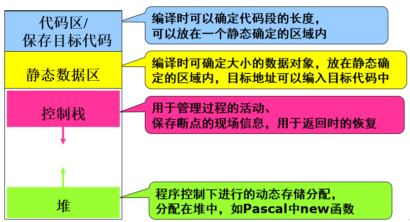
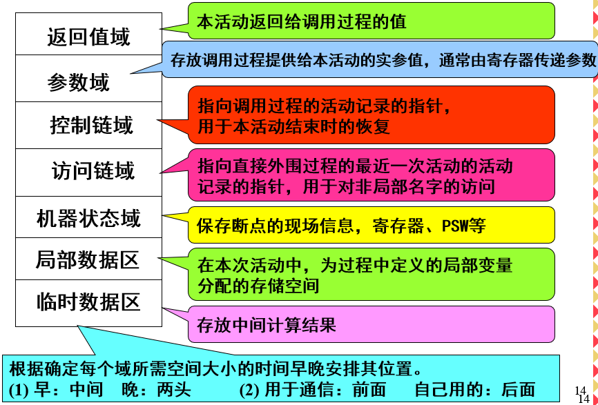

# 运行环境

## 活动记录、控制栈

### 预备知识

- **过程** - 过程、函数和方法统称为过程，包括过程名和过程体
- 过程的分类
  - 过程 - 没有返回值的过程
  - 函数 - 有返回值的过程
- **活动** - 过程的一次执行
- 过程和活动就像可执行文件与进程

### 程序运行空间的划分

### 控制栈与活动记录

- 控制栈 - 程序运行空间中的存储区域，**以栈的形式组织和管理**，保存活动记录。
- 活动记录 - 保存活动相关的各种信息

活动记录的内容：

重要的部分：
- 控制链 - 保存当前活动执行完后应该返回到的地方
- 访问链 - 保存此活动的直接外围，用来判断数据可访问性

局部数据编址可能会遇到**对齐**的问题

名字的左值和右值：
- 左值指其地址
- 右值指其值

## 存储分配策略

- 静态存储分配 - 编译时为所有变量分配空间，运行时不能动态分配（不能new
- 栈式存储分配 - 运行时需要局部变量时在栈区分配局部变量（相当于new出来的对象也在栈区，有生命周期
- 堆式存储分配 - 所有变量都在堆区分配，需要手动delete（相当于所有变量都需要new出来

重点为栈式存储分配的方案

## 栈式存储分配

调用子过程时把子过程的活动记录压入控制栈

**调用序列和返回序列**：是两段代码，**分别处理调用过程时压栈的操作和过程结束时弹栈的操作**（包括参数计算、返回值计算、控制链和访问链设置、保存机器状态等

## 非局部名字的访问

注意：**非局部名字不是局部变量也不是全局变量**。

使用访问链实现

C/C++语言不存在非局部名字。所以C语言的活动记录不需要访问链这一块。不是局部变量就是全局变量，地址确定

PASCAL语言允许过程嵌套，如果把一个子过程作为参数传递给其他函数，那么这个子过程无论在哪里都仍然可以访问父过程中定义的变量。所以存在非局部名字，需要访问链判断是否能够访问指定变量。

所以访问链是**静态链**，指向代码中的直接父过程（固定）。而控制链是**动态链**，指向调用它的过程（可变）。

## 参数传递方式

- 传值调用（参考C/C++
- 传引用调用（参考C/C++
- 复制恢复（按一定顺序恢复到参数列表
- 传名调用（相当于宏