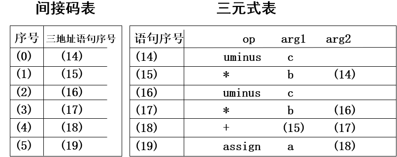

# 中间代码生成

## 三地址代码

三地址语句：`x := y op z`，切记赋值符号是`:=`而不是`=`

三地址语句的实现：
- 四元式（四地址代码）：`(op, arg1, arg2, result)`
  - `a + b = c -> (+, a, b, c)`
  - `x := y -> (:=, y, , x)`
  - `goto label -> (goto, , , label)`
  - `if x relop y goto label -> (relop, x, y, label)`
  - 缺点：需要很多临时变量保存在符号表中
- 三元式（三地址代码）：`(op, arg1, arg2)`
  - 避免把临时变量也存入符号表
  - `arg1`和`arg2`可以是其他三地址代码的序号

三地址代码示例：

代码优化阶段使用三地址代码比较难以调换运算顺序

间接三元式：使用一个间接码表记录运算顺序，便于代码优化

