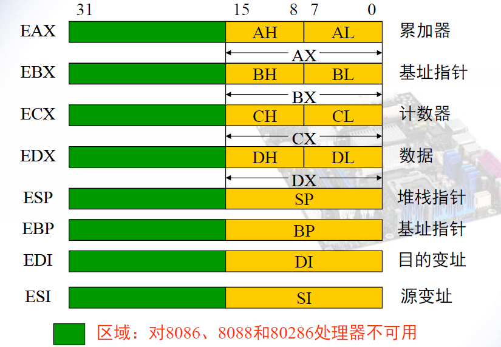

# 微机原理与接口技术 目录

1. [微机基础](1.md)
2. [微处理器功能与结构](2.md)
3. [指令系统和寻址方式](3.md)
4. [汇编语言程序设计](4.md)
5. [微处理器外部特性与输入输出](5.md)
6. [中断与定时技术系统](6.md)
7. [常用接口技术](7.md)

# 微处理器的功能结构

## 8086微处理器内部结构

- 总线接口部件BIU
  - 形成访问存储器和IO设备的地址，完成指令预取，存放运算结果
  - 包括：
    - 地址加法器
    - 专用寄存器组
    - 指令队列
    - 总线控制电路
- 执行部件EU - 负责执行指令，包括：
  - 算数逻辑单元ALU
  - 标志寄存器FR
  - 通用寄存器组
  - EU控制器

EU和BIU可以并行工作以提高效率

## 8086寄存器

### 通用寄存器

80386之前的处理器都是16位，80386之后变为32位。本课程只考虑16位，即忽略上图绿色区域

以下所有通用寄存器均为16位。其中AX/BX/CX/DX都可以拆成两个8位寄存器（即?H/?L）来使用。虽然是通用寄存器，但是他们也有一些约定俗成的用法

- AX
  - 累加器
  - 算术运算的主要寄存器，保存计算结果
  - IO指令使用AX和外设传送信息
- BX
  - 基址寄存器，保存**基址**
- CX
  - loop循环中隐含的计数器
  - 串处理中隐含的计数器
- DX
  - 保存数据
  - 可以和AX一起存储双字，DX为高位，表示为DX:AX
- SP
  - 堆栈指针，可以指示栈顶的偏移地址
- BP
  - 基址指针寄存器，可以指向栈底
- SI
  - 源变址，能够自动增减
- DI
  - 目的变址，能够自动增减

### 段寄存器

- CS - 代码段
- DS - 数据段
- ES - 附加段
- SS - 堆栈段

### 专用寄存器

- IP - 指令指针寄存器，存放代码段中的偏移地址。和CS一起使用，表示为CS:IP，即某代码段中的某一句代码
- PSW（或FR） - 程序状态字寄存器，也称为标志寄存器，如图：

标志寄存器中的常用位：
- CF - 是否进位
- ZF - 是否为0
- OF - 是否溢出

## 指令的执行过程

从CS:IP指向的内存地址取指令（并执行），然后CS:IP指向下一条指令

执行过程：
- 取指 - BIU把指令从内存取到指令队列
- 译码 - EU控制器发出控制信号
- 执行 - ALU执行计算结果并影响标志寄存器FR
- 写回 - 可能需要把结果放回寄存器

## 8086存储器

### 实模式Real-Address mode

8086处理器的存储器模式，使用20位物理地址、单任务工作方式、独占系统所有资源

存储器空间：00000H-FFFFFH

处理器上电后首先进入实模式

DOS系统要求实模式

使用两个16位地址来形成一个20位地址。计算方式：**16位段地址左移四位加上16位偏移地址**

存储器被分为很多**大小不同的段**，因为段内偏移地址为16位，所以每个段最大为64KB

段寄存器用来保存这些段的段地址

### 保护模式Protected mode（略

- 为实现虚拟存储器提供硬件支持
- 为存储器共享和保护提供硬件支持
- 支持多任务处理

觉得有用？欢迎[打赏](../../../donate.md)

:)

[返回主页](../../../index.md)