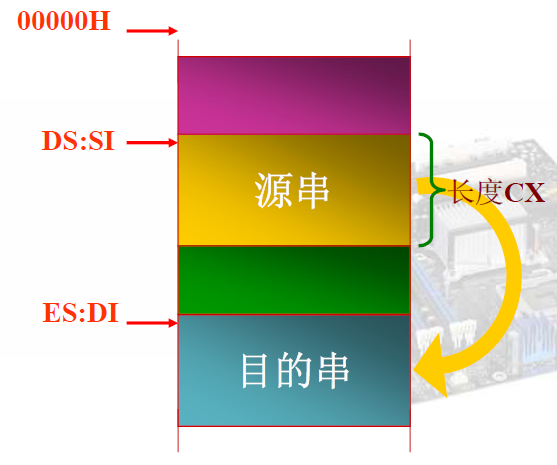

# 指令系统与寻址方式

## 一些概念

- 指令集体系ISA(Instruction Set Architecture)：
  - 寄存器组织
    - 寄存器个数
    - 寄存器尺寸
  - 处理器组织
    - 地址空间
    - 寻址粒度
  - 指令集
    - 操作码表
    - 寻址方式
    - 指令格式
- 复杂指令集计算机体系CISC: Complex Instruction Set Computer
  - 通用寄存器数量少
  - 寻址方式多
  - 专用、复杂指令种类多
  - 指令比较长
- 精简指令集计算机体系RISC: Reduced Instruction Set Computer
  - 指令集被简化
  - 固定长度、固定格式的指令字
  - 流水线操作
  - 寻址方式少
  - 可用寄存器数量多
- CISC vs RISC
  - CISC
    - 比RISC执行的指令条数少（代码密度高
    - 取指操作少，降低功耗
  - RISC
    - 执行的指令多
    - 功耗大
    - 每条指令功耗低
    - 易于流水线

指令的构成：
- 操作码 - 说明计算机要执行哪种操作
- 操作数 - 操作涉及的对象（可能0个也可能多个

## 寻址方式

### 分类

1. 立即寻址
2. 寄存器寻址
3. 直接寻址
4. 寄存器间接寻址
5. 寄存器相对寻址
6. 基址变址寻址
7. 相对基址变址寻址
8. ...

上面的除了立即寻址和寄存器寻址，其他的都属于**存储器寻址**（即去存储器寻找数据

### 存储器寻址

需要考虑三个因素：
- 有效地址EA: Effective Address
  - 操作数地址（物理地址）=段基址+偏移地址（有效地址）
  - EA=基址+变址*比例因子+位移量
    - 基址不是段基址，存放在基址寄存器而不是段寄存器
    - 变址存放在段寄存器
    - 比例因子和位移量由指令给出，也可能仅仅是CS:IP+1。指令会给出寻址方式
- 默认段
  - 指令 - CS
  - 堆栈 - SS
  - 局部数据 - DS
  - 串处理的目的串 - ES
- 段超越
  - 如果不想使用如上默认段，可以使用段超越来访问非默认段
  - 格式为`段寄存器:操作数`，如`ds:[1000h]`

### 寻址举例

- 立即寻址
  - 操作数在指令中
  - mov ax, 0000h
- 寄存器寻址
  - 操作数在寄存器中
  - mov ax, bx
- 直接寻址
  - EA在指令中
  - mov ax, [1000h]
- 寄存器间接寻址
  - EA在**BX/BP/SI/DI**中（只有这四个寄存器可以作为偏移量
  - mov ax, [bx]
  - 如果使用bp作为基址，默认段寄存器为SS
- 寄存器相对寻址
  - EA为bx/bp/si/di加上某个常数
  - mov ax, [bx+10]
  - mov ax, bx[10]
  - mov ax, 10[bx]
  - 使用bp的时候默认段寄存器为SS
- 基址变址寻址
  - EA为基址寄存器和变址寄存器内容之和
  - mov ax, [bx+si]
  - mov ax, bx[si]
  - mov ax, si[bx]
  - 基址寄存器为bp时默认段寄存器为SS
- 相对基址变址寻址
  - EA为基址寄存器和变址寄存器和某个常数之和
  - mov ax, [bx+si+10]
  - mov ax, 10[bx][si]

其他在80386中才有

## 转移指令

根据上一章内容我们知道物理地址为20位。所以指令的物理地址为`CS*16+IP`

顺序执行时IP自动增加，CS内容不变

转移的分类：
- 段内转移 - 只修改IP
- 段间转移 - 修改IP和CS

但是编写汇编程序的时候，使用label和转移指令，汇编程序会帮助我们计算转移

## 8086指令

### 数据传送指令

- 通用数据传送指令
  - mov dst, src
    - 不影响标志位
    - 可以是8位指令，也可以是16位指令
    - 寻址方式：
      - mov reg, reg/mem/imm
      - mov mem, reg/imm
  - push src
    - 不影响标志位
    - 寻址方式：
      - push mem/reg
    - 先移动栈顶指针再copy值入栈顶
    - 栈顶指针SP向上移动（地址变小
    - 16位指令，指针每次减2
    - SP为0的时候堆栈溢出（即堆栈偏移量为0，到达SS
  - pop dst
    - 不影响标志位
    - 寻址方式：
      - pop mem/reg
    - 先弹出数据再移动栈顶指针
    - 栈顶指针SP向下移动（地址变大
    - 16位指令，指针每次加2
  - xchg opr1, opr2
    - 不影响标志位
    - 寻址方式：
      - xchg mem/reg, mem/reg
- 累加器专用传送指令
  - in & out
    - 指令格式：
      - in al/ax, 端口地址
      - out 端口地址, al/ax
      - 端口地址必须是立即数或dx中的数
    - 不影响标志位
  - xlat（略
- 地址传送指令
  - LEA reg, src
    - 把src的EA送到reg
- 标志寄存器传送指令
  - lahf - 把FR内容放到AH
  - sahf - 把AH内容放到FR
  - pushd - push FR
  - popf - pop FR
- 类型转换指令
  - 不影响标志寄存器
  - cbw - 字节变字
  - cwd - 字变双字
  - cdq - 双字变四字

### 算术运算指令

- 加法
  - add - 加法
  - adc - 带进位加法（加CF
  - inc - 加1
- 减法
  - sub - 减法
  - sbb - 带借位减法（减CF
  - cmp - 比较（不保留结果，只保留FR
  - dec - 减1
  - neg - 求补（按位取反后+1
- 乘法
  - mul src
    - [ax] <- [al] * [src]
    - [dx:ax] <- [ax] * [src]
    - 因为操作数仅为src，所以src要用来判断是8位乘法还是16位乘法，所以src必须为寄存器或存储器
    - 乘法结束后位数要拓展一倍，即8位乘法得到16位结果，16位乘法得到32位结果
- 除法
  - div src
    - [al] <- [ax] / [src]的商
    - [ah] <- [ax] / [src]的余数
    - [ax] <- [dx:ax] / [src]的商
    - [dx] <- [dx:ax] / [src]的余数
    - 和乘法一样，需要靠src判断是8位还是16位除法，所以src必须为寄存器或存储器
- 十进制调整（略

### 逻辑运算指令

- and - 逻辑与
- or - 逻辑或
- xor - 逻辑异或
- test - 逻辑与，不保存结果
- not - 按位取反
- sal - 算数左移，符号位不左移。移出去的结果放在CF
- sar - 算数右移，同上
- shl - 逻辑左移，移出去的结果放在CF
- shr - 逻辑右移，同上
- rol - 循环左移，移出去的放到末尾和CF
- ror - 循环右移，同上
- rcl - 带进位循环左移，把CF放到末尾，然后把移出去的放到CF
- rcr - 带进位循环右移，同上

**移位指令的位数如果不是1，需要放到cl中指明**

### 串处理指令

数据串string保存在内存中，存放连续的字节或字序列。使用DS:SI指定源串，ES:DI指定目的串，使用CX指定串操作长度，DF指定串操作方向（即SI和DI是递增还是递减

- 串操作指令
  - movs
    - movsb - 移动一个字节
    - movsw - 移动一个字
    - movsd - 移动一个双字
  - stos
    - stosb
    - stosw
    - stosd
  - lods同上，有三种
  - cmps同上，有三种，比较结果保存在FR
  - scas同上，有三种，比较源串和[al]或[ax]或[dx:ax]，结果保存在FR。用于搜索
  - ins - 串输入，有三种，把端口号在DX的IO空间的数据输入到DI指向的内存
  - outs - 串输出，把si指向的数据段中的数据输出到DX保存的IO端口
- 重复前缀
  - rep - 无条件重复
    - rep movsb
  - repe(repz) - 为0重复
  - repne(repne) - 非0重复

### 控制转移指令

- 无条件转移指令
  - jmp
- 条件转移指令
  - jc
  - je
  - ja
  - jb
  - ...
- 循环指令
  - loop
    - 内部使用cx进行计数
- 子程序调用指令
  - call & ret
- 中断指令
  - int
  - into - 溢出中断
  - iret - 中断返回

### 处理机控制指令

- 标志处理指令
  - clc - 清进位，即CF置0
  - cmc - 进位标志CF取反
  - stc - 置进位CF为1
  - cld - 清方向DF为0
  - std - 设置DF为1
  - cli - 清中断IF为0
  - sti - 置中断IF为1
- 其他处理机控制指令
  - nop - 无操作，用于预占存储单元或软件延时
  - hlt - 停机指令，等待中断，中断返回后继续执行下一条指令
  - ...