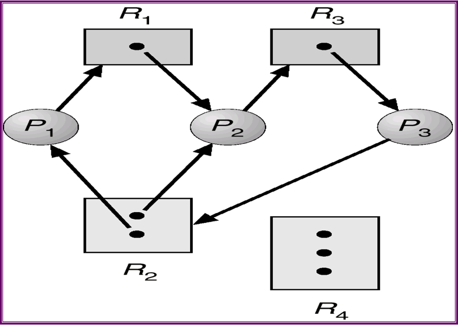
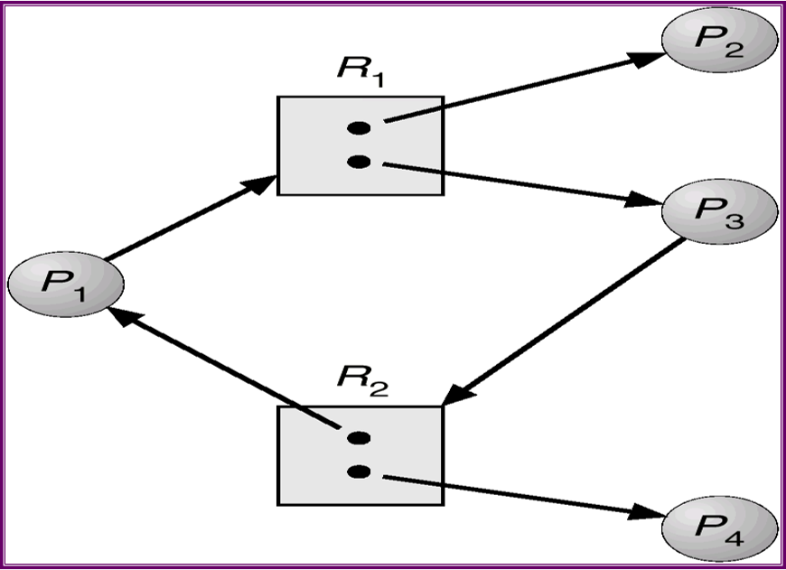
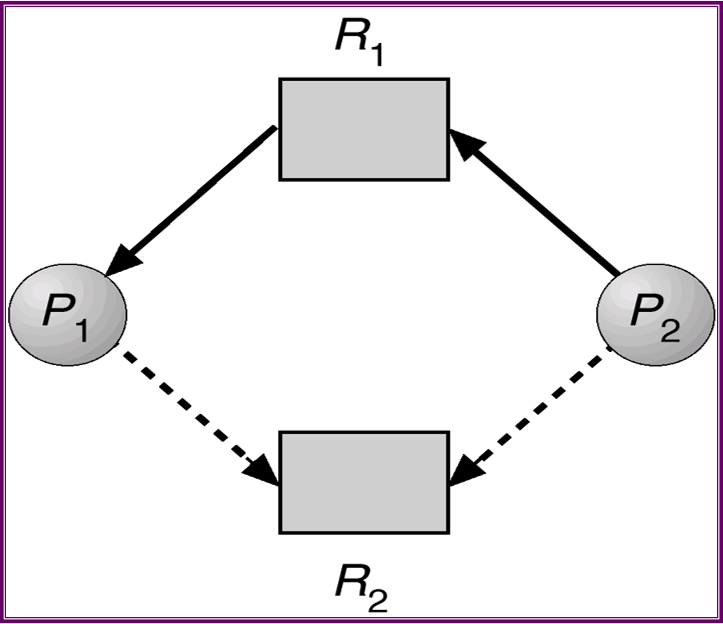
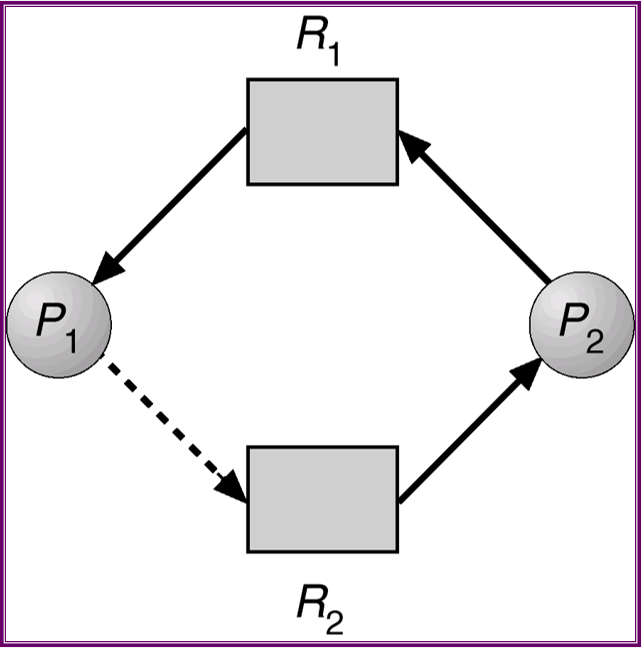
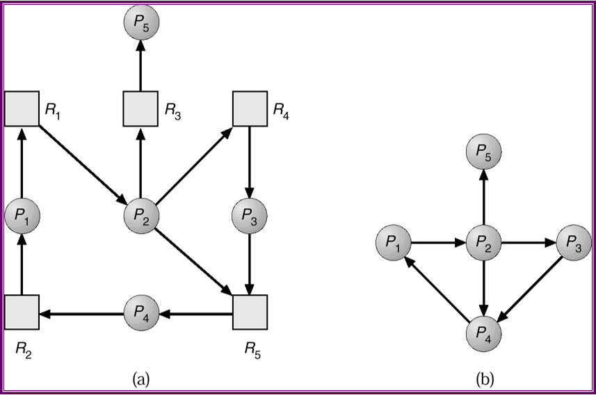

# Chapter7 Deadlocks

>A deadlock state occurs when two or more processes are waiting indefinitely for an event that can be caused only by one of the waiting processes.

## 资源分配图Resource allocation graph

有死锁的资源分配图：

无死锁的资源分配图：

## 死锁必要条件

如下四个情况同时发生时会死锁：
- mutual exclusion - 存在同时只能被一个进程访问的资源
- hold and wait - 进程持有某些资源，而且在等待更多资源
- no preemption - 资源不能被抢占
- circular wait - 等待资源的进程形成了一个环

## deadlock handling

处理死锁的三个思想：
- 忽视它。假装死锁不存在
- 允许系统进入死锁并设置恢复方案
- 保证死锁不存在

## deadlock prevention死锁预防

- 预防mutual exclusion
  - 不使用共享变量
- 预防hold and wait
  - 防止wait - 一次性给所有资源（利用率差，可能饥饿
- 预防no preemption
  - 改成preemption，如果请求其他资源失败就释放所有自己的资源
- 预防circular wait
  - 保证存在一个可解序列而没有形成环

## 死锁避免deadlock avoidance

### 安全

**安全序列safe sequence** - 能够按顺序结束所有进程的序列

系统处于**安全状态safe state**要求至少存在一个安全序列

### 资源分配图算法

资源分配图没有环则安全

例：存在如下资源分配图：

R1被P1使用，P2在请求R1。此时P2和P1在同时请求R2。如果R2把资源给P2，则：

形成了环，死锁

### 银行家算法Banker's algorithm

包括四个矩阵：
- available矩阵 - 保存所有资源的剩余量
- max矩阵 - 保存所有进程需要的所有资源量
- allocation矩阵 - 保存所有进程已经被分配的资源量 
- need矩阵 - 保存所有进程还需要哪些资源量

显然`max-allocation=need`

例：已知如下allocation/max/available矩阵，求need矩阵

显然此处的available矩阵为干扰项。只需要用max-allocation就能求得need：

银行家算法：持续将available和need矩阵对比，确保存在安全序列

## 死锁检测

### single instance of each resource type

使用wait-for gragh:

如果存在环则死锁

### several instances of a resource type

银行家算法中使用的矩阵。略

## 死锁恢复

- 停止所有死锁进程
- 每次停止一个进程直至死锁被解开