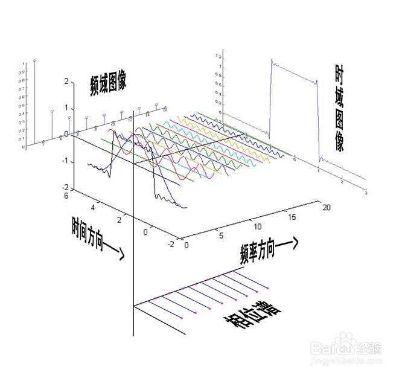
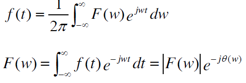
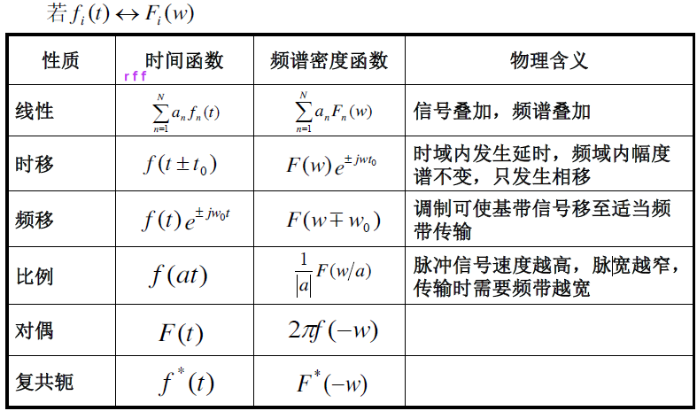
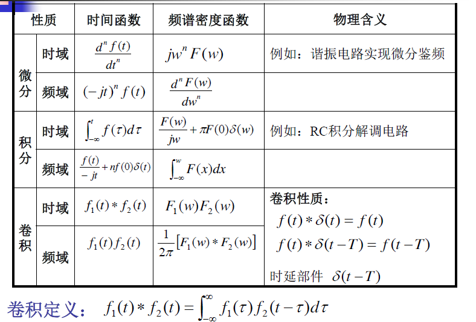
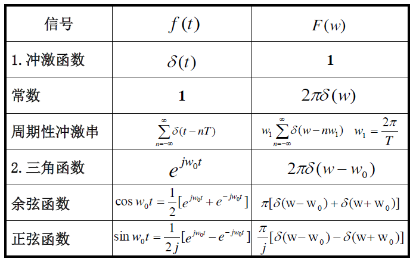
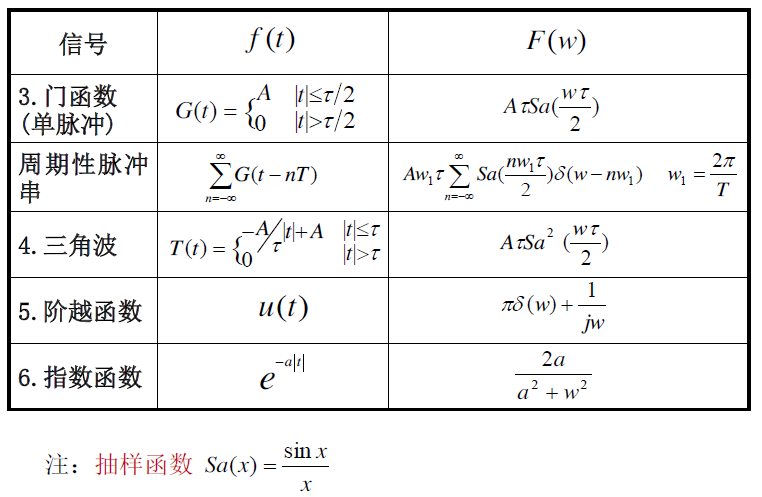
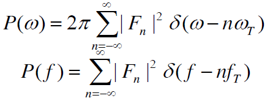
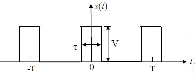
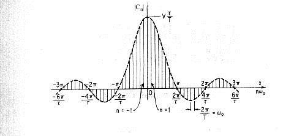

# 第二章 确知信号分析

## 傅里叶展开

使用傅里叶级数展开得到基波

## 单边谱与双边谱

例题：

首先把函数转换成`+cos`形式

单边和双边的变化：cos(5t - 1/3) = 1/2cos(5t - 1/3) + 1/2cos(-5t + 1/3)

所以双边谱是单边的一半

相位变化：

## 傅里叶变换

记做`f(t) <-> F(w)`

其中w = 2πf

## 傅里叶变换的性质

## 常用信号的傅里叶变换

## 能量信号和功率信号

电压或电流f(t)加在单位电阻上消耗的功率为`f(t)^2`

在无穷时间内的总能量为

平均功率为能量的时间平均

定义**能量信号**和**功率信号**：
- 能量信号
	- 振幅和持续时间有限
	- 非周期
	- 能量有限
	- 因为能量有限，所以在无限时间上的平均功率为0
- 功率信号
  - 持续时间无限
	- 能量无限
	- 平均功率有限

### 能量信号性质

符号声明：
- 信号函数f(t)
- 频谱密度F(w)
- 能量函数f(t)^2
- 能量谱密度G(w)
- 能量E

能量谱密度定义： G(w) = |F(w)2|

上式的意义 - 时域内无限时间累计的总能量=频域内各个频率分量能量之和

### 功率信号性质 - 无限非周期

**非周期信号有连续谱**，因为要用无限个周期信号才能拟合出非周期信号

功率信号在无限时间上能量无限，在有限时间[-T/2, T/2]上能量有限

使用极限来定义平均功率：

上式中已经是对频谱w的积分形式，所以得到下列等式：

功率谱密度

平均功率

### 功率信号性质 - 无限周期信号

**周期信号的频谱是离散的**

**使用δ(t)函数构造离散谱**

功率谱密度：

平均功率：

## 信号的带宽

信号的能量或功率（的主要部分）集中在一定的频率范围内时，此频率范围为信号的带宽

### 信号速率与带宽

- 速率 - 时域中单位时间内传送的码元个数
- 带宽 - 频域内信号传输需要的频带宽度

码元**波形相同**情况下，**速率越高**，码元宽度越小，占用**带宽越宽**

**主瓣带宽** - 频率轴上第一个0点的带宽。比如下面的方波

主瓣带宽就是2π/τ

### 等效矩形带宽

能量谱或功率谱在0频点有最大值

把所有频谱的能量或功率集中到一个矩形中

## 信号自相关函数

能量信号f(t)的自相关函数用能量表示（因为能量有限且不为0

功率信号f(t)的自相关函数用功率表示（因为功率有限且不为0

### 性质

意义：自相关函数反应了一个信号**延迟**τ后与之前信号的相关程度

- R(τ)是偶函数 -> R(τ) = R(-τ)
- R(0) >= |R(τ)|，即无时移时信号自身的相关性最强
- 能量信号R(0)=E，功率信号R(0)=P
- 自相关函数与谱密度函数互为傅里叶变换关系
	- 能量信号R(τ) <-> G(w)
	- 功率信号P(τ) <-> P(w)

## 信号通过线性系统

系统的性质：
- 输入信号f(t)和系统内激励信号h(t)进行**时域卷积/频域相乘**操作得到输出r(t)
- 如果激励信号为δ(t)，则称h(t)为系统的传递函数
- 线性系统满足线性叠加定理

理想滤波器
- 理想低通滤波器LPF
- 理想高通滤波器HPF
- 理想带通滤波器BPF