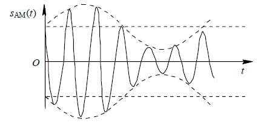
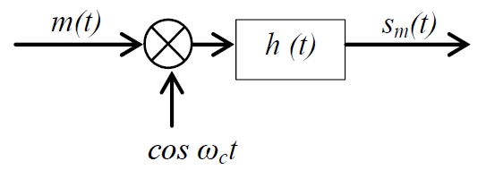
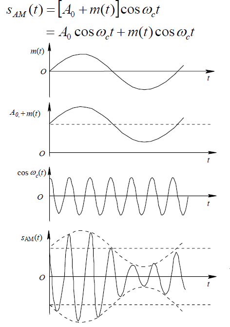
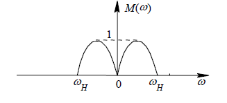
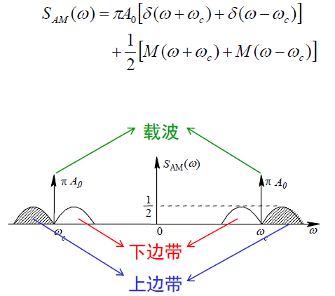
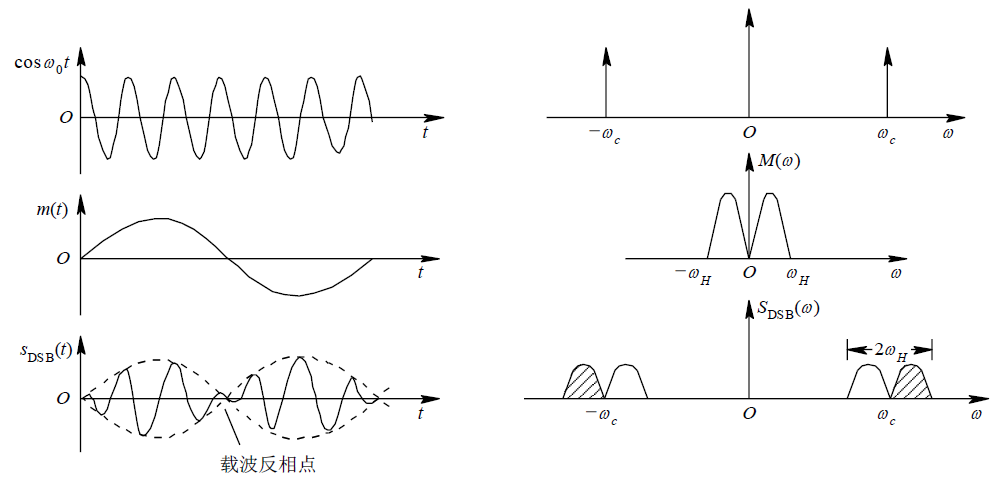
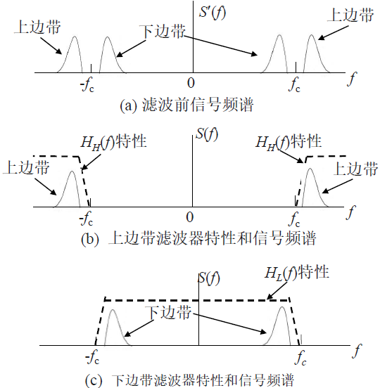
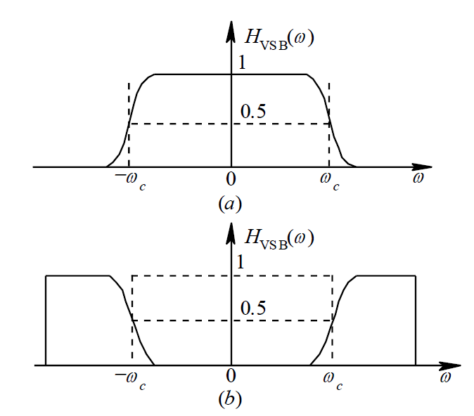
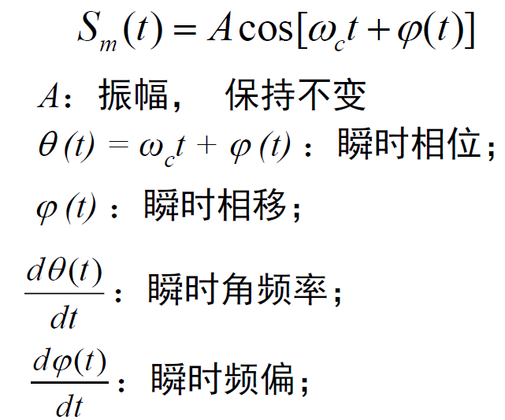

# 通信原理 目录

1. [绪论](1.md)
2. [确知信号分析](2.md)
3. [随机过程](3.md)
4. [信道](4.md)
5. [模拟调制系统](5.md)
6. [数字基带传输系统](6.md)
7. [数字带通传输系统](7.md)
8. [信源编码](8.md)
9. [差错控制编码](9.md)

# 模拟调制系统

## 概述

调制 - 改变基带信号的某些属性使其适合被信道传输

本章介绍的是使用正弦载波`c(t) = Acos(ωct + φ0)`携带模拟调制信号`m(t)`的模拟调制，分为：
- 幅度调制（线性调制）
  - 调幅AM
  - 双边带DSB
  - 单边带SSB
  - 残留边带VSB
- 角度调制（非线性调制
  - 调频FM
  - 调幅PM

## 幅度调制

### 概述

幅度调制是把高频载波叠加到调制信号上，**使高频载波的幅度随调制信号的瞬时值变化**

从频域上看只是乘了一个正弦波，体现为频谱的搬移，故称为线性调制

线性调制通用模型：

使用高频乘性干扰cosωct作用于调制信号m(t)，然后使用滤波器h(t)<->H(ω)进行滤波得到输出

### 标准调幅AM

思想：叠加直流分量A0，然后使用高频乘性干扰cosωc(t)，得到已调信号：

频域特性：已知A0的频域特性为`A0*2πδ(ω)`为原点冲激函数，假设m(t)带宽为ωH，m(t)的频谱：

乘上cosωc(t)相当于卷积其频谱`π(δ(ω - ωc) + δ(ω + ωc))`，即原频谱图像搬移ωc的距离，振幅减半：

滤波器特性H(ω)=1，即调制的时候不对上述波形进行处理

- 可以使用包络检波解调，简单
- 信号由对称的上下两个边带组成（上边带为正频域频率大的边带），需要带宽为`B(AM)=2fH`，fH为原信号带宽，也是原信号最高频率（因为原信号关于原点对称，所以调制后需要的带宽加倍
- **平均功率P**(AM) = Pc + Ps，其中Pc=A0^2/2，为**载波功率**，Ps = m^2(t)/2，为**边带功率**
- **调制效率**（即功率利用率）ηAM = Ps / P(AM) = Ps / (Pc + Ps) = m^2(t) / (A0^2 + m^2(t))
  - 当m(t)=Amcosωm(t)（单音余弦信号）时m^2(t)=Am^2/2，因此令**调幅系数**m=Am/A0，则ηAM=m^2/(2+m^2)
- m=1时称为**满调幅**，此时调制效率ηAM最大，但仅为1/3，所以**AM信号的功率利用率很低**，原因是引入了直流信号消耗大量功率
- 主要应用于中短波调幅广播（因为远距离太浪费功率

### DSB双边带信号（抑制载波双边带调幅

解决AM中功率利用率低的问题

主要思想：**去掉AM中的A0**，直接乘高频载波cosωc(t)。要求调制信号m(t)为不带直流的信号（直流可以使用隔直电路滤掉

时域与频域图示：

特点：
- 包络不再与m(t)成正比，且m(t)改变符号时载波相位反转，**不能再使用包络检波**，**使用相干解调**（复杂
- 占用的带宽和AM一样，B(DSB)=B(AM)=2fH
- 调制效率高，为100%，因为不含载波分量A0，所以全部功率用于信息传输

### SSB单边带信号（单边带调幅

提升DSB的带宽性能（信道利用率）。DSB的带宽是2fH，SSB带宽是fH

使用一个滤波器实现，原理电路：

H(ω)是理想低通滤波器时提取下边带，为理想高通时提取理想下边带。

频域原理图：

- SSB最突出的优点就是占用带宽窄，适合短波通信（高频
- 因为不传送载波和另一个边带，节省发送功率
- 缺点是设备复杂，需要相干解调

### VSB残留边带信号（残留边带调幅

弥补SSB需要理想滤波器的缺陷，VSB使用边带滤波器来实现

H(ω)是残留边带滤波器，满足关于ωc点**奇对称互补**，频域图表示：

图a为残留部分上边带滤波器，b为残留部分下边带滤波器

- VSB解决了DSB的带宽问题和SSB实现上的困难
- 调制效率100%，带宽介于DSB和SSB之间
- 广泛用于电视广播系统中的图像信号传输，因为低频分量丰富

### 解调

- 相干解调（也称为**同步检波**
  - 叠加乘性干扰把频谱再次搬回原点
  - 使用乘法器和低通滤波器LPF实现
  - 适用AM/DSB/SSB/VSB的解调
  - 信、噪分开处理，无门限效应
  - 要求载波同步，即接收方必须提供一个严格同步的相干载波
- 包络检波
  - 使用整流器和低通滤波器实现
  - 仅使用于AM且要求Am<=A0
  - 优点 - 简单，不需要载波同步

## 线性调制的抗噪性能

令输入白噪声n(t)的单边功率谱密度是n0，BPF是高度为1带宽为B的理想矩形函数，则**解调器输入噪声功率**`Ni=n0*B`

**制度增益**`G=(So/No)/(Si/Ni)`，即输出的信噪比比输入的信噪比多了多少

DSB解调输出为m(t)/2，SSB的解调输出为m(t)/4，所以DSB输出功率为1/4原功率，SSB为1/16原功率

恒成立的等式：`No = Ni/4 = n0*B/4`

以上计算可得`G(DSB)=2`，`G(SSB)=1`

分析：
- DSB的制度增益为2，即输出信噪比是输入的2倍，因为相干解调把噪声中的正交分量相互抑制，导致噪声功率减半
- SSB的制度增益为1是因为噪声和信号功率都被减半
- 虽然G(DSB)>G(SSB)，但是不能说明DSB优于SSB，实际二者输出信噪比相似，即二者抗噪声性能相同
- VSB的分析方法类似于SSB

AM的包络检波在大信噪比时性能和AM的相干解调差不多，但是输出信噪比均比以上二者差

## 角度调制

### 概述

把调制信号作为瞬时相移，置入高频正弦波

FM的输出信噪比最优

### FM信号的产生与解调

- 直接调频
- 锁相调频
- 间接调频
  - 将m(t)进行积分后对载波进行调相，从而产生一个窄带调频(NBFM)信号，然后n次倍频，提高调频指数，实现宽带调频

调频信号的解调是要产生一个与输入调频信号的频率呈线性关系的输出电压，完成这一**频率<->电压**转换的器件为**鉴频器**。这种解调方法属于非相干解调，对窄带调频NBFM和宽带调频WBFM均适用。NBFM也可以使用相干解调

### 调频系统的抗噪性能

解调器输入信噪比`Si/Ni=A^2/(2n0B(FM))`

- 大信噪比时制度增益随带宽增大而增大，**调频系统可以通过增加传输带宽改善抗噪性能**
- 但是这样的改造不是无止境的，一直使用会出现门限效应
- 小信噪比时，当输入信噪比低于门限值时，鉴频器也会出现门限效应
- 门限效应是所有非相干解调器都存在的一种特性，相干解调器不存在门限效应

## 模拟调制系统性能比较

- 抗噪性
  - FM最好
  - DSB、SSB、VSB次之
  - AM最差
- 频谱利用率
  - SSB最高
  - VSB次高
  - DSB、AM次之
  - FM最差
- 功率利用率
  - FM最高
  - DSB、SSB、VSB次之
  - AM最差
- 设备复杂度
  - AM最简单
  - DSB、FM次之
  - VSB较复杂
  - SSB最复杂

| 调制方式 | B | G |
| --- | --- | --- |
| AM | 2f | 2/3 |
| DSB | 2f | 2 |
| SSB | f | 1 |
| VSB | 略大于f | 近似SSB | 近似SSB |

## 频分复用

为了防止相邻信号出现干扰，相邻信号之间应有防护频带fg。令B1为单路带宽，则复用n路带宽为

`Bn = nB1 + (n-1)fg`

觉得有用？欢迎[打赏](../../../donate.md)

:)

[返回主页](../../../index.md)