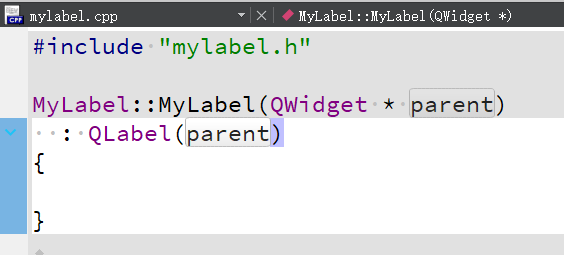

## 曲线与曲面的基本概念

### 曲线

通常用来描述物体轮廓或运动轨迹

描述方法：
- 代数方程 - 规则曲线
- 给定控制点拟合 - 不规则曲线

使用**位置矢量**描述曲线：`P(t) = [x(t), y(t), z(t)], t ∈ [0, 1]`

t=0时为曲线起点，为1时为曲线终点

### 曲面

通常描述物体形状

描述方法：
- 规则图形拼接 - 规则曲面
- 拟合 - 不规则曲线

方法应具有的特点：
- 形状不依赖于坐标系
- 人机交互方便
- 易离散生成，构造灵活，易于拼接

## Bezier曲线

### 定义

给定空间n+1个点的位置矢量$P_0\cdots P_n$，定义n次Bezier曲线为：

$$
P(t) = \sum_{i=0}^nP_iJ_{i,n}(t), 0\le t \le 1
$$

其中$J_{i, n}(t)$是Bernstein基函数：

$$
J_{i,n}(t)=C_n^i t^i (1-t)^{n-i}, i=0, 1, \cdots, n\\
C_n^i-\frac{n!}{i!(n-i)!}
$$

易得：$J_{0, n}(t)=(1-t)^n, J_{n, n}(t)=t^n$

这样就可以由n个点确定一条弧线。称$P_0 \cdots P_n$为曲线$P(t)$的**控制顶点**，这些顶点组成的多边形称为**控制多边形**

图例：

### 性质

- $P_0$和$P_n$是曲线的端点。$P(0) = P_0, P(1) = P_n$（注意$P(t)$中t的取值范围是0到1而不是0到n
- $P(t)$在$P_0$点与边$P_0P_1$相切，在$P_n$点与$P_{n-1}P_n$相切，即$P'(0) = n (P_1 - P_0), P'(1) = n(P_n - P_{n-1})$
- 凸包性 - Bezier曲线位于其特征多边形的凸包之中：
  - 
- 几何不变性 - 几何特性不随坐标系变换而变换，仅和控制顶点位置有关
- 交互能力 - 可以通过移动控制顶点实现改变曲线形状，比较直观
- 保凸性 - 如果控制多边形为凸多边形，则生成的曲线为凸曲线

不足：
- 缺乏局部修改性，改变某一个控制点就会影响整个曲线
- n较大时特征多边形的边数较多，对曲线的控制能力减弱
- 幂次过高，难以修改

### 递推算法（略

使用定义式来生成显然过于麻烦。可以使用递推式生成，请自行搜索

## Bezier曲面

### 定义

给定$(n+1) \times (m+1)$个点$P_{ij}(i=0, 1, \cdots, n; j=0, 1, \cdots, m)$，定义Bezier曲面：

$$
P(u, v) = \sum_{i=0}^n\sum_{j=0}^m P_{ij} J_{i, n}(u) J_{j, m}(v), 0 \le u, v \le 1
$$

同样，$P_{ij}$为曲面$P(u, v)$的**控制顶点**，把多边形$P_{i0}P_{i1}\dots P_{im}(i=0, 1, \dots, n)$和多边形$P_{0j}P_{1j}\dots P_{nj}(j=0, 1, \dots, n)$**组成的网**称为曲面$P(u, v)$的**控制网格**，记为$\{P_{ij}\}$，如图

### 性质

- 端点相关
  - $P_{00}=P(0, 0)$
  - $P_{0m} = P(0, 1)$
  - $P_{n0} = P(1, 0)$
  - $P_{nm} = P(1, 1)$
- 边界线位置 - 曲面$P(u, v)$的四条边界线$P(0, v), P(u, 0), P(1, v), P(u, 1)$分别是以$P_{00}P_{01}\cdots P_{0m}, P_{0m}P_{1m}\cdots P_{nm},  P_{nm}\cdots P_{n1}P_{n0}, P_{n0}\cdots P_{10}P_{00}$为控制多边形的Bezier曲线
  - 
- 凸包性
- 几何不变性
- 交互能力
- 易拼接，易离散

## B样条曲线

### B样条基函数

给定参数t轴上的一个分隔：

$$
T = \{t_i\}_{-\infty}^{+\infty}(t_i\le t_{i+1}, i=0, \pm 1, \pm 2, \cdots)
$$

定义T的k阶（k-1次）B样条基函数$B_{i, k}(t)$为：

$$
B_{i, 1}(t) = 
	\begin{cases}
	1 & \text{if $t_i \le t \le t_{i+1}$}\\
	0 & \text{others}
	\end{cases}\\
B_{i, k}(t) = \frac{(t - t_i)B_{i, k-1}(t)}{t_{i+k-1} - t_i} + \frac{(t_{i+k} - t) B_{i+1, k-1}(t)}{t_{i+k}-t_{i+1}}, -\infty \lt t \lt \infty(\text{see 0/0 as 0})
$$

称T为**节点向量**，$t_i$为**节点**。如果有l个节点重合则称为T的l重节点

### B样条基函数性质（略

### B样条曲线

性质：
- 凸包性
- 分段参数多项式 - 每一个区间$(t_i, t_{i+1}), k \le i \le n$上都是次数不高于k-1的参数t的多项式
- 连续性
- 几何不变性
- 保凸性
- **局部调整性** - 改变控制点仅对一段产生变化，局部刷新较快（不需要刷新所有点）
- 造型灵活性

相比于Bezier曲线，B样条曲线有以下优点：
- 逼近特征多边形的精度更高
- 多边形的边数与基函数的次数无关
- 具有局部修改性

### 使用deBoor算法构造B样条曲线（略

## B样条曲面（略

## Coons曲面（孔斯曲面（略

Bezier曲面和B样条曲面的特点是**曲面逼近网格**，而孔斯曲面的特点是**插值**