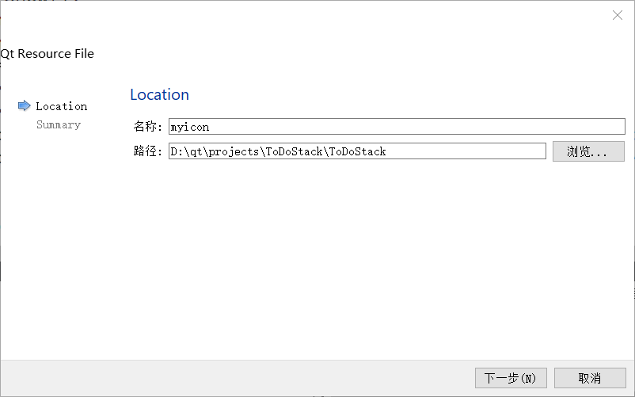

不是物理传播介质 传播介质可以视为第零层

## 功能

物理层决定了通信的：

- 机械特性 - 在什么样的介质上
- 电气特性 - 以什么样的方式
- 时序特性 - 如何有序的

## 基本术语

- 信源 - 信息的发送方
- 信宿 - 信息的接收方
- 信道 - 传递信息的介质
- 基带信号 - 直接用01表示两种电压并送到信道上传输
- 宽带信号 - 把基带信号调制后形成频分复用模拟信号 提高利用率
- 基带传输 - 数字信号在数字信道上传输
- 频带传输 - 数字数据借助模拟信道传输

## 性能指标

### 时延DELAY

指一个数据块从链路或网络的一断传送到另一端所需要的时间

- 发送时延 = 数据块长度 / 数据发送速率
- 传播时延 = 信道长度 / 电磁波在信道上的传播速率
- 转发时延 - 中间节点转发数据引起的时延

总时延为上述三者之和

### 时延带宽积

`时延带宽积 = 传播时延 * 带宽`

例如：某一链路的传播时延为`500μs`，带宽`100M/s`，则时延带宽积为50000比特

物理意义：发送第一个比特到达终点时，发送端已经发出了50000个比特，充满整个链路。此时链路得到充分的利用

### RTT往返时间

Round-Trip-Time

从发送端发送数据开始，到发送端收到来自接收端的确认所花费的总时间

### 带宽(Bandwidth)

信息传输速率就是计算机网络的带宽，指计算机网络可通过的最高数据率，即每秒多少比特，单位`b/s`，又称比特率

带宽的另一个定义是信道能够使用的频率范围，单位为`Hz`，**在物理层描述带宽一般都是用频率范围**

### 波特率

码元(Signal units)：一个离散信号状态或信号事件

波特率B：码元传输速率，每秒传输的码元数

`波特率 = 比特率 / log2(电平级数V)`

单位 波特每秒 `Baud/s`

举例：使用`00/01/10/11`表示四种码元 1波特等于2比特（电平级数为4，波特率为比特率的一半）

## 两个重要公式

### 奈氏(Nyquist)准则（奈奎斯特公式）

**理想信道**的最大比特率`C = B * log2(V)`

其中`B`为带宽，以`Hz`为单位，`V`为码元能够取得的离散电平值个数，C的单位为bps

### 香农(Shannon)公式

信道的极限信息传输速率`C`可表达为

`C = B log2(1 + S / N)`

其中`B`为信道带宽，以`Hz`为单位。`S/N`为信道的信噪比（信号功率与高斯噪声功率之比）

信噪比也常用分贝表示单位，有以下转换式

`(S/N)dB = 10log10(S/N)`

### 应用

某信道带宽为`B = 1MHz`，信噪比`SNR(dB) = 24dB`
- 求最大数据率
- 如果能达到最大数据率，应使用几级电平信号

```
解：
1.
SNR(dB) = 24dB = 10log10(S/R)
=> S/R = 251
=> C = B log2(1 + S/R) = 8Mbps

2.
C = 2B log2(V)
V = 16级电平
```

## 数据的传输方式

### 单工、全双工和半双工

- 单工 - 在一个信道上允许单向传输
- 半双工 - 在一个信道上允许双向传输，但不能双方同时发送
- 全双工 - 在一个信道上允许双向传输，可以同时发送与接收

### 串行通信 & 并行通信

- 串行通信 - 一个比特一个比特法
- 并行通信 - 多个比特同时发送

计算机网络使用**串行通信**

### 同步串行传输 & 异步串行传输

- 同步串行传输
	- 使用时钟信号对传输的数据线上的信号进行同步
	- 以数据块（帧或分组）为单位传输
- 异步串行传输
	- 独立时钟，不需要同步
	- 以字符为单位传输
	- 发送的两个字符之间的间隔是任意的
	- 接收方依靠字符中的起始位和停止位来同步

## 调制解调技术

### 基本调制方法

- 调幅AM
- 调频FM
- 调相PM


### 正交调制QAM

Quadrature Amplitude Modulation

正交调制星图：



## 编码技术

### 不归零编码NRZ

Non-Return to Zero

低电平为0 高电平为1

容易产生传播错误

### 曼彻斯特编码与差分曼彻斯特编码

- 曼彻斯特(Manchester)编码

也称“相位编码”

每一位中间都有一个跳变。这个跳变可以作为时钟，即这个编码方式自带时钟，能够自同步

主要应用于以太网

- 差分曼彻斯特码(Differential Manchester)

即“如果当前位与之前的一位相同则视为0，不同则视为1”，然后按照曼彻斯特编码的方式编码

- 曼彻斯特编码特点
	- 内含数据信息和**时钟**信息，易实现两种信息的合并与分离
	- 无直流分量
	- **效率低**，时钟信号频率是发送信号频率的两倍，所以**快速以太网不使用曼彻斯特编码**

- 违例码

如果曼彻斯特码的中间没有发生跳变则违例。有“0违例”和“1违例”。有些网络利用违例作为帧的开始或结束标志

## 信道复用技术

- 频分复用
- 时分复用
- 波分复用（即光波的频分复用）
- 码分复用

### 码分复用CDMA

不同站拥有不同的“码片序列”，这些码片序列必须是正交的，即相乘结果为0

如果一个站需要发送1，就发送`码片序列*1`，如果需要发送0，就发送`码片序列*(-1)`，如果不发送，就视为发送了`码片序列*0`

信道上的数据为所有站发送的码片信号的叠加。接收方需要把信道上的数据乘自己的码片序列来恢复信号

举例：已知分配给四个站的码片序列：

```
A = (-1, -1, -1, +1, +1, -1, +1, +1)
B = (-1, -1, +1, -1, +1, +1, +1, -1)
C = (-1, +1, -1, +1, +1, +1, -1, -1)
D = (-1, +1, -1, -1, -1, -1, +1, -1)
```

如果A站发送1，B站发送0，C站不发送数据，D站发送1，得到的码片应该是`(-1, +1, -3, +1, -1, -3, +1, +1)`，计算过程如下：

```
   (-1, -1, -1, +1, +1, -1, +1, +1) * 1
 + (-1, -1, +1, -1, +1, +1, +1, -1) * (-1)
 + (-1, +1, -1, +1, +1, +1, -1, -1) * 0
 + (-1, +1, -1, -1, -1, -1, +1, -1) * 1
 = (-1, +1, -3, +1, -1, -3, +1, +1)
```

接收方恢复信号：

```
A:
   (-1, +1, -3, +1, -1, -3, +1, +1)
 * (-1, -1, -1, +1, +1, -1, +1, +1)
 / 8
 = 1

B:
   (-1, +1, -3, +1, -1, -3, +1, +1)
 * (-1, -1, +1, -1, +1, +1, +1, -1)
 / 8
 = -1

C:
   (-1, +1, -3, +1, -1, -3, +1, +1)
 * (-1, +1, -1, +1, +1, +1, -1, -1)
 / 8
 = 0
D:
   (-1, +1, -3, +1, -1, -3, +1, +1)
 * (-1, +1, -1, -1, -1, -1, +1, -1)
 / 8
 = 1
```

## 传输介质

定向传输
- 双绞线
- 同轴电缆
- 光纤
- 电力线

不定向传输(无线广播)
- 无线电
- 微波与卫星通信
- 红外波与毫米波
- 光波

### 双绞线(Twisted Pair)

- 最普遍的传输介质
- 模拟/数字信号都可传播
- 两条电线绞合以减小电流串扰
- 带宽取决于电线厚度和传输距离
- 速度可达Mb/s

三类线与五类线
- 五类线绞合更密集 使用效果好
- 目前常用五类线

### 同轴电缆(Coaxial Cable)

- 距离更远 速度更快
- 高带宽(1GHz) 抗噪能力极强

有两种不同的线被广泛使用
- 50ohm 数字信号传输
- 75ohm 模拟信号传输

### 光纤(Fiber Optics)

- 高带宽
- 重量轻
- 安全 保密性好

### 定向传输介质带宽比较

按照带宽**从低到高**：

双绞线 -> 同轴电缆 -> 光纤

### 无线电传输

- 0-2MHz 直接沿地球表面传播
- 2-30MHz 通过大气电离层反射传播
- 30-MHz 直线视距传播 不受电离层影响

### 卫星通信

非常长的传播时延

## 链路层设备 - 交换机(switch)

使用**存储转发**方式。内部结构可以理解为一个多端口网桥：


把完全图化简为星型图。不使用交换机：


使用交换机：


如果不使用存储转发方式，也可以使用**直通(cut-through)**方式，能够提高转发速度（因为在交换机内不对数据进行校验），但是网络吞吐量不变

## 电路交换与分组交换

**电路交换必定是面向连接的**

电路交换三个阶段
- 建立连接
- 通信
- 释放连接

由于计算机数据具有突发性，不适用电路交换

分组交换把较长的报文划分为较短的数据段，依次把各分组发送到接收端

画图时注意分组首部的位置：分组首部总是先到达接收端


分组交换的问题：排队时延与首部开销

三种交换的比较：


## PSTN电话网

### ADSL(Asymmetric Digital Subscriber Lines)非对称数字用户线

把1.1MHz的信道均分为256个4312.5Hz的信道（频分复用）

- 信道0用来打电话
- 信道6-255用来实现网络传输，共250个信道
	- Upstream control(1)
	- Downnstream control(1)
	- User Data(248)
- 信道1-5不使用，防止电话数据与网络数据互相干扰

非对称的意思：下行信道多于上行信道，因为通常用户的下载多于上传

使用双绞线。即在原始电话网的基础上添加非对称数字上网的功能。**需要调制解调器，把数字信号转换成在电话网上传输的模拟信号**

