## 外围设备的定时方式和信息交换方式

根据外设速度把外设分类：
- 速度极慢或简单的外设
	- CPU只需要接收或者发送数据即可。**无条件传送**
- 慢速或者中速的设备
	- 异步传送方式（应答）
- 高速外设
	- 同步传送

数据传输方式：
- 程序查询方式(Polling)
- 程序中断方式
- 直接存储器存取(DMA: Direct Memory Access)
- 通道方式（过时）

### 程序查询方式

最简单的输入输出方式

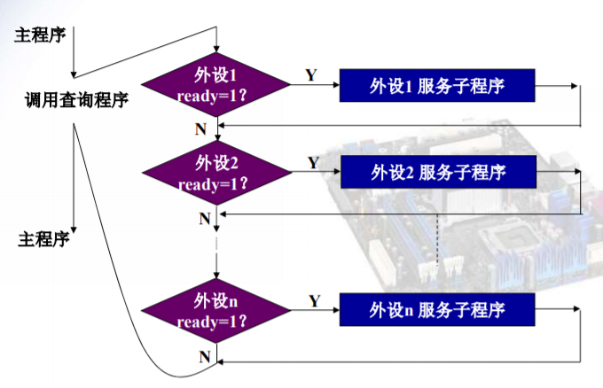

- CPU需要不断查询并等待慢速外设
- 效率低，CPU与外设不能并行工作。如果外设多，可能还需要链式查询，慢
- 接口电路简单，硬件开销小

### 程序中断方式

外设通过接口向CPU发出中断请求，CPU有能力执行中断时转去执行中断，执行完毕后再回到主程序

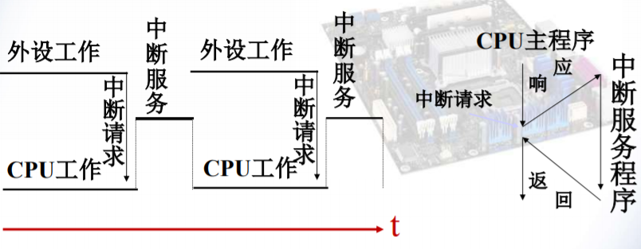

**中断系统**是计算机实现中断功能的**软硬件**总称，一般包括：
- 在CPU中设置的中断机构
- 在系统中设置的中断控制器
- 在软件上设置相应的中断服务程序

中断处理过程：
1. 中断请求
2. 中断排队与判优
3. 中断响应
	1. 暂时中断主程序（即现在执行的程序），发出中断响应信号
	2. 保存断点（即返回地址）
	3. 关中断（不再允许中断）
	4. 查找中断源，获取中断服务程序的入口地址
4. 中断处理
	1. 保护现场（即保护主程序目前的状态）
	2. 中断服务（即给中断源提供服务）
5. 恢复现场并中断返回，开中断（允许中断）

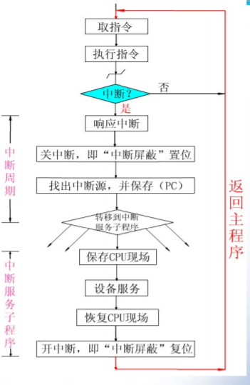

中断源的识别：
- 单级中断中采用**串行排队链**实现公共请求线的中断源判优识别
- 也可以采用**中断控制器**判断

转中断服务程序的方法：
- 预先规定中断服务程序的入口地址
- 或使用中断向量（类似于设备的名字），通过链式查表的方式找到入口地址

如图，使用中断向量和中断控制器，首先根据中断控制器获取中断向量

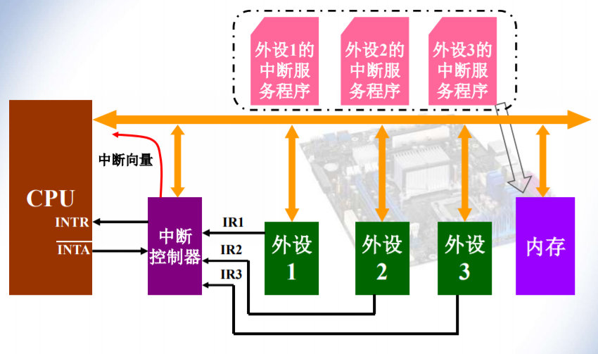

然后根据中断向量链式查找设备入口地址

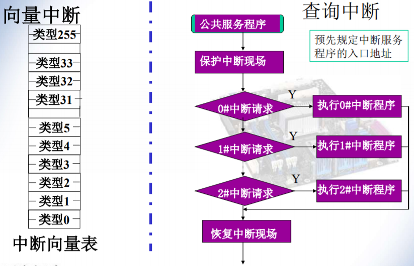

**单级中断**不允许其他程序在中断中再次中断，中断响应不允许嵌套

**多级中断**通常称为**中断嵌套方式**，优先级高的中断可以打断优先级低的中断。类似于高级语言中的函数嵌套。**使用堆栈保存现场**

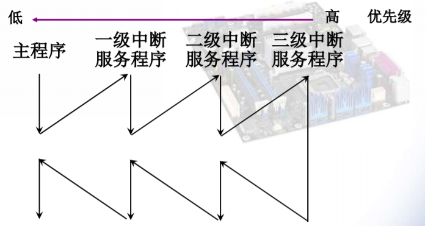

**二维多级中断结构**

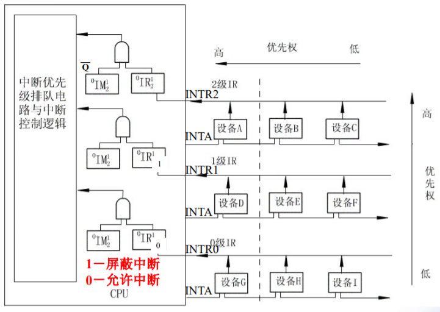

### DMA方式

正常情况下外设从内存获得数据需要通过CPU的中转。而CPU为运算设计，所以单独设计一个用于数据转移的部件**DMA控制器**

基本思想：通过硬件实现主存与IO设备的**直接数据传送**，传送过程中**无需CPU干预**，速度快

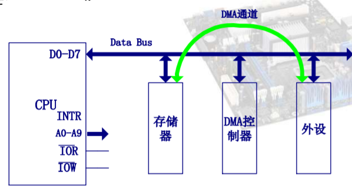

过程：
1. 申请阶段 - DMA控制器收到DMA传送请求后向CPU发出总线请求信号申请占用总线
2. 响应阶段 - CPU响应总线请求，释放总线，回送总线应答信号，表示已经让出总线
3. 数据传送阶段 - DMA控制器收到总线应答信号后占用总线，分别向存储器和外设发出读写控制信号，完成数据传送操作，记录传送字的个数
4. 传送结束阶段 - 规定字数传送完毕后DMA控制器以中断方式或状态位的方式向CPU报告，释放总线，CPU重新占用总线

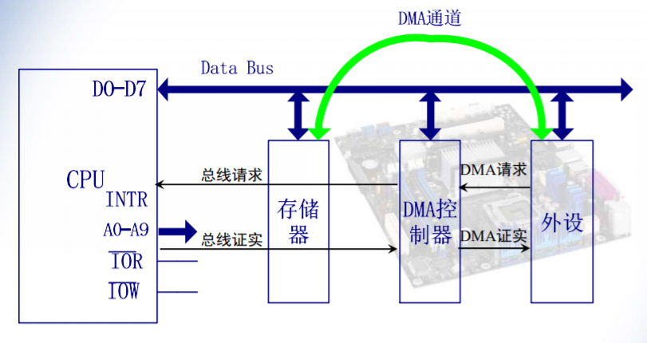

DMA传送方式：
- 成组传送
	- 传送过程中CPU停止访存
	- 控制简单，适用于数据传输率很高的设备
	- 但是CPU无法处理紧急事件，数据块也不能太大

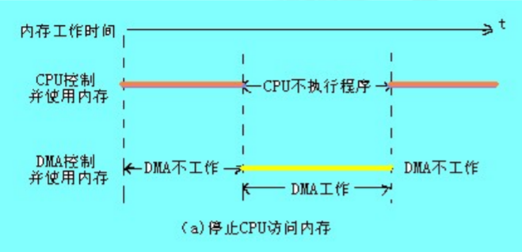

- 周期窃取
	- 每次占用一个CPU周期，只让CPU暂停工作一个周期
	- 但是总线申请和归还存在过多的时间开销

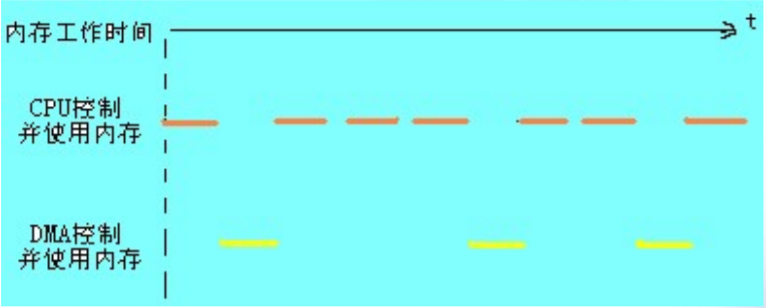

- DMA与CPU交替访存
	- 不需要总线使用权的申请与归还，总线使用权通过C1和C2分时进行(C1+C2=CPU周期)
	- 也称为**透明DMA方式**，CPU不停止主程序也不等待
	- 前提条件：CPU工作周期比内存存取周期长很多

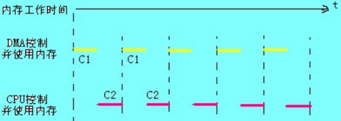

### 通道方式

- **通道**是计算机系统中代替CPU管理外设的独立部件，是一种**能执行有限IO指令集的处理机**
- 一个主机可以连接几个通道，每个通道可以连接多个IO设备
- 通道完成IO操作而不需CPU介入，数据交换结束后向CPU发出中断请求交换数据

通道类型：
- 选择通道
	- 选择一台外设独占整个通道，以成组传送的方式传送数据块
	- 效率高，适合快速设备

- 字节多路通道
	- 简单的共享信道
	- 分时处理，面向中低速字符设备

- 数组多路通道
	- 多个设备以数据块为单位交叉使用通道。结合了以上两种方式
	- 使用多个子通道实现
	- 效率高，但控制复杂

