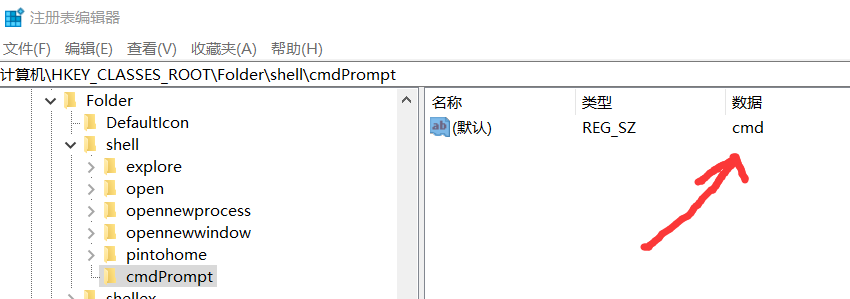

## 基础结构化查询

```sql
select A1, A2, ..., An from r1, r2, ..., rm where P
```

其中A1...An是属性，r1...rm是关系，P是条件

以上语句相当于关系代数的：


**SQL语句的结果也是一个关系**

可以看出：
- from关键字对应的操作是笛卡尔乘积
- where关键字对应的操作是选择
- select关键字对应的操作是投影（支持广义投影

### 关于select部分

可以使用`select *`表示查询所有属性

使用广义投影时，建议配合重命名操作，关键字为`as`，如：

```sql
select ID, name, salary / 12 as monthly_salary from instructor
```

SQL语句的查重是可选的。如果要去重，使用关键字`distinct`。如果不去重，使用关键字`all`。默认不去重

```sql
select distinct name from instructor
select all name from instructor
```

select语句可以使用常量，如`select attr1, 1, '123', null from table_name;`

### 关于where部分

可以使用的条件包括：
- `>, <, >=, <=, =`

可以使用的关键字：
- `and/or/not`拼接条件
- `between...and...`指定范围，如`where salary between 100 and 200`

支持元组比较：`where (name, salary) = ('Tom', 1000)`

### 关于from部分

因为from代表了笛卡尔乘积，所以会非常占用空间。通常不直接使用笛卡尔乘积，可以和where配合使用，变成连接操作

例：

```sql
select name, course_id from instructor, teaches where instructor.ID = teaches.ID
```

以上便使用了内连接操作

### 重命名

在select和from部分都可以重命名：

```sql
select salary / 12 as monthly_salary
from instructor as T, instructor as S
where T.salary > S.salary
```

可以看出同一个关系可以拥有多个**别名Alias**。关键字`as`其实可以省略，比如可以直接写`instructor T`

### 字符串操作

匹配时可以模糊匹配，支持下面两个元字符：
- `%` - 匹配任意子串
- `_` - 匹配任意字符

在where后面可以使用`like`关键字模糊匹配，如搜索含有`dar`的字符串：

```sql
select name from instructor where name like '%dar%'
```

如果要匹配元字符，则需要转义，比如需要搜索以`main%`开头的字符串：

```sql
select name from T where name like 'main\%' escape '\'
```

支持的字符串操作（略）：
- `||` - 字符串拼接
- 大小写转换
- 求长度
- 取子串
- ...

### 排序

使用关键字`order by`

例：

```sql
select distinct name from T order by name
```

可以使用关键字`desc` & `asc`表示降序与升序。默认升序。例：`order by name desc`

### 集合操作

关键字包括：
- `union` - 并集
- `intersect` - 交集
- `except` - 差

集合操作默认**去重**。如果不想去重，使用`union/intersect/except all`

例：

```sql
(select course_idfrom section where sem= ‘Fall’ and year = 2009)
union
(select course_idfrom section where sem= ‘Spring’ and year = 2010)
```

### 聚集函数

- avg
- min
- max
- sum
- count

例：

```sql
select avg(salary) from T
```

可以使用`count(*)`查询个数（因为*会把所有元组视为1

通常也会配合重命名操作使用

可以使用关键字`group by`来对关系内元组进行分类：

```sql
select dept_name, avg(salary) as avg_salary
from T
where salary > 2000
group by dept_name
```

**要求** - select语句中聚集函数之外的属性必须出现在group by中。反例：

```sql
select dept_name, ID, avg(salary)
from T
group by dept_name
```

以上语句会导致错误，因为ID被聚集了无法表示

关键字`having`可以对聚集的条件进行筛选，例：

```sql
select dept_name, avg(salary)
from T
group by dept_name
having avg(salary) > 1000
```

`having`和`where`的区别：having是对结果（即各个group）的筛选，where是对原数据（即各个tuple）的筛选

### 空值

使用`null`表示

与空值有关的计算都返回null

使用关键字`is null`和`is not null`判断是否是`null`

例：`where salary is null`

关于聚集函数：
- sum如果内容全是null则返回null，否则忽略null
- count(*)不忽略null
- 如果全null，则count(*)返回0，其他聚集函数返回null
- 其他情况忽略null

## 嵌套查询

### 概述

对于查询语句：`select A1, ..., An, from r1, ... rm where P`
- A1...An可以被替换为**返回一个值**的子查询
- r1...rm可以被替换为任意子查询
- P可以被替换为`B <operation>(subquery)`

### where中的子查询

子查询通常是用来：
- 判断是否在另一个集合中
  - 使用关键字`in` & `not in`
  - 支持元组比较
  - 格式：`where (att1, ..., attn) in (subquery)`
- 集合比较
  - 使用关键字`some` & `all`
  - 比如：`where salary > some(select salary from T)`
  - 针对上例，只要大于其中的1个就判断为真
  - 操作符可以是`<, <=, >, >=, =, !=`
  - 
  - 类似地，可以使用关键字`all`，如`where salary > all(subquery)`
- 判空
  - 使用`exists` & `not exists`
  - 判断子查询是否为空
  - 格式：`where exists(subquery)`
- 判重
  - 使用`unique`
  - 判断子查询中是否有重复元组
  - 格式：`where unique(subquery)`

### from中的子查询

子查询也可以使用`as`命名，例：

```sql
select dept_name, avg_salary from(
  select dept_name, avg(salary)
  from instructor
  group by dept_name
) as dept_avg(dept_name, avg_salary)
where avg_salary > 42000
```

### select中的子查询

标量子查询(scalar subquery) - 结果只有一个元组的查询

select子查询必须是标量子查询。如果查询结果多于一个则报错runtime error

例：

```sql
select dept_name, (
  select count(*) from instructor
  where department.dept_name = instructor.dept_name
)as num_instructors from department;
```

主查询每执行一步，子查询都要执行一次

### 使用with生成临时关系

临时关系仅在一个查询中生效，例：

```sql
with max_budget(value) as (
  select max(budget) from department
) select department.name
from department, max_budget
where department.budget = max_budget.value;
```

可以生成多个临时关系：

```sql
with dept _total (dept_name, value) as (
  select dept_name, sum(salary)
  from instructor
  group by dept_name
), dept_total_avg(value) as (
  select avg(value)
  from dept_total
)
select dept_name
from dept_total, dept_total_avg
where dept_total.value > dept_total_avg.value;
```

### 相关子查询与无关子查询

相关子查询 - 子查询内部需要用到主查询中定义的东西

无关子查询 - 可以忽略主查询直接执行的子查询

处理无关子查询时，先进行子查询，然后进行主查询

处理相关子查询时，因为需要用到主查询的数据，所以主查询每查询一个元组，子查询需要查询一次。所以相关子查询会执行若干遍

### 查询总语法



## DDL

Data Definition Language

### 新建表

```sql
create table table_name(
  A1 D1, A2 D2, ..., An Dn,
  (integrity_constrant1),
  (integrity_constrant2),
  ...
  (integrity_constrantk),
);
```

A1...An是属性名，D1...Dn是属性的数据类型

完整性约束包括：
- `not null`非空
- `primary key(Am, ..., An)`设置主键
- `Foreign Key(Am, ..., An) reference table table_name on delete restrict/cascade/set NULL`设置外键。可选级联删除或置空
- `check(P)`设置一个check条件

例：

```sql
create table takes(
  ID varchar(5),
  course_id varchar(8),
  sec_id varchar(8),
  semester varchar(6),
  year numeric(4,0),
  grade varchar(2),
  primary key (ID, course_id, sec_id, semester, year),
  foreign key (ID) references student,
  foreign key (course_id, sec_id, semester, year) references section
);
```

常见数据类型：
- `char(n)` - 定长字符串
- `varchar(n)` - 边长字符串，最大长度n
- `int` - 整数，范围依赖机器
- `smallint` - 小范围整数，范围依赖机器
- `numeric(p, d)` - 定点数，小数点左边p位，右边d位
- `real` - 浮点数，范围依赖机器
- `double precision` - 双精度浮点数，范围依赖机器

### 删除表

```sql
drop table table_name;
```

### 修改表

添加属性

```sql
alter table table_name add A D;
```

## DML

Data Modification Language

### Deletion

```sql
delete from table_name where P
```

### Insertion

```sql
insert into table_name(att1, att2, ..., attn) values (value1, value2, ..., valuen);
```

可以把查询的结果给insert

```sql
insert into table_name select ...
```

### update

```sql
update table_name
set att1 = value1
where P
```

使用`case`实现条件更新

```sql
update table_name
set attr = case
when statement1 then value1
else value2
end
```

## 索引Index

创建索引：

```sql
create index index_name on table_name(attrs);

create unique index index_name on table_name(attrs);

drop index index_name;
```

