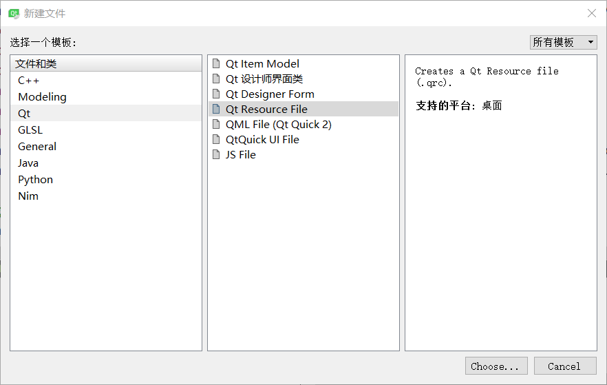
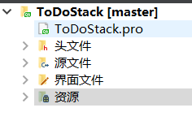

## DFA的形式定义

DFA是一个五元组```M=(Q, T, δ, q0, F)```

- Q 有限状态集合
- T 有限输入字母表
- δ 状态转移函数
- q0 初始状态
- F 终止状态集合

状态转移函数格式

```
δ(状态, 输入字母表) = 新状态
δ(q0, 0) = q1
```

### 状态转移图



- 终止状态使用两个圈表示
- 起始状态使用一个无源箭头指出

### 状态转移表


- 终止状态使用星号标出
- 起始状态使用箭头指出

### 拓展转移函数以适合于输入字符串

定义```δ'```函数如下

```
δ'(状态1, 字符串ω+字符a) = δ(δ'(状态1, 字符串ω), 字符a)
δ'(q, ωa) = δ(δ'(q, ω), a)
δ'(q, ε) = q
```

被DFA接收的字符串：输入结束之后能够使DFA状态到达终止状态的串

## 格局

使用一个二元组```(q, ω)```表示自动机的一个瞬时状态

- 初始格局 (q0, ω)
- 终止格局 (q1, ε)

格局之间使用符号```|-```连接

状态转移举例

```
(q0, 0010) |- (q1, 010) |- (q2, 10) |- (q2, 0) |- (q0, ε)
```

## 不确定的有限自动机(NFA)

修改DFA模型，同一个状态接收同一个输入可以到达不同的新状态

NFA五元组：```M=(Q, T, δ, q0, F)```

其中状态转移函数δ的等号右边为一个集合，如```δ(p, 0) = {p, q}```

## NFA与DFA的转换

DFA本就是NFA的特例。下面介绍NFA转换成DFA的方法

**子集构造法**

构造原始NFA中状态的子集，作为生成的DFA中的状态

举例：已知如下NFA

```
δ(p, 0) = {q}
δ(p, 1) = ∅
δ(q, 0) = {q}
δ(q, 1) = {q, r}
δ(r, 0) = ∅
δ(r, 1) = ∅
```

转换DFA的思想就是把新状态集合{q, r}作为DFA的状态，意为**状态q或者状态r**。如果**状态q或者状态r**接收字符0，得到的新状态应该是**状态q接收字符0得到的状态集合**和**状态r接收字符0得到的状态集合**的并集，即得到如下转移函数

```
δ({q, r}, 0) = {q}
δ({q, r}, 1) = {q, r}
```

如果状态集合中包含终止符号，那么这个状态集合在DFA中表示的状态是DFA的终止符号

例题：



## 带空转移的有限自动机

允许无输入时的状态转移

带空转移的不确定有限自动机表示为ε-NFA，是一个五元组```A=(Q, T, δ, q0, F)```，与NFA的区别是转换函数里面可以接受空串

### ε-闭包

ε-闭包，记为 ε-CLOSURE 或 ECLOSE

某个状态q的ε-闭包定义为此状态q仅接受空串能够到达的状态集合（**注意包含状态q自身**）

## ε-NFA转换为NFA

NFA本就是ε-NFA的特例。下面介绍ε-NFA转换为NFA的方法。也就是**消空转移**

思路：假如从状态a接收某字符x转移到状态b，而状态b接收空串可以到达状态c，那么消空转移生成的NFA中状态a接收字符x可以到达状态b和状态c。即状态a接收字符x可以到达状态b的ε-闭包。

例题：


解法举例：假设原本ε-NFA的转移函数为δ，令生成的NFA的转移函数为δ1

```
δ1(q0, 0) = ε-CLOSURE(δ(q0, 0))
```

### 关于终止符号集合

已知ε-NFA的终止符号集合为F，初始状态为q0，NFA中的终止符号集合F1定义如下

```
if q0能够通过空转移到达F then F1 = F + q0
else F1 = F
```

也就是说除了初始状态，不需要考虑其他状态可能变成终止符号的情况。

## 正则集和正则式

运算符号按照优先级从高到低依次为

- 星号```*``` 闭包
- 点号```·``` 连接
- 加号```+``` 联合

### 正则式的性质

交换律与结合律

```
(a + b) + c = a + (b + c)
(ab)c = a(bc)
a + b = b + a
```

等幂律

```
a + a = a
```

分配率

```
a(b + c) = ab + ac
(a + b)c = ac + bc
```

幺元与零元

```
a + ∅ = ∅ + a = a
a∅ = ∅a = ∅
aε = εa = a
```

闭包相关运算

```
(a*)* = a*
a* = a + a*
```

## 从右线性文法导出正则式

令大写字母为非终结符，小写字母为终结符或终结符串，S为起始非终结符

如果一个非终结符的正则式是```A = aA + b```，则A的解为```A=a*b```

例题：已知右线性文法生成式如下，求其正则式

```
S -> aA, S -> bB, S -> b
A -> bA, A -> ε
B -> bS
```

解：得到如下联立方程

```
S = aA + bB + b (1)
A = bA + ε (2)
B = bS (3)
```

解方程组即可求得S的正则式

解(2)式得```A = b*```，把此结果和(3)式代入(1)式得到

```
S = ab* + bbS + b
  = bbS + (ab* + b)
```

解得```S = (bb)*(ab* + b)```

## 正则表达式与有限自动机

### 由DFA构造正则表达式

状态消去法


如果最后构造出了如下状态


则对应的正则式为```(R + SU*T)*SU*```

例题：


### 正则表达式构造等价ε-NFA

规则如下图


例题：


## 右线性文法生成等价NFA

右线性文法生成式格式为```A -> aB```，可以理解为**B的前面加上a等价于A**，所以**A消去串首的a可以得到B**，那么NFA中存在状态转移函数```δ(A, a) = B```。如果存在生成式```A -> a```，那么存在转移函数```δ(A, a) = C```，C为一个新的状态而且是终止状态

例题：已知右线性文法```G = ({S, B}, {a, b}, P, S)```，其中生成式P如下

```
S -> aB
B -> aB | bS | a
```

构造等价NFA，则

```
S -> aB => δ(S, a) = {B}
B -> aB => δ(B, a) = {B}
B -> bS => δ(B, b) = {S}
B -> a => δ(B, a) = {H}
```

其中H为新增的状态且为终止状态

## 有限自动机构造等价右线性文法

和右线性文法构造NFA相反，由```δ(A, a) = B```可以得到```A -> aB```，如果其中B是终止符号，还可以得到```A -> a```。

## DFA的化简（极小化）

状态等价的概念：如果两个状态接收相同的串都能够在最后到达同一终止状态，则两状态等价

化简的目标：若某个DFA中不存在互为等价状态的状态和不可达状态，则称此DFA是最小化的

最小化算法：**填表法**

思路：构造下三角表格，把非等价状态在图中用```X```标出，最后得到等价关系

例题如图：


注意构造表格的时候横坐标是第1个状态到第n-1个状态，纵坐标是第n个状态到第2个状态

表格填充过程：

1. 终态和非终态一定不等价
2. 区分终态与终态是否等价，非终态与非终态是否等价

最后表格中没有```X```的单元格的横坐标与纵坐标是等价的

注意先删除不可达状态

## 正则语言的泵浦(Pumping)引理

所有正则语言都满足的性质：pumping性质

定理：设L是正则集，存在常数n，对字符串```ω ∈ L```且```|ω| >= n```，则ω可以写成ω1ω0ω2，其中```|ω1ω0| <= n, |ω0| > 0```，且对所有的```i >= 0```有```ω1ω0^iω2 ∈ L```

定理的物理意义：因为正则集一定可以转换为DFA。假设DFA中的状态数为n，如果某个串ω的长度大于n，那么这个串必定经过了DFA中某个相同的状态至少两次（鸽巢原理），那么这个DFA中就存在一个循环。之前的串ω就可以被分解为三个部分ω1、ω0和ω2，其中ω0就是循环体。针对这个循环体，理论上说循环任意次数，DFA都能够接收这个串。也就是对任意非负整数i，有```ω1ω0^iω2 ∈ L```。显然其中ω0长度必须大于0，ω1ω0的长度应该小于n。

**泵浦引理用来证明某个语言不是正则语言**

证明方法：反证法。假设这个语言是正则语言，使用泵浦引理。如果发现了某个i使循环体循环i次之后得到的串不满足语言要求，则这个语言不是正则语言（因为正则语言循环体循环任意次都满足要求）

通常需要假设一个n作为**泵长**，即DFA中的状态数量，然后根据语言的条件和n生成一个长度大于n的串，分类讨论其中的循环体ω0只能为某种格式，再证明这种格式的循环体循环i次之后不满足原语言的条件。

例题：证明```L = {a^n b^n | n为正整数}```不是正则集

证明：若L是正则集，假设泵长为k，那么串```ω = a^k b^k```为此正则集中一个串。把ω拆分为三部分ω1ω0ω2，其中ω0为循环体，显然ω0不能只包含a或者只包含b，因为这样的话ω0的任意次方会导致新生成的串中a与b数量不同，不满足语言条件。所以ω0同时包含a和b。因为ω0长度大于0，所以ω0最短应为串ω的第n位与第n+1位，也就是```ω0 = ab```，此时```ω1 = a^(n-1)```，```|ω1ω0| = n + 1 > n```，不满足条件。事实上ω0可以为```a^x b^x```其中x小于等于n，这样构造出的ω1ω0的长度还是大于n，所以在一个长度大于n的串中找不到这样一个循环体ω0，不满足泵浦引理，所以原语言不是正则语言。

## 右线性语言的封闭性

右线性语言及其**并、积、闭包**是正则集

## 正则语言的几个判定性质

### 判定正则语言是否为空

无法到达终止状态的语言视为空语言（即不接受任何串、任何串都无法到达终态）

算法复杂度O(n^2)

### 判定正则语言是否包含特定的字符串

- 如果用DFA表示正则语言
	- 如果DFA处理此串能够到达终态则包含此串
	- 假设串长为n，算法复杂度O(n)
- 如果用NFA或ε-NFA表示正则语言
	- 可以转换为DFA再判断
	- 也可以直接判定是否能够到达终态
	- 算法复杂度O(n2^s)，n为串长，s为自动机状态数量
- 如果用正则表达式表示正则语言
	- 转换为等价的ε-NFA再判断

### 判定两个正则语言是否相等

构造DFA判断两个DFA是否相等

## 有输出的有限自动机

- 米兰机 输入和状态影响输出
- 摩尔机 状态影响输出，与输入无关

有输出的自动机功能更多，可以减少状态

### 米兰机

输出由输入和当前状态决定

米兰机的形式定义：```M = (Q, T, R, δ, g, q0)```，其中

- Q 有限状态集
- T 有限输入字母表
- R 有限输出字母表
- δ 转换函数
- g 输出函数
- q0 初始状态

δ函数和g函数共同描述了米兰机的工作状况如：

- δ(p, a) = q
- g(p, a) = b

这样两个式子可以得到下图


在状态转移箭头上面的```a/b```表示输入a输出b

米兰机例题：


### 摩尔机

输出与到达的状态有关

形式定义：```M = (Q, T, R, δ, g, q0)```，形式和米兰机一样，但是输出函数的参数只有当前状态。

比如这样的输出函数和状态转移函数：

- δ(q, a) = p
- g(p) = b2

意为状态q接收输入a可以转移到状态p，转移到状态p时输出字符b2。图形表示如下：


摩尔机例题：


### 已知摩尔机构造等价米兰机

可以看到米兰机的输出在状态转移箭头上，摩尔机的输出在状态中

想要根据摩尔机构造等价米兰机，只需要把目标状态中的输出放到状态转移箭头上面即可

例题：


### 已知米兰机构造摩尔机（略）

