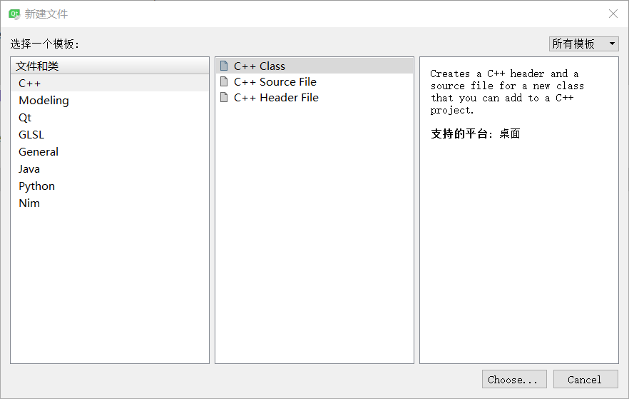

## 符号表

符号表是一张**动态表**，在编译期间不断增加或减少（因为可能有临时变量的产生

- 多遍编译程序
  - 符号表在词法分析阶段创建
  - 语法分析阶段不使用符号表
  - 在语义分析和代码生成阶段被使用
- 一遍编译程序
  - 语法分析程序是核心模块
  - 语句被识别出来的时候放入符号表

## 类型等价

### 类型表达式

- 基本类型
  - 如int/char/real/bool这样的内部没有结构的类型
- 类型构造器
  - 数组`array[count/range, type]`，例：
    - `array[10, int]`
    - `array[1..9, bool]`
  - 笛卡尔积`M*N`
  - 记录（结构体）`record(name*type)`，例：
    - `record(i*int)`
    - `record((i*int)*(c*array[10, char]))`
  - 指针`pointer(type)`
  - 函数`type -> returnType`，例：
    - `pointer(int) -> record(i*int)`

类型表达式的图形表示：

### 结构等价与名字等价

- 结构等价 - 完全展开类型表达式，判断二者是否等价（包括record中的name
- 名字等价 - 不展开，仅判断名字

C语言中：对于union和struct使用名字等价（因为二者可以嵌套定义，防止无限展开），其他使用结构等价

## 类型检查（略

