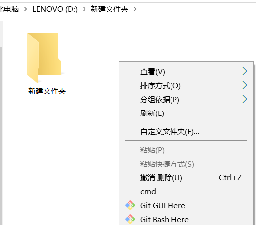

神经网络语言模型

## 动机

n-gram模型的局限：

- 数据稀疏
	- 理论上n越高越好，但由于数据稀疏，n到达一定值后n越大性能越差。有没有高阶性能更好的模型？
	- n-gram使用平滑来解决数据稀疏的问题。有没有不需要平滑的模型？
- 忽略词义
	- 如果两个词在某些程度上相似，那么在一些特定场景下它们的概率也应该相似。n-gram基于符号来表示词语，无法表示词义

问题：如何表示词义？

## 表示词义

**You shall know a word by the company it keeps**

从一个词的相邻词来推测词语的意思。使用 **同现矩阵(cooccurrence matrix)**

### 基于窗口的同现矩阵

- 窗口长度通常选取5-10
- 对称矩阵（即允许词语逆序出现）

举例：当前有三个句子：

```
I like deep learning.
I like NLP.
I enjoy flying.
```

通过这三个句子训练得到的同现矩阵：


简单同现向量(simple cooccurrence vectors)的问题：
- 随着词量的上升，体积集聚变大
- 维度高，需要大容量存储
- 模型不够稳健

解决方案：低维度向量(Low dimensional vectors)
- 使用固定的低纬度存储较为重要的信息
- 维度通常选为25-1000

如何减少维度？

### 同现矩阵的奇异值分解(SVD, Singular Value Decomposition)（略

使用 **最小二乘法(least squares)** 获得原矩阵X的秩为k的最优近似矩阵X^


这样一个单词就可以使用一个k阶向量来表示

### SVD的问题

- 计算复杂度高
- 难以添加新的训练数据
- 和其他深度学习模型处于不同的体系

## NNLM模型


### 举例 - bigram

假设语料库为以下三个句子：
- the dog saw a cat
- the dog chased the cat
- the cat climbed a tree

我们得到了一个大小为8的单词表：
- a
- cat
- chased
- climbed
- dog
- saw
- the
- tree

神经网络结构：八个输入神经元（输入前一个词的向量）和八个输出神经元（输出当前词的向量）。假设运算过程中需要三个中间神经元（在隐藏层hidden layer），则有两个参数：8乘3的输入矩阵WI和3乘8的输出矩阵WO。这两个矩阵的初值为随机数，如：



假设分析到`cat climbed`这两个词，输入cat，期望的输出为climbed。按照词表，**输入向量**(input vector)X为`[01000000]`，**期望输出向量**(target vector)为`[00010000]`

实际计算输出向量为：`X * WI * WO = [0.100934, -0.309331, -0.122361, -0.151399, 0.143463, -0.051262, -0.079686, 0.112928]`，因为输出的向量应该表示为概率，所以**归一化**得到结果`[0.143073, 0.094925, 0.114441, 0.111166, 0.149289, 0.122874, 0.119431, 0.144800]`

通过对比上述输出和期望输出，两个向量相减可以得到一个 **错误向量**(error vector)，通过神经网络**反向传播算法**(backpropagation)即可修正WI和WO矩阵

**延伸**：如果是trigram，则输入两个单词，即16个神经元，只需要更改矩阵维度即可。如下图的4-gram NNLM图：


其实只需要把输入矩阵WI的维度改成24乘3即可

### 概述

从上述过程我们可以发现，一旦数据训练完毕，如果我们需要获得一个词的向量表示，只需要输入一个`[000...010...00]`这样的向量就够了（其中1的位置为这个词在词表中的位置）。而且这个被训练出来的**词向量**是和**上下文有关**的，所以**词向量可以反映语义**。

NNLM的优点：
- 不需要数据平滑
  - 因为词向量的 **语义相关性**，即使某词串没有出现过，只要语料库中存在同义词的词串，目标词串的概率也不为0。故不需要平滑
- 高阶可计算性
  - 使用矩阵计算。也可以通过矩阵算术优化
  - 词向量长度通常大于1e5

实验表明比基于符号的语言模型更好

### 训练过程举例 - trigram

图为trigram的NNLM训练过程


### NNLM模型结构

**词表映射**

查表映射C：将词表V中的每一个词映射为一个m维向量。对于任意词wi，得到向量C(wi)，简写为C(i)


**神经网络模型**

目标：训练一个映射g来建模n元语言模型。即：


其中ω为神经网络参数

