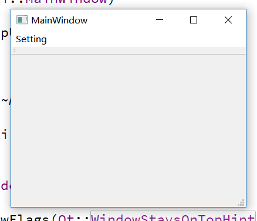

词性标注

## 概述

词性(POS: Part of Speech)：
- 名词noun
- 动词verb
- 形容词adjective
- 副词adverb
- ...

研究词性的目的 - 有助于其他NLP任务

词性标注中的**词性歧义** - 一个词可以有多个词性

影响词性标注的因素：
- 词本身
  - 词性歧义
  - 专有名词有特定词性，如：天安门
- 上下文
  - 两个定冠词连续出现的情况很少
  - ...

## 词性标注方法

- 基于规则(Rule-Based) - 人类专家总结的规则
- 基于学习(Learning-Based) - 从人类专家总结的语料库中学习
  - 统计模型
    - 隐马尔可夫模型HMM
    - 条件随机域模型CRF
    - 神经网络NN
  - 规则学习
    - 基于转换的学习TBL

本章重点为 **隐马尔可夫模型**

## 词性标注的学习过程

给定训练数据 - 很多**句子O与词性序列Q的二元组**

目标：训练一个映射函数f(O)来完成句子到词性序列的映射

标注过程：
- 输入
  - 句子或词序列（中文为分好词的句子
- 输出
  - 每个词的词性

## 如何进行词性标注

### 目标

为O寻找最优的Q使得`P(Q|O)`最大

根据**贝叶斯法则**，`P(Q|O) = P(O|Q)P(Q)/P(O)`。其中P(O)可忽略，则原问题可转化为求`P(O|Q)P(Q)`的问题

### 模型的数学分解

其中`P(O|Q)`可以被拆解为:

而`P(Q)`可以使用语言模型计算，如bigram下的`P(Q)`:

### 模型的图分解

在上述数学分解后，可以使用图模型来表示词性标注的任务。

显然`P(Q)`可以使用语言模型的马尔科夫链解决，`P(O|Q)`应该如何表示？

## 隐马尔可夫模型

隐马尔可夫模型的图表示：

上面的状态被称为 **隐状态**

### 两个重要假设

- 马尔科夫假设 - 当前状态仅由之前有限个状态决定（通常为1
  - 
- 输出独立性假设 - 当前输出o仅由当前状态决定
  - 

### 模型参数

| 参数 | 解释 |
| --- | --- |
| `Q = [q1, q2, ..., qn]` | n个**状态** |
| `A = [[a11, a12, ..., a1n]...[an1, an2, ..., ann]]` | n*n状态转移矩阵 |
| `O = [o1, o2, ..., ot]` | t个**观测**（输出） |
| `B = {bi(ot)}` | **发射概率矩阵**，每个元素bi(ot)表示状态i发射（输出）ot的概率 |
| `q0 & qf` | **起始状态和终止状态的概率，不和任何观测关联** |

### 使用隐马尔可夫模型需要解决的问题

- 估算问题
  - 给定观测序列与模型参数，如何计算此观测序列在各个情况下的出现概率
- 解码问题
  - 给定观测序列和模型参数，如何计算最优状态序列（即什么状态序列能够最大概率产生此观测序列
- 参数学习
  - 如何学习模型参数使输出准确

## 举例 - Ice Cream Problem

### 概述

假设你是一个气象学家。你找不到了某年夏天某城市的气象数据，但是找到了一个当年夏天当地人的日记本，上面记录了每天吃了多少冰淇淋。推算：这个夏天有多热

数据限定：
- 每天吃冰淇淋的数量为1、2、3三种情况
- 气候可能的取值只有Hot和Cold两种情况

模型参数：使用图的方式给出。图如下：

可以看出模型参数：
- 一共三个状态，分别是起始状态start(0)，热天状态HOT(1)和冷天状态COLD(2)
- 状态间的转移概率已在图上标注（省略了小数点前面的0）
- 三种观测（输出），即当天吃冰淇淋的数量，范围为1、2、3
- 发射概率矩阵B，即根据天气决定吃冰淇淋数量的矩阵（省略了小数点前面的0）
- 起止状态概率，此处起始状态概率为1，无终止状态

### 解决估算问题

计算观测Ice Cream序列为`[3, 1, 3]`的概率有多大

#### 方案1 - 无脑枚举

天气序列仅有9种情况(H for Hot, C for Cold)：
- HHH
- HHC
- HCH
- HCC
- ...

所以列举所有天气情况`P(313) = P(313, HHH) + P(313, HHC) + ...`

根据 **输出独立性假设**，`P(313|HCC) = P(3|H)P(1|C)P(3|C)`

根据 **马尔科夫假设**，`P(HCC) = P(H|start)P(C|H)P(C|C)`

所以`P(313, HCC) = P(H|start)P(C|H)P(C|C)P(3|H)P(1|C)P(3|C)`

最后算出所有情况，得到`P(313)`

缺陷：计算复杂度大，而且显然存在被重复计算的**公共子问题**

#### 方案2 - 前向算法(the Forward algorithm)

前向算法是一种 **动态规划**(Dynamic programming algorithm)算法，使用一个表格存储中间值

基本思路 - 通过叠加所有可能**隐状态序列**，计算观测序列的似然。使用 **格栅**(trellises/lattices)记录部分结果

前向算法的目标是计算某观测序列出现的概率，问题被分解为不同终态下某观测序列出现概率之和。不同终态时观测序列出现概率：

>上式中的λ为某些可能的条件。可忽略

定义 **前向变量**αt(j)表示前t个时刻的观测序列且在t时刻位于状态j的概率。由于**观测序列已知**，所以观测序列仅使用长度t表示即可。前向变量可以保存在格栅的`[j, t]`位置上。即：

前向递归过程：
- 初始化 - 观测序列长度为1且当前状态为j的前向变量
  - 
  - 即**从初态转移到状态j的概率**乘**状态j发射第一个观测的概率**
- 递归 - 利用观测序列长度为t-1的前向变量计算观测序列长度为t的前向变量
  - 
  - 即【**观测序列长度为t-1且状态为i的概率**乘**状态转移概率**乘**状态j发射观测t的概率**】之和
- 终止 - 观测序列为**完整**序列且状态为终态（**终态无观测**
  - 
  - 即【**观测序列完整的前向变量**乘**状态转移概率**】之和

#### 方案3 - 后向算法(backward algorithm)

动态规划。定义**后向变量**βt(i)表示在t时刻位于状态i时得到t时刻后的观测的概率

- 初始化
  - 
- 递归
  - 
- 终止
  - 

#### 方案4 - 前向算法与后向算法相结合

结论：

### 解决解码问题

已知Ice Cream观测序列313和模型参数，找到最有可能的天气状态序列

#### 方案1 - 基本思路

计算所有的`P(XXX|313)`然后选出最大值。

同样，计算量大，有重复公共子问题

#### 方案2 - the Viterbi algorithm

当然，也是动态规划，类似于前向算法。使用格栅。

定义vt(j)表示**t时刻到达状态j的最可能的路径对应的概率**，即：

定义**最可能**：**一步贪心策略**，如下图：

- 从A到D概率为0.6*0.5=0.3
- 从C到D概率为0.4*0.8=0.32

则视为C是最可能到D的状态

所以Viterbi算法的前向递归过程：

- 初始化 - 1时刻到达状态j且发射指定观测的概率
  - 
  - 即**状态转移概率**乘**指定状态发射指定观测的概率**
- 递归 - t时刻到达状态j且发射指定观测的概率
  - 
  - 即【**t-1时刻到达某一状态i且发射指定观测的概率**乘**状态转移概率**乘**状态j发射指定观测的概率**】的最大值
- 终止 - 最优路径对应的概率
  - 
  - 即【**最后时刻到达某一状态i且发射指定观测的概率**乘**状态转移概率**】的最大值

计算的过程中**记得保存路径**

### 解决参数学习问题

- 有监督学习
  - 基于已知的正确答案进行估计
- 无监督学习
  - 基于无正确答案的数据进行估计

#### 前向-后向算法(Baum-Welch algorithm or Forward-Backward algorithm)

基本思想 - 极大似然估计

是一种无监督学习算法

- 不知道模型参数，但是可以通过某个参数计算观测的似然概率
- 通过计算，可以看到哪些概率转移和观测发射最可能被使用
- 增大它们的概率

过程：
- 初始化 - 给模型参数初值（可以随机
- 迭代
  - 采用当前模型参数估计参数期望
  - 使用极大似然估计法更新模型参数
- 收敛 - 重复迭代过程直至模型参数收敛到最优值

## 隐马尔可夫模型HMM应用于词性标注

给定句子W，求解最优词性序列T

从概率模型的角度：考察所有可能的tag序列，从中选取使`P(T|W)`最大的T

**和HMM的关联**：不同tag即为HMM中的不同状态。根据语料库可以习得tag之间的转移概率以及tag发射某个word的概率

以上两个概率都可以使用n-gram模型求得

## 其他序列标注任务

- 中文分词
- 命名实体识别(NER: Named Entity Recognition)

