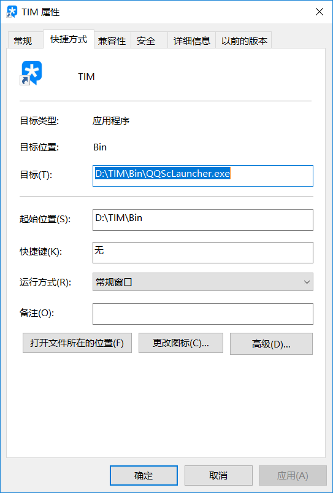
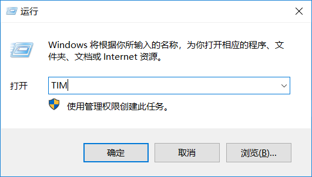

**文本分类** - 把文本划分到特定的类别或主题下，如政治、经济、体育等

使用机器学习，得到一个**从文档到文档类别的映射函数**

显然是一个**有监督学习**过程，需要人为提供处理过的训练数据

## 流程

1. 预处理
2. 选择文本表示模型（数学模型
3. 选择文本分类模型（计算模型
4. 评价

## 预处理

根据具体的文本形式及任务而定。常见的预处理：
- 去除html标签
- 去除**停用词**(Stop-words)
  - 高频词往往携带较少信息
  - 如:[a, an, the, this, for, at, ...]
- 获得**词干**(Word-stemming)
  - 取消词的后缀或其他变形，合并意义相同的词
  - 如:[walk, walking, walker, ...]

## 文本表示 - 向量空间模型VSM

Vector Space Model

一种常用的文本表示方法

### 概述

思想：
- 把文本表示为由词条构成的向量
  - 其实不仅仅是文本。此模型可以广泛用于其他数据对象
- 假设词条之间统计独立（并不考虑词出现的顺序和位置）
  - 即文本是由词构成的集合(set)，也称为词袋(bag-of-words)

### 模型参数

**文档-词条矩阵**`A = {a(i, k)}`，其中`a(i, k)`表示词`k`在文档`i`中的权重

`a(i, k)`的性质：
1. 某个词条在**某个文档**中出现的次数越多，这个词条和此文档的**类别相关性越大**
2. 某个词条在**所有文档**中出现的次数都很多，则这个词条对于文档的**类别区分性**越低

定义如下符号：
- f(i, k) - 词条k在文档i中出现的频次
- n(k) - 词条k在所有文档中出现的总次数，即sum(f(i, k))
- N - 文档集合中的文档个数
- M - 预处理之后文档集合中所有词条的个数

#### 如何表示词的权重

- 布尔权重
  - 如果词条k在文档i中出现过，则权值a(i, k)为1，否则为0
- 词条频次权重(TF: term frequency weighting)
  - a(i, k) = f(i, k)
  - 体现了a(i, k)的性质1
- 逆文档频次(IDF: inverse document frequency)
  - 正相关于包含此词条的文档个数
  - 即a(i, k)正相关于1/n(k)
  - 即**包含此词条的文档越多，此词条越没用**
  - 体现了a(i, k)的性质2
- TF-IDF权重 - 同时考虑词条频次和逆文档频次
  - 
  - 满足a(i, k)的两个性质
    - 正比于单个文档出现频次
    - 反比于包含词条的文档个数
- TF-IDF权重的一些变形（略
  - TFC(term frequency component)权重 - 对文档长度正则化
  - LTC权重 - 减少绝对频次差异带来的影响
  - ...
- 熵权重(Entropy weighting)
  - 词条k的信息熵：
  - 
  - 如果所有文档中分布相等，则熵为-1。如果只在一个文档中出现，则熵为0
  - 权重：
  - 

## 文本分类模型

- Instance-based methods
  - Nearest neighbor最近邻模型
- Probabilistic models概率模型
  - Naive Bayes朴素贝叶斯模型
  - Maximum Entropy Model最大熵模型
  - Neural Network
- Linear Models线性模型
  - Linear Regression/Perception线性回归
  - Support Vector Machine
- Decision Models决策模型
  - Decision Trees决策树
  - Random Forest
- ...

### 最近邻模型&分类器

#### 概述

Nearest neighbor classifier，也可以叫1-近邻模型/分类器

思想：把点归类到最近的集合（穷举

图形表示：

#### 平滑

问题：**过度拟合** - 忠实于每一个训练数据，包括噪声和错误数据

解决过度拟合：使用k-近邻取代1-近邻以**平滑分类边界**

k-nearest neightbor classifier(kNN): 找到k个最近的点，这些点在哪个集合最多，新的点就归类到哪个集合

k也被称为**平滑(smoothing)参数**或**正则化(regularization)**参数

平滑效果：

#### 训练（略

训练k-近邻分类器：执行上述分类过程。略

#### 如何选择参数k

采用**验证数据**(validation data)
- 把训练数据分成两组 - 训练数据+验证数据
- 通过选择不同的k得到不同的kNN分类器
- 应用于验证数据
- 选择最优k

#### 距离测度

如何评定点与点之间的距离，常用距离测度方式：
- 欧氏距离(Euclidean Distance) - 几何常规操作
  - 
  - 使用了平方，视为二阶距离，记为L2
- 曼哈顿距离(Manhattan Distance) - 类似于二进制中的海明距离
  - 
  - 一阶距离，L1
- 切比雪夫距离(Chebyshev Distance)（略
- ...

#### 其他问题

- 如何快速找到最近邻？
  - 使用树结构，减少计算量
  - 剪辑近邻、压缩近邻以减少计算量

#### KNN总结

- 优点Pros
  - 可以描述很复杂的分类边界（因为不是使用参数描述的
  - 训练快速（构建数据结构即可
  - 简单且好用（在computer vision领域常见
  - 模型结果易解释
- 缺点Cons
  - 存储开销大
  - 样本不均衡时会造成影响
  - 参数空间很大时近邻搜索慢
  - 从性能上说不是最好的分类器

### 朴素贝叶斯模型&分类器

Naive Bayes Classifier

#### 假设

条件独立性 - `P(A, B, C, ..., N|X) = P(A|X)P(B|X)...P(N|X)`

#### 思想

求`P(文档类别为X|文档中出现ABC...N)`

使用贝叶斯公式，应求`P(文档中出现ABC...N|文档类别为X)P(文档类别为X)/P(文档中出现ABC...N)`

根据条件独立性假设，应求`P(A|X)P(B|X)...P(N|X)P(X)/(P(A)P(B)...P(N))`

因为无需计算词条在单个文档中的出现频次，所以使用bag of words模型即可

#### 平滑

- 拉普拉斯+1平滑
- ...

#### 总结

- 优点
  - 原理简单
  - 易于处理大规模训练数据（只需要计数+1即可
  - 实际文本分类应用中表现良好
- 缺点
  - 糟糕的条件独立性假设
  - 短语位置无关假设
  - 不能融入较复杂的特征

## 评估指标

- Precision = TP/(TP+FP)
- Recall = TP/(TP+FN)

