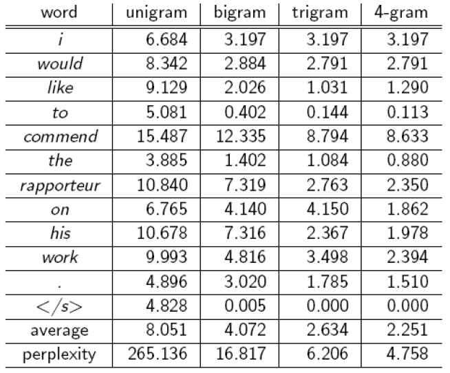

## 概述

基本原则：**一个好的语言模型应该给实际使用的句子打较高的概率**

构建语言模型的两个阶段：
- 模型训练 - 使用training data获得模型参数
- 模型测试 - 使用test data进行评价

- 外部评价extrinsic measure - 比较两个模型优劣
  - 两个模型用于同一个任务
  - 比较准确率
- 内部评价intrinsic measure - 对模型自身进行评价
  - 困惑度PP(Perplexity) - P(W)的几何平均值的倒数

## 困惑度

困惑度PP(Perplexity) - P(W)的几何平均值的倒数，即：

给定的语料，PP越小，所用的LM越好，因为：
- P(W)概率越高，PP越小
- 在预测下一个词时，PP值表示了候选词的平均个数。PP越大，该语言的不可预测性越高

某语料库不同阶n-gram模型的困惑度对比：

不同平滑算法困惑度对比：

## 信息熵

使用概率估算信息熵。假设词串为W，则信息熵H(W):

因此得到信息熵和困惑度的关系：

**H和PP正相关**

