文本聚类问题

## 概述

- 文本分类
  - 使用**有监督**的学习框架
  - 学习时需要人为提供标签
- **文本聚类**
  - 使用**无监督**的学习框架
  - **挖掘数据内部的隐藏模式、类别**

应用：
- 文档分类
- 搜索引擎优化

## 聚类模型

### K-means

思想：
- 首先确定聚类后簇的个数K
- 假设每个簇都有一个**中心点**(centroid)
- 将每个样本点归类到中心点最近的簇中，然后**刷新中心点**
- 直到所有中心点**收敛**

效果图：

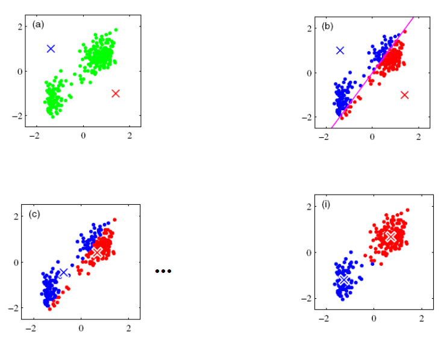

定义**SSE(the Sum of Squred Error)函数**为：

其中μk为簇Ck的中心点。r(n, k)表示点xn是否被划分到了簇Ck，如果是则r(n, k)为1否则为0

显然SEE函数表示了一个划分的质量。一个划分的SEE越小，划分的质量越高

- 初始中心点通常**随机选取**
- 中心点通常取**中位数**
- 算法复杂度O(ndKI)
  - n - 样本点的个数
  - d - 样本特征维度，即每个样本中含有几个变量
  - K - 类的个数
  - I - 迭代次数

弊端：**需要人为预先设定K**，这样簇和簇之间就会存在歧义（如本来两个簇应该是一个簇，或者一个簇该是两个簇

### Hierarchical Clustering层次聚类/分层聚合

输出一个**嵌套的**、层次化的**类别树**(dendrogram)，树状结构记录簇的合并或拆分

#### HAC层次凝聚聚类

HAC: Hierarchical Agglomerative Clustering

层次凝聚聚类，一种很常见的聚类模型

思想：
- 初始每一个点都是一个簇
- 每次合并最近的（最相似的）两个簇
- 直到只剩下一个簇

**相似度矩阵(proximity matrix)**：每个矩阵项都保存了两个簇之间的相似度。下图为五个簇时的相似度矩阵

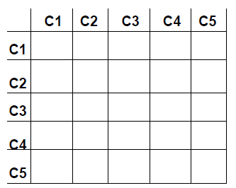

假设合并C2和C5，得到的相似度矩阵：

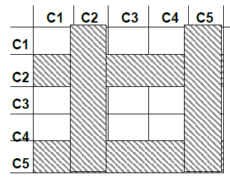

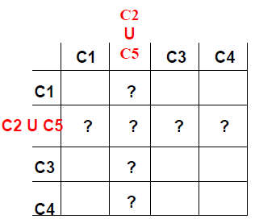

关键：如何评定两个簇的相似度？这也决定了相似度矩阵中行列的合并结果

可选方案：
- min(single linage)
  - 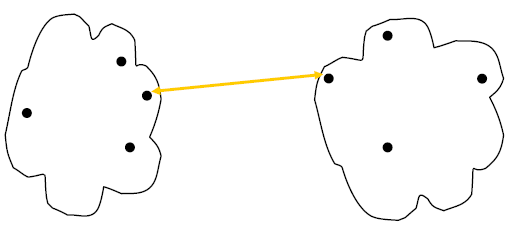
- max(complete linkage)
  - 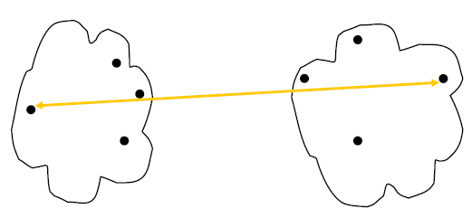
- group average
  - 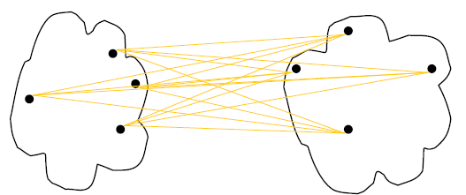
- distance between centroids
  - 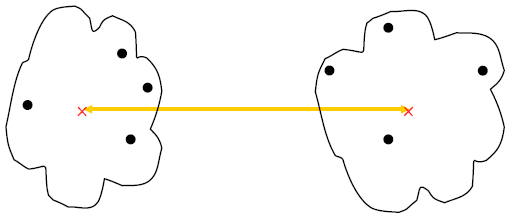
- ward's method
- ...

效果图：

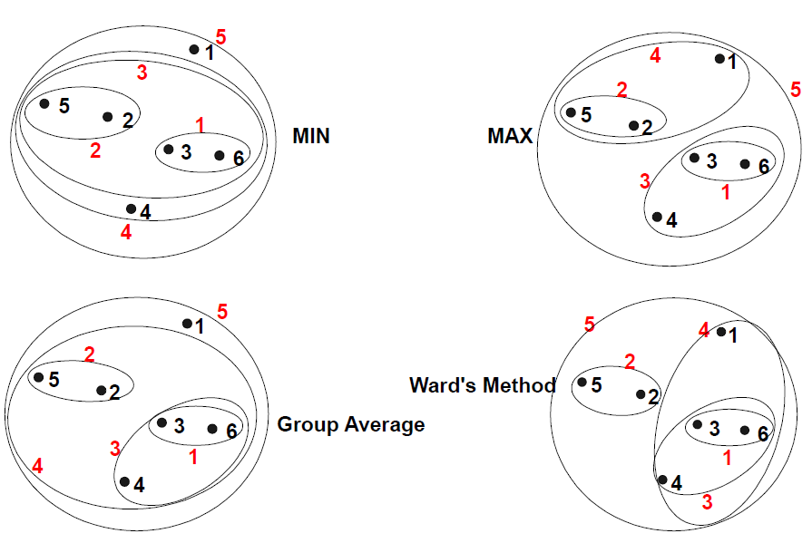

#### DHC自顶向下层次聚类

DHC: Divisive Hierarchical Clustering

主要思想：**构建最小生成树**

例：使用Prime算法：

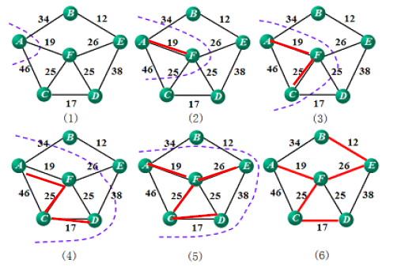

使用Kruskal算法：

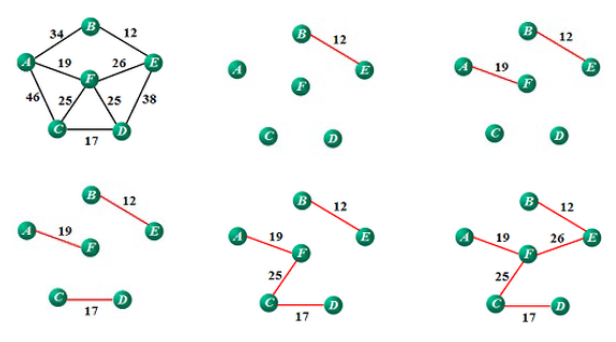

#### 分类聚合总结

- 优点
  - 不需要提前设置簇的个数（因为可以自行剪枝求得
- 缺点
  - 合并不可撤销，全局是一个整体
  - 没有最优合并方案
  - 不同的合并方案总会有一些问题
    - 边界或噪音敏感问题
    - 本来应该很大的簇被切割
    - 不易设置簇的大小与形状
    - ...

### GMM高斯混合模型（略

GMM: Gaussian Mixture Model

