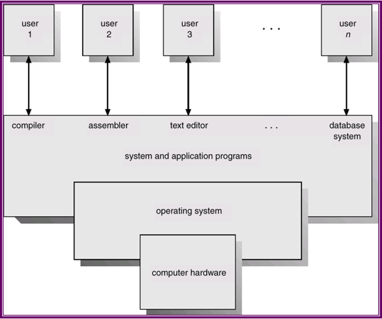
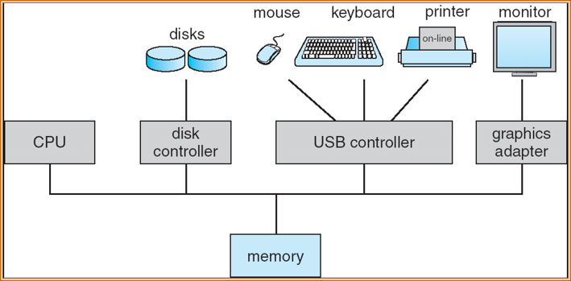
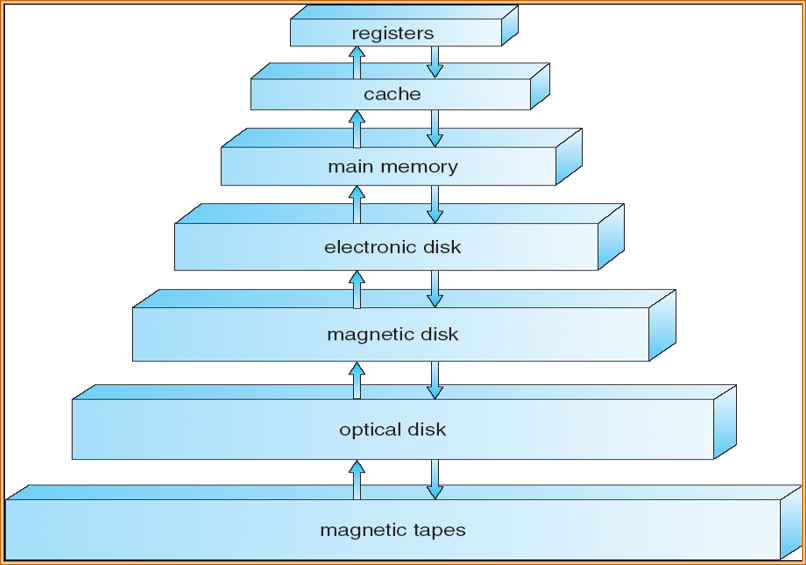
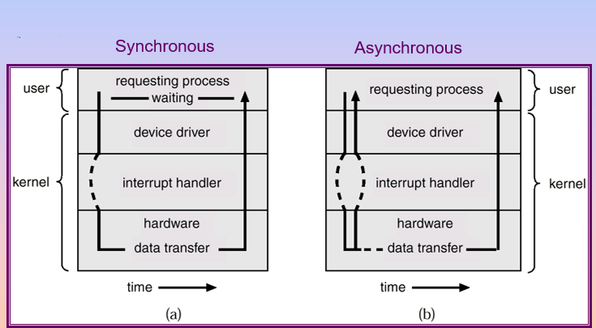

## 概述

>操作系统是用户和硬件之间的媒介(An operating system acts as an intermediary between the user of a computer and the computer hardware)
>操作系统的目标是提供一个使用户进程**方便高效**地运行的环境(The purpose of an operating system is to provide an environment in which a user can execute programs in a **convenient** and **efficient** manner)

但是通常**方便和高效是对立的**。大型机(Mainframe)注重高效，小型机(Minicomputer)注重方便

**操作系统是管理硬件的软件**

一个computer system可以被粗略分为四个components:
- hardware
- operating system
- application programs
- users

## 操作系统的身份

- 资源分配者(Resource allocator)
- 程序管理者(Program controller)
- 内核(Kernel) - 时刻都在运行着的程序

## 计算机结构

### 结构概述与中断

- 一个或多个CPU
- 多种设备连接同一块内存(memory)
- 连接的媒介是总线(BUS)
- 设备通过设备控制器(device controller)连接总线，**设备控制器自身有缓冲区(local buffer)**
- 每个设备控制器管理一种设备。操作系统对每种设备控制器都要有**驱动程序(device driver)**
- IO设备和CPU可以同时运行(execute concurrently)
- CPU负责在内存和设备控制器缓冲区之间交换数据，IO操作在设备控制器进行
- 设备控制器通过产生**中断**通知CPU是否有事件的发生。软件也可以使用**系统调用(system call or monitor call)**引起软件中断(trap)

计算机开机（或重启）的时候需要运行一个**引导程序(bootstrap program)**，引导程序存在ROM或EEPROM里，属于硬件中的子类——**固件**(**firmware**)

中断使用**中断向量(interrupt vector)**实现。中断可以被**屏蔽(disabled)**，因屏蔽而未能生效的中断被称为丢失的中断(lost interrupt)

### 存储结构

主存(main memory)是CPU可以直接访问的唯一大容量存储介质。是易失(volatile)的。从二级存储(secondary storage)开始就不易失了

存储层级结构：

层级越高，价格越贵，越快

### IO结构

两种IO策略：
- 同步(synchronous)
  - 阻塞，顺序执行
- 异步(asynchronous)
  - 非阻塞，并行执行

DMA方式的IO每传输一块(block)发出一次中断而不是常规的一字节(byte)一次中断

## 用户态和内核态

user mode and kernel mode

IO指令、关机指令这些只能在内核态进行(privileged)

