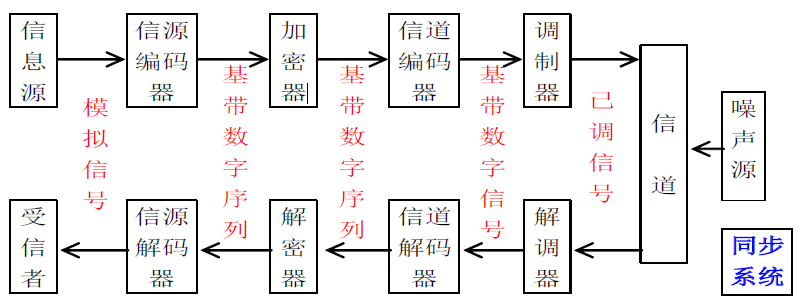

## 基础知识

- 通信：传递**消息**(message)中的**信息**(information)
- 通信系统：完成通信过程的全部设备和传输介质
- 数字信号
	- 状态数有限的信号
- 模拟信号
	- 状态数无限的信号
- 基带信号 - 低频成分较多，未调制的初始信号
- 已调信号 - 适合信道传输，又称 **频带信号/带通信号**，携带消息多，适合在信道传输

## 通信系统一般模型


- 信源/信宿
  - 信源完成非电量->电量的转换。信宿反之
	- 模拟信源，输出连续模拟信号
		- 话筒
		- 摄像机
	- 数字信源，输出离散数字信号
		- 键盘
- 发送/接收设备
  - 发送设备使原始的电信号变成适合在信道中传输的电信号。接收设备反之
	- 很笼统的概念，信源和信道之间的所有设备都归为此类，功能繁多
		- 调制解调
		- 加密解密
		- 编码
		- 复用
		- ...
- 信道
  - 传输介质
  - 会对信号造成损耗和干扰
	- 无线信道
		- **自由空间**
	- 有线信道
		- 光纤
		- 电缆
		- ...

## 模拟通信系统模型


包含两种重要变换：
- 消息<->基带信号（信源与信宿的工作
- 基带信号<->已调信号（调制解调的工作

## 数字通信系统模型



相较于一般模型，添加了如下设备

- 信源编/解码器 - 模数转换 数据压缩 提高传输效率
- 加/解密器 - 保密传输 提高安全性
- 信道编/解码器 - 差错控制 提高抗干扰能力
- 调制解调器 - 使信号适合传输 复用
- 同步系统 - 保证收发双方步调一致
  - 不同的同步器在模型中的位置不同，所以此处没有标出
  - 分类
    - 载波同步
    - 码元同步
    - ...

上述模型是一般化模型，**实际使用时可能不包含以上所有设备**

>数字通信系统也可以使用基带通信，即不使用过多的调制，其模型和一般模型相似

**信源和信宿可以是数字的也可以是模拟的**

## 数字通信特点

- 抗干扰性强
	- 使用再生中继，噪声不积累
- 传输差错可控
	- 能够使用差错控制策略改善传输质量
- 便于是用那个数学进行信号处理、变换、存储、复用
- 支持各种消息的传递
- 保密性强
- 易于集成化、小型化
- **缺点**：频带利用率低，对同步要求高，设备复杂

## 通信系统分类

- 单工、半双工与全双工
	- 单工 - 仅单向传输
	- 半双工 - 可双向传输，但不能同时收发消息
	- 全双工 - 完全双向传输
- 并行传输与串行传输
- 数字与模拟
- 有线与无线
- ...

## 信息及其度量

### 信息量函数

信息量函数`I = F(P(x))`
- I为信息量
- P(x)为事件x发生的概率

可以看出 **信息量只与事件发生概率相关**，与其他无关

### 离散消息的信息量

`I = -loga(P(x))`

- a = 2时，信息量单位为比特bit
- a = e时，信息量单位为奈特nit
- a = 10时，信息量单位为哈特来

注意：**信息量(bit)和数据量(bit)不同**

### 离散信源的平均信息量

也称为**熵**，符号为H。值为离散消息出现的概率乘离散消息的信息量，即


熵的物理意义为信源不确定性。**所有符号等概率出现时不确定性最大**，假设所有符号出现概率为`1/M`，则熵为

```
Hmax = log2M(b/符号)
```

### 总信息量

设信源的熵为`H(x)`，信源发送一条含n个符号的消息，平均总信息量为`I = nH(x)`

## 通信系统性能指标

主要指标为：
- 有效性
  - 占用的信道资源
- 可靠性
  - 信息的准确程度

### 模拟通信系统指标

- 有效性指标 - 占用带宽
  - 越小越好
  - 多路复用时，复用越多，有效性越好
- 可靠性指标 - **输出信噪比**`So/No`

### 数字通信系统指标

- 有效性指标 - **频带利用率**，即单位带宽（每赫兹）内的传输速率
  - 
  - RB为码元速率，即传输符号的速率（波特率），`RB = 1 / TB`，**只和时间（码元宽度）TB有关，与进制数无关**
  - Rb为信息速率，即传输bit的速率（比特率），**和码元宽度、进制数有关**
  - 假设每个码元的平均信息量为H，则`Rb = RB * H`
- 可靠性指标 - 差错概率，包括**误码率**、**误信率**等
  - 误码率 - 接收错误的码元在所有传输码元中的比例Pe
  - 误信率（误比特率）Pb


