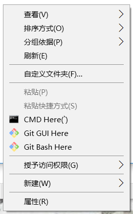

## 信道类型（略

## 信道数学模型

### 调制信道模型

模型 - **时变线性网络**

- k(t)为信道的传输特性，可以视为乘性干扰
  - k(t)基本不随时间变化 - 恒参信道
  - k(t)随时间变化 - 随参信道
- n(t)为信道噪声，视为加性干扰

常用信道模型：k(t)为常数1

特点
- 满足叠加定理
- 有延迟
- 有损耗（乘性干扰
- 无输入时也有输出（加性噪声

可能受到的影响 - 乘性干扰和加性噪声使信号波形失真

### 编码信道模型

模型 - **数字转移概率**

可能受到的影响 - 数字序列发生错误

误码率：`Pe = P(0)P(1|0)+P(1)P(0|1)`

## 信道特性分析

### 恒参信道

举例
- 有线电信道
- 光纤信道
- 卫星中继信道

参数基本恒定，可以等效为一个线性非时变系统（非随机），使用线性系统的分析方法

传输特性（即上文中的乘性干扰k(t)）记为H(ω)，使用频率作为参数

**无失真传输条件**：
- 幅频特性为一条水平直线，即H(ω) = K（常数）
  - 含义 - 对信号中的不同频率成分有相同的效果
- 相频特性是一条通过原点、频率固定的直线，即φ(ω) = kω
  - 含义 - 对不同的频率成分有相同的延迟

满足上述两条，则无失真，这样的恒参信道称为**理想恒参信道**

**失真**：
- 幅频失真 - 不满足H(ω)是常数
  - 不同频率受到不同的影响
  - 模拟信道会**波形失真**，信噪比下降
  - 数字信号会**码间串扰**，误码率上升
- 相频失真 - 不满足相频特性需求
  - 不同频率分量造成不同的时延
  - 模拟信道影响不大
  - 数字信道**码间串扰**

上述失真均属于**线性失真**，通常可**使用线性网络补偿**，这样的补偿网络成为**幅度/相位均衡器**

### 随参信道

如自由空间

随参信道的特性是随时间变化的，且有以下三个特点：
- 传输衰耗随时间变化
- 传输时延随时间变化
- **多径传播**

多径传播示意图：

假设发射信号为正弦波Acosωt，则经过n条路径传输后接收信号是一个包络和相位随机变化的平稳高斯窄带随机过程`R(t) = V(t)cos(ωt + φ(t))`

**多径传播的影响**：
- 瑞利衰落 - 从波形上看，振幅恒定、频率单一的正弦波变成了包络随机起伏的波（下图1
- 概率弥散（概率扩展） - 从频谱上看，单根线谱变成了窄带频谱（下图2
- **频率选择性衰落** - 信号间干扰导致某些频率成分发生严重的随机性衰落（下图3

**减少频率选择性衰落**的措施：设信道各路径之间的最大时延差为τm，定义信道的相关带宽（相邻传输零点的频率间隔）为`delta f = 1/τm`，根据工程经验，信号带宽应介于1/3-1/5的delta f。数字信号占用的带宽取决于码速率RB = 1 / TB，所以数字信号的码元宽度TB = (3-5)τm

## 信道噪声

统计特性 - 高斯白噪声

使用矩形等效带宽，视为此带宽恒定

## 信道容量

记为C，表示信道**无差错**时**最大平均信息速率**

### 连续信道的信道容量

香农公式：

其中：
- B为信道带宽(Hz)
- S为信号功率(W)
- N为噪声功率(W)
- n0为加性高斯白噪声的单边功率谱密度(W/Hz)

公式含义：
- 影响信道容量C的三要素
  - B
  - S
  - n0
- 提升信噪比可以增大信道容量
- 若n0趋近于0，则C趋近于无穷，即无扰信道理论容量无限大
- 若S趋近于0，则C趋近于无穷，说明信号功率不受限时容量无限大
- C随着B的增大而增大，但是B趋近于无穷时C趋近于`1.44S/n0`（收敛
- C一定时带宽和信噪比可以互换
- 信源的实际信息速率远小于C是理论上可无差错（或小差错）传输

### 离散信道的信道容量

- 信源发送的平均信息量为H(x)（熵
- 因为信道噪声而损失的平均信息量H(x/y)
  - 等于**发送y的概率**乘**接收y判定发送的是x（可以等于y）的概率**乘**接收y判定发送是x的信息量**
- 接收端得到的平均信息量为H(x) - H(x/y)
- 假设每秒传输r个符号（即符号发送速率），则信道平均信息传输速率R = r(H(x) - H(x/y))
- 信道容量是无差错传输时信息传输速率的最大值，即对一切可能的信源概率分布，求R的最大值，即为C

例题：某个信源可能发送ABCD四个符号，每个符号独立出现，概率分别为1/4、1/4、3/16、5/16，经过信道传输后，每个符号正确接收的概率为1021/1024，接受错为其他符号的概率均为1/1024，求信道容量为每个符号多少bit。

解：因为ABCD四个符号的接收错误情况一致，计算可发现无论ABCD在发送端发送的概率的多少，H(x/y)是定值：0.033 bit/符号。**因为信道容量是一切可能的信源概率分布时R的最大值**，所以要求H(x)的最大值，即ABCD等概发送，最大值为2 bit/符号。所以信道容量R为2-0.033=1.967 bit/符号

