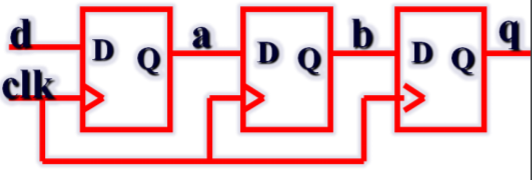
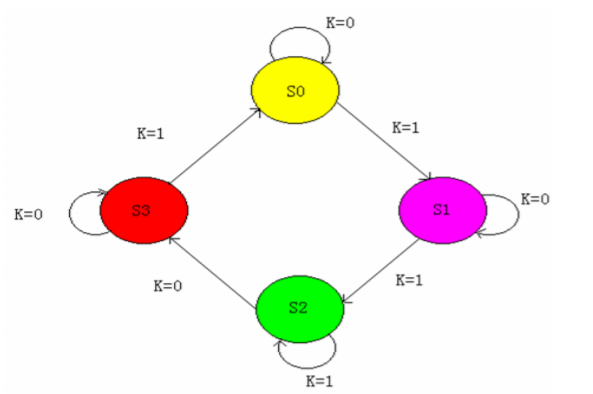

## 基本知识

- 代码不区分大小写
- 两个减号及后面的字符为单行注释
- 电路功能分为顺序语句和并行语句两种

## 库Library

存放**已编译**程序包和数据集合的地方。可以被调用

代码格式：

```
library 库名;
use 库名中的逻辑体名;
```

代码实例：

```vhdl
library ieee;                  --打开ieee库
use ieee.std_logic_1164.all;   --加载ieee中std_logic_1164包内的所有内容
```

库的种类
- STD库 - VHDL标准库
- IEEE库 - VHDL标准库的扩展
- WORK库 - 用户自己的库

## 实体Entity

描述电路的外部特征（输入和输出）

代码格式：

```
entity 实体名 is
	[类属参数说明]
	[端口说明]
end entity 实体名;
```

端口说明格式：

```
port(
	端口名a1, ..., 端口名an : 方向 类型;
	...
	端口名x1, ..., 端口名xn : 方向 类型
);
```

代码实例：

```vhdl
entity HALFADD is          --实体的名字为HALFADD半加器
	port(
		A, B       : in bit;   --端口A和B，输入端口，输入数据类型为bit
		SUM, CARRY : out bit;  --端口SUM和CARRY，输出端口，输出数据类型为bit
	);
end entity HALFADD;
```

端口方向：
- in - 输入端口，此类型的信号不能被赋值
- out - 输出端口
- inout - 双向端口
- buffer - 缓冲端口

## 构造体Architecture

描述了电路的内部行为与数据流动

### 基本代码格式

代码格式：

```
architecture 构造体名 of 实体名 is
	[说明语句]
begin
	[功能描述语句]
end architecture 构造体名;
```

说明语句包括了内部信号、常数、元件、数据类型、函数定义

### 数据流描述

代码实例（半加器）：

```vhdl
architecture BEHAVE of HALFADD is  --构造体名为BEHAVE，属于HALFADD
begin
	SUM <= A xor B;                  --把"A异或B"赋值给SUM
	CARRY <= A and B;                --把"A与B"赋值给CARRY
end architecture BEHAVE;
```

### 结构描述

- 组件Component类似于高级语言中能够被调用的函数
- 一个entity内部可以包含很多component
- VHDL库中有很多component
- **component之间使用信号signal连接**，所以构造体通常要有内部信号声明
- 使用port map表明组件与实体信号的映射关系

实例：假设有如下两个实体

```vhdl
entity and_gate is
	port(A, B : in bit; X : out bit);
end entity and_gate;

entity or_gate is
	port(A, B : in bit; X : out bit);
end entity or_gate;
```

可以看到实体的声明类似于高级语言中函数的声明。我们只需要知道接口port即可，不必关心内部实现，即architecture

此处举例为了简单起见写了一个与门一个或门。如果有实体要调用这两个门：

```vhdl
entity and_or_gate is
	port(
		in1, in2, in3, in4 : in bit;
		x : out bit
	);
end entity and_or_gate;

architecture behave of and_or_gate is
	component and_gate is
		port(a, b : in bit; x : out bit);
	end component and_gate;

	component or_gate is
		port(a, b : in bit; x : out bit);
	end component or_gate;

	signal out1, out2 : bit;
begin
	g1 : and_gate port map(a => in1, b => in2, x => out1);
	g2 : and_gate port map(a => in3, b => in4, x => out2);
	g3 : or_gate  port map(a => out1, b => out2, x => x);
end architecture behave;
```

可以看到
- 如果要在architecture内部调用其他实体，需要**在begin之前声明实体名与接口**
- 在调用时可以给每个组件名称，即本例中的g1/g2/g3。和变量与信号的声明类似，组件名称后面接冒号和组件的类名
- 使用port map来给组件设置信号对应关系

### 行为描述

#### with-select-when语句

实例：

```vhdl
with x select q <=
	"01" when "00",
	"10" when "01",
	"00" when others;
```

即x取00时q赋值为01，x取01时q赋值为10，x取其他情况时q赋值为00

#### when-else语句

```vhdl
y <= "00" when s = '0' else "11";
```

即s取0时y赋值为00，否则y赋值为11

#### if-else语句

```vhdl
if a = '1' then
	c <= '0';
else
	c <= '1';
end if;
```

## VHDL数据对象(Data Objects)

### 常量

常量声明格式：

```
constant 常量名 : 数据类型 [:= 初始值];
```

可以在library/entity/architecture/process中定义

### 变量

变量声明格式：

```
variable 变量名 : 数据类型 [取值范围] [:= 初始值];
```

- 变量是**局部量**，只能在进程process和子程序中使用
- 变量的赋值是理想的，没有延时（即使用组合逻辑实现而不是时序逻辑）
- 变量赋值符号为`:=`

数组变量的赋值方式：
- 整体赋值，使用双引号
	- `temp := "10101001"`
- 逐位赋值，使用单引号
	- `temp(7) := '1`
- 多位赋值，使用双引号
	- `temp(7 downto 4) := "1010"`

**有些变量类型需要声明范围**，比如integer类型就需要。而std_logic类型就不需要（std_logic取值范围比较小，而integer取值范围很大，手动声明范围可以减少元件的使用）

带取值范围的变量声明举例：

```vhdl
variable x, y : integer range 15 downto 0 := 1;
```

### 信号

- 在architecture中定义
- **信号赋值符号为**`<=`，**但是初始化符号是**`:=`

信号声明格式：

```
signal 信号名 : 数据类型 [:= 初始值];
```

### signal vs variable

| 属性 | 信号 | 变量 |
| --- | --- | --- |
| 赋值符号 | <= | := |
| 功能 | 电路内部连接 | 内部数据交换 |
| 作用范围 | 全局，可以在进程之间通信 | 进程内部 |
| 行为 | 延迟赋值 | 立即赋值 |

可以把信号理解为**时序逻辑**中的信息传递，变量理解为**组合逻辑**中的信息传递

## VHDL数据类型

- 整数integer
	- 范围-(2^31-1)到(2^31-1)
	- 能够使用加减乘除运算
- 实数real
	- 范围-1\*10^38到1\*10^38
	- 书写时**一定要有小数点**，即使小数点后面全0
	- 可以使用科学计数法，比如1.0e38
- 位bit
	- 取值'0'或'1'，使用单引号括起来
	- 不等同与数字中的0或1，只是两种逻辑状态的取值
- 位矢量bit_vector
	- 使用双引号括起来的一组值，如"000"
	- 使用时先声明矢量长度，如`signal s : bit_vector(15 downto 0)`
- 布尔值boolean
	- 取值true或false
	- 和bit不同，没有数值含义。不能进行算术运算，可以进行逻辑运算
- 字符character
	- 使用单引号括起来
	- 区分字符'1'和位'1'时可以使用`character('1')`
- 字符串string
	- 使用双引号括起来
	- 常用于程序的提示和说明
	- 需要说明长度，如`variable s : string(0 to 3)`
- 时间time
- 错误等级
- 自然数 & 正整数

## VHDL运算符

### 逻辑运算符

- and - 与
- or - 或
- not - 非
- nand - 与非
- nor - 或非
- xor - 异或
- xnor - 与或

### 关系运算符

- `=` 等于
- `/=` 不等于
- `<` 小于
- `>` 大于
- `<=` 小于等于
- `>=` 大于等于

注意区分“小于等于”和“信号赋值语句”

### 算术运算符

- `+` 加
- `-` 减
- `*` 乘
- `/` 除
- `**` 乘方
- `mod` 取模
- `rem` 取余
- `sll` 逻辑左移
- `srl` 逻辑右移
- `sla` 算数左移
- `sra` 算数右移
- `rol` 逻辑循环左移
- `ror` 逻辑循环右移
- `abs` 取绝对值

### 其他运算符

并置运算符`&`，用来连接变量形成更长的变量，如：

```vhdl
signal a, b : std_logic;
signal c : std_logic_vector(1 downto 0);

c <= a & b;
```

## 并行语句与顺序语句

**构造体中的语句是并行执行的**，与书写顺序无关

### 并行语句 - 信号赋值语句

#### 简单信号赋值

```vhdl
aim <= expression
```

#### 条件信号赋值

```vhdl
aim <= expression1 when value1 else
       expression2 when value2 else
       expression3;
```

#### 选择信号赋值

```vhdl
with sel_expression select aim <=
	expression1 when value1,
	expression2 when value2,
	expression3 when others;
```

- 选择信号赋值语句**不允许条件重叠或条件涵盖不全**
- 注意区分逗号和分号

### 顺序语句 - 进程语句

进程描述格式：

```
[进程标签 :] process (敏感信号参数表)
	[进程说明]
begin
	[顺序描述语句]
end process
```

- **进程由敏感信号变化启动**
- 进程内语句为顺序语句，但构造体内的不同进程是并行的，各个进程根据敏感信号独立运行
- 时序电路中CLK信号常为敏感信号

### 常见顺序语句

#### 赋值语句

变量赋值与信号赋值

#### if-else语句

```
if 条件 then
	顺序语句
elsif 条件 then
	顺序语句
else
	顺序语句
end if
```

#### case语句

```
case expression is
	when value1 => 顺序语句;
	when value2 => 顺序语句;
	when others => 顺序语句;
end case;
```

- 如果expression的值是value1则执行后面的顺序语句
- 这里的`=>`不是操作符，相当于then

## 时序逻辑相关

### 基础

时序逻辑需要经常检测clk信号的上升沿，所以经常使用process语句，然后在process中使用顺序语句

**上升沿的描述**：`clk'event and clk = '1'`或`rising_edge(clk)`

### 时序逻辑举例

实现如下电路



思路：不同触发器之间使用信号连接（因为这些量可能会被用来发送到其他地方），clk上升沿来临时从右向左顺序处理信号，即b先赋值给q，d最后赋值给a。代码：

```vhdl
entity ent1 is
	port(d, clk : in bit; q : out bit);
end ent1;

architecture behave of ent1 is
	signal a, b : bit;
begin
	process(clk)
	begin
		if rising_edge(clk) then
			q <= b;
			b <= a;
			a <= d;
		end if;
	end process;
end behave;
```

### 使用VHDL描述自动机

使用VHDL描述下图自动机，要求有复位功能



VHDL可以像C里面的**枚举常量**一样定义一系列**状态**。此题代码如下：

```vhdl
library ieee;
use ieee.std_logic_1164.all;
use ieee.std_logic_unsigned.all;

entity ent1 is
	port(
		clk, k, res : in std_logic;
		qout        : out std_logic_vector(1 downto 0)
	);
end ent1;

architecture behave of ent1 is
	type state is (s0, s1, s2, s3);
	signal current_state : state;
begin
	process(clk)
	begin
		if res = '1' then current_state <= s0;  --reset, ignore clock
		elsif clk'event and clk = '1' then
			case current_state is
			when s0 =>
				qout <= "00";
				if k = '0' then
					current_state <= s0;
				else
					current_state <= s1;
				end if;
			when s1 =>
				qout <= "01";
				if k = '0' then
					current_state <= s1;
				else
					current_state <= s2;
				end if;
			when s2 =>
				qout <= "10";
				if k = '0' then
					current_state <= s3;
				else
					current_state <= s2;
				end if;
			when s3 =>
				qout <= "11";
				if k = '0' then
					current_state <= s3;
				else
					current_state <= s0;
				end if;
			end case;
		end if;
	end process;
end behave;
```

可以看到代码中使用`type state is (s0, s1, s2, s3)`设置了一系列状态，就像是c语言中的枚举常量，state是类型，s0-s3是值。在`signal current_state : state`时使用此类型

