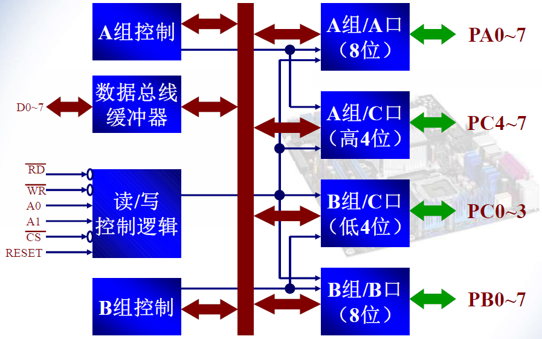
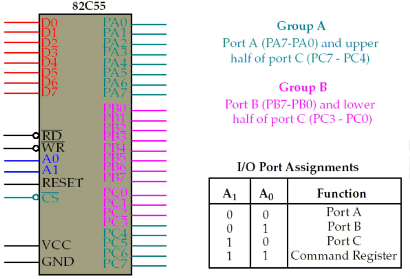
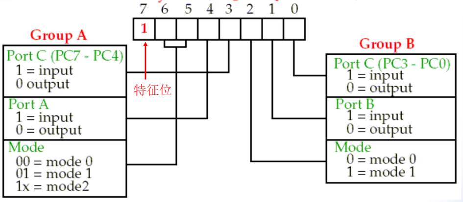
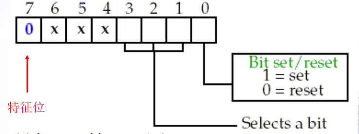
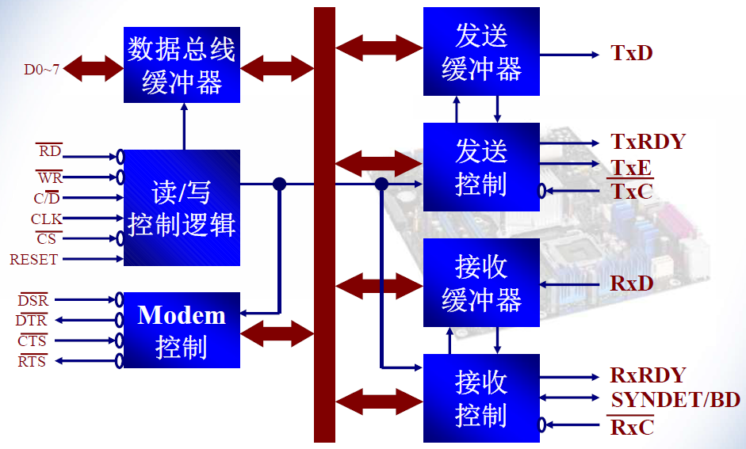
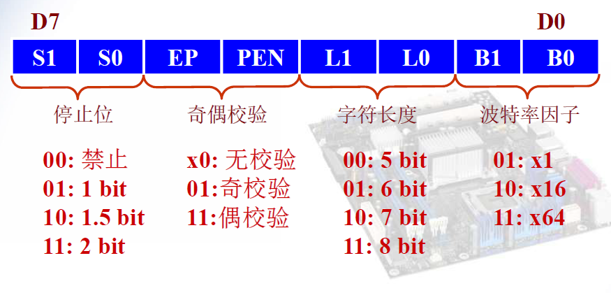
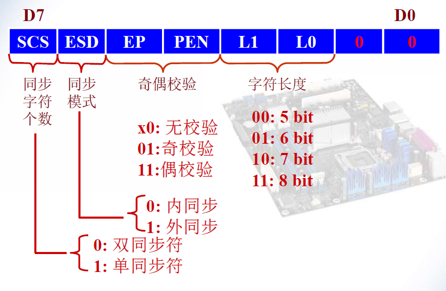
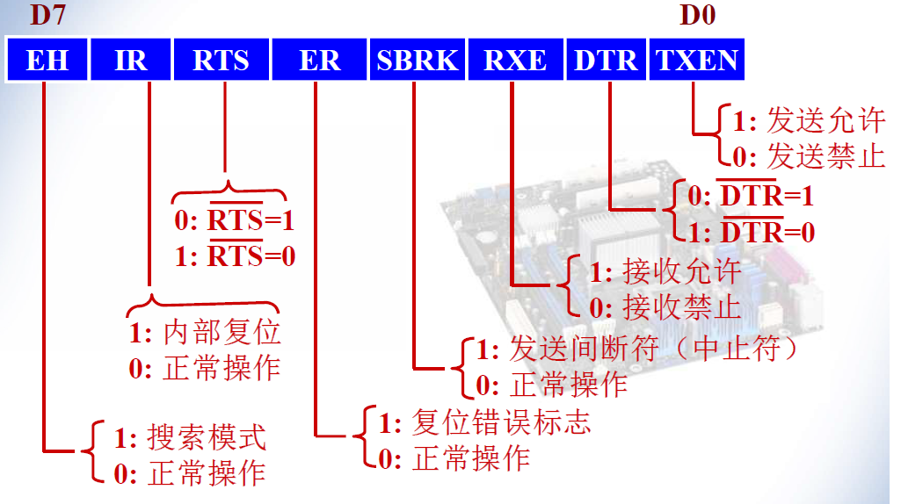
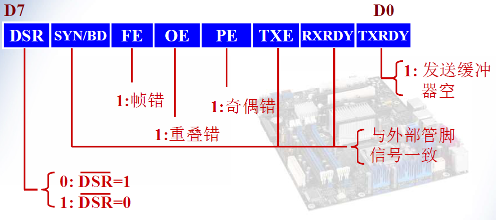
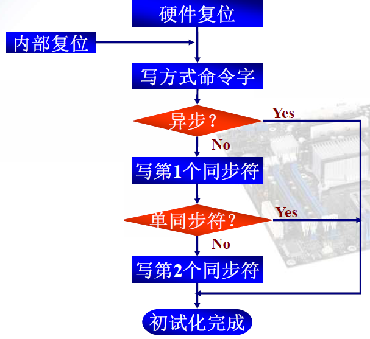

# 微机原理与接口技术 目录

1. [微机基础](1.md)
2. [微处理器功能与结构](2.md)
3. [指令系统和寻址方式](3.md)
4. [汇编语言程序设计](4.md)
5. [微处理器外部特性与输入输出](5.md)
6. [中断与定时技术系统](6.md)
7. [常用接口技术](7.md)


# 常用接口技术

## 可编程并行接口8255A

### 概述

并口特点：
- 多条数据线，传送距离短
- 需要握手信号进行控制
- 数据传输率高

### 8255A结构与引脚



- 数据总线缓冲器 - 用于收发数据总线上面的数据
- 读写控制逻辑 - 控制总线的开放、关闭以及数据的传送方向
- 数据端口ABC - AB具有输入输出锁存、三态缓冲功能，C具有输出锁存、输入缓冲功能，可以拆分为两个4位端口
- AB组控制电路 - A组控制A口和C口高四位，B组控制B口和C口低四位
- 两根地址线A0A1 - 11为设置命令寄存器



### 编程

- 方式0 - 基本输入输出方式
  - 用于无条件传送和查询方式的输入输出
- 方式1 - **选通输入输出方式**
  - 用户查询和中断方式的输入输出
- 方式2 - 双向传送方式

**方式选择控制字**：



例：端口地址60-63H，初始化A口味方式1输入，C口高四位为输出，B口方式0输出，C口低四位为输入：

```asm
mov dx, 63h ; 控制寄存器地址
mov al, 10110001b
out dx, al
```

**置为、复位控制字**：



控制C口。如把C口的bit3值1：

```asm
mov dx, 63h
mov al, 00000111b
out dx, al
```

也可以直接写入C口：

```asm
mov dx, 62h ; C口地址
in al, dx ; 读取原值
or al, 00001000b ; PC3置1
and al, 11111101b ; PC1清零
out dx, al ; 输出
```

在对输出信号有严格要求的时候建议使用控制字修改C口（即第一种方式

### 工作方式

- 方式0 - 基本输入输出方式
  - 用于无条件传送和查询方式的输入输出
  - 无专用握手信号（不过可以使用C口的一条或多条作为握手线
  - 输出有锁存功能，输入有缓冲而无锁存
- 方式1 - **选通输入输出方式**
  - 用户查询和中断方式的输入输出
  - AB口作为数据传送口，可输入或输出
  - 使用C口中的若干线作为**专用的握手信号**
  - 输出有锁存，输入有缓冲和锁存
- 方式2 - 双向传送方式
  - A口在某一时刻可以输入数据，在不同时刻可以输出数据
  - 可以采用中断方式或查询方式传送数据
  - B口只能工作在方式1或0
  - 使用C口的若干线作为专用的握手信号

## 可编程串行接口

### 概述

- 串行传送 - 把数据按照二进制一位一位地传送
- 使用的传输线少，适合远距离传输
- 数据信息和控制信息在同一条线上传送
- 双方需要约定传输的波特率
- 抗干扰能力强，串行通信信号之间的相互干扰可以忽略不计

数据传送方式：
- 单工
- 半双工
- 全双工

### 异步通信

- 以字符为单位进行传送
- 收发双方使用不同的时钟，两个时钟允许存在一定偏差
- 无数据传送时，传送高电平
- 成本低，速率不高

异步通信数据格式：


异步数据帧的构成：
- 一个起始位（低电平
- 5-8个数据位
- 0或1个奇偶校验为
- 1、1.5或2个停止位

### 同步通信

- 以数据块（或字符块）为单位进行传送
- 接收方和发送方的时钟完全同步
- 数据传输效率高
- 需要**界定符**
- 没有数据传送的时候发送**同步字符**

**面向字符的同步通信数据帧格式**：


- 规定了10个特殊字符为控制字符
- 在数据块中如果传送了控制字符，则采用转义字符DLE进行字符填充

**面向比特的同步通信数据格式**：


- 使用比特填充技术

### 数据传输单位

- 比特率
  - 单位时间传输的二进制比特的数量
- 波特率
  - 单位时间内载波调制状态改变的次数，是对符号传输率的一种度量

## 可编程串行接口芯片8251

### 概述

基本功能：
- 数据格式的自动生成
- 串并转换
- 传输速率控制
- 错误检测
- 电平转换

### 结构



- 面向CPU的连接信号
  - D0-D7三态双向数据线
  - ~RD & ~WR读写信号线
  - ~CS片选
  - RESET芯片复位，需要宽度大于6个时钟周期的高电平
  - C/~D地址线。高电平访问控制寄存器，低电平访问数据寄存器
- 状态信号
  - TxRDY(out)发送器准备好。可以作为中断请求信号
  - RxRDY(out)接收器准备好。可以作为中断请求信号
  - TxE(out)发送器空
- 时钟信号
  - ~TxC(in)发送时钟，异步方式下为x1/x16/x64倍波特率。下降沿移出数据
  - ~RxC(in)接受时钟，同上
  - CLK(in)工作始终

### 编程

- 方式命令字 - 设定通信方式和数据格式
- 工作命令字 - 指定芯片完成某种操作（如发送、接收、内部复位、检测同步字符等
- 状态字 - 报告芯片状态

异步方式命令字：



同步方式命令字：



工作命令字：



**间断符**（中止符） - 大于连续10个0，通知对方停止发送

状态字：



错误标志：
- 奇偶错误PE(Parity Error) - 奇偶校验失败
- 帧错误FE(Frame Error) - 收到的字符格式不符合规定（如缺少停止位
- 重叠错误OE(Overrun Error) - 接收寄存器还没有把数据送出时就受到新的数据

8251A初始化流程：



觉得有用？欢迎[打赏](../../../donate.md)

:)

[返回主页](../../../index.md)