## 直线段生成算法

### DDA算法

**数字微分分析法DDA** - Digital Differential Analyzer

也称 **增量算法**

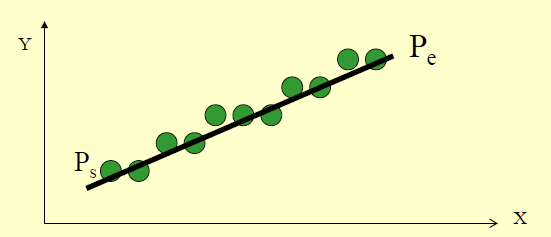

算法流程：
1. 已知直线段的起点和终点，得到`delta x & delta y`
2. 取`delta t = max(delta x, delta y)`
3. 取步长为`1/delta t`，因为`delta t`为`delta x & delta y`中的最大值，所以不会出现计算下一步时x或y的变化量超过1（但是有可能两个都是0
4. 根据当前坐标`x[n] & y[n]`计算`x[n + 1] & y[n + 1]`。计算时使用浮点，画图时取整

特点：
- 原理简单
- **步长为浮点数**，浮点运算与取整比较耗时
- 浮点增量连续叠加导致误差累计

### Bresenham算法

**最有效的算法之一**

相比DDA的优化：
- 步长取1
- 使用**整数小计算量判别式**判定另一方向是否+1

斜率为0-1时把X方向作为步长方向，计算Y方向是否+1。否则使用Y方向作为步长方向，计算X方向是否+1

以斜率0-1为例。如果X+1后Y的增量小于0.5则Y方向不+1，大于等于0.5时+1

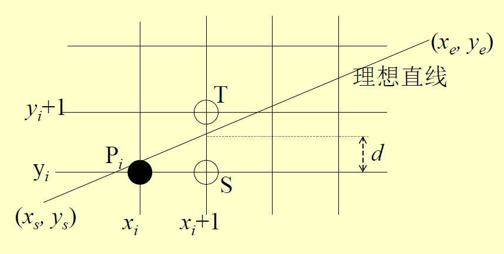

由此得到**判别式**：`e = d - 0.5`。显然e的初值为-0.5。

令`m = delta y / delta x`，使用m代替计算d

- e小于0时Y方向不+1，更新`e = e + m`
- e大于等于0时Y方向+1，更新`e = e + m - 1`

**为了使用整数而非浮点数简便计算**，把原判别式两边同时乘`2 delta x`（思路：使用数字`2`把公式中的0.5变成整数，使用`delta x`把公式中`delta y / delta x`变成`delta y`，即整数），得到`e' = delta x * (2d - 1)`，初值`e' = -delta x`。更新公式：
- e'小于0时Y方向不+1，更新`e' = e' + 2delta y`
- e'大于等于0时Y方向+1，更新`e' = e' + 2delta y - 2delta x`

算法特点：
- 全部使用整数计算，公式只含加法、减法、乘2（使用移位实现）三种简单运算，便于硬件或固件实现

### 直线段属性

- 线型
  - 实线、虚线、点划线...
  - 设置一个flag值即可实现。略
- 线宽
  - 通常把设备支持的最小线宽作为基准，然后定义2倍宽或4倍宽的直线
  - 反复调用基准直线多画几次即可
- 颜色

## 圆弧生成算法

### Bresenham算法

使用简单计算的判别式计算下一个显示点，是最有效的算法之一

- 仅考虑八分之一圆弧，剩余7个部分使用点的对称计算得到

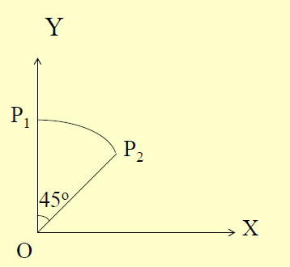

- 每一步都选择最接近理想圆周的点。令选中的点为P，定义误差`D(P) = x^2 + y^2 - R^2`。已知上一个点是`(x[i - 1], y[i - 1])`时，计算`(x[i], y[i])`其中`x[i] = x[i - 1] + 1`。因为此1/8圆弧为减函数，仅需要考虑`y[i]`为`y[i - 1]`和`y[i - 1] - 1`这两种情况即可。根据上述判别式求得误差最小的点。如图，C为圆弧，P为前一个点，S和T为候选点。令`d = |D(S)| - |D(T)|`，则d非负时选择T点，否则选择S点

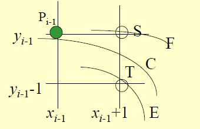

- 因为1/8圆弧的切线斜率特性，D(S)和D(T)必定一正一负。则`d = D(S) + D(T)`。如果d为负，则S和T中靠下的那个点误差更大，应该选择靠上的点。否则选择靠下的点。

- 推导一个递推公式以简化d的计算

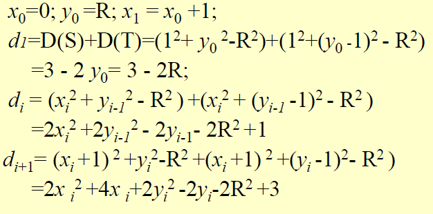

结论：

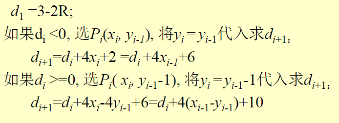

- 获得1/8圆弧之后，通过对称计算其他7/8圆弧的点

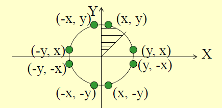

### 正负法（逐点比较法

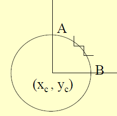

- 仅考虑1/4圆弧（一个象限的圆弧）。以第一象限为例
- 假设选中的显示点为`(x, y)`，定义判别式`F(x, y) = x^2 + y^2 - R^2`，显然F为正时点在圆外，否则点在圆内
- 以第一象限为例，点在圆内时，`x[i] = x[i - 1] + 1`，即向X轴正方向移动，试图走出圆。点在圆外时，`y[i] = y[i - 1] - 1`，即向Y轴负方向移动，试图走进圆。
- 推导一个递推公式以简化判别式。易得：

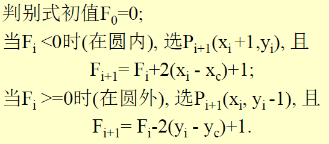

对比Bresenham算法，正负法的运算更为简单，但是因为可以存在X相同Y不同的点（一直+Y），所以生成的点数更多

### 多边形逼近法

使用内接多边形逼近圆，然后使用Bresenham直线生成算法生成直线

已知圆心为(0, 0)，**正多边形**两个相邻顶点的夹角为θ，则选中的点与某个标准值的偏移量为nθ，则需要计算n次三角函数，计算量较大

可以使用递推公式优化计算过程：

```
y[i] = sin(? + θ)
x[i] = cos(? + θ)
y[i + 1] = sin(? + 2θ) = sin(? + θ)cosθ + cos(? + θ)sinθ = y[i]cosθ + x[i]sinθ
x[i + 1] = cos(? + 2θ) = x[i]cosθ - y[i]sinθ
```

这样sinθ & cosθ只需要计算一次即可。另外，使用递推公式需要考虑积累误差是否稳定（特别是浮点数）。可以证明此递推公式的误差是稳定的

可以使用两个处理器流水线处理，一个求点，一个画图

## 规则曲线的生成方法

### 规则曲线的一半生成方法

平面曲线的分类：
- 规则曲线（函数曲线
  - 使用函数直接描述
- 不规则曲线（自由曲线
  - 由一系列样本点定义

规则曲线的生成基本思路 - 把曲线离散化成小直线段，连接各直线段来逼近所要的直线

### 椭圆生成算法

- 标准方程法


解标准方程得到：


此式把椭圆划分为上下两个部分。以某个x的增量为步长，计算y以得到显示点的坐标

缺点：x增量是常数，而椭圆各部分曲率不同，增量取大的话容易出现棱角，取小的话容易过多的计算

- 参数方程法

参数方程：


类似于圆的多边形逼近法即可求得显示点

$$
x[i]=a\cos(?+\theta)\\
y[i] = b\sin(?+\theta)\\
x[i+1]=a\cos(?+2\theta)\\
=a\cos(?+\theta)\cos\theta-a\sin(?+\theta)\sin\theta\\
=x[i]\cos\theta-\frac{a}{b}y[i]\sin\theta\\
y[i+1]=b\sin(?+2\theta)\\
=b\sin(?+\theta)\cos\theta+b\cos(?+\theta)\sin\theta\\
=y[i]\cos\theta+\frac{b}{a}x[i]\sin\theta
$$

### 抛物线生成算法

以`(0, 0)`为顶点，焦点为`(0, p)`的抛物线标准方程为：


抛物线是不封闭的，首先要确定x的取值范围。x的范围可能由屏幕宽度直接决定（下图2），也可以由屏幕高度限制y的值来间接决定（下图1）：

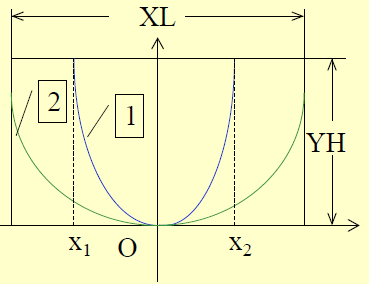

**x取值范围确定的流程**：
1. 计算x=屏幕左右边界时y的值
2. 如果y的值大于屏幕高度，则通过方程反解x

以X方向为步进方向，设置增量并代入方程，得到很多相邻点，使用直线填充相邻点即可

### 生成规则曲线时需要注意的几点

1. 首先建立目标曲线的几何描述（数学表达式
2. 直线段逼近曲线时要考虑精度，选择合适的步进增量，兼顾生成图形的质量和耗时
3. 实际曲线总有一个预定的范围，注意坐标越界问题

## 字符的生成方法

### 概述

两种基本的字符生成技术：
- 笔划（矢量）方式
  - 通过扫描转换生成，目前常用，生成字符效果好，但是计算量大
- 位图（点阵）方式
  - 传统，简单，高速，不灵活

### 矢量字符的存储和显示

- 定义字符
  - 写**字模** - 把所有字符写到一个指定大小的正方形方格中，采集每一个笔划的端点相对于网格左下角(0, 0)的坐标
  - 编码 - 不能重复也不能越界
  - 按照一定结构保存字符笔划轮廓各端点坐标以及前一点到此端点之间是否划线的标志
  - 把字模写入字符库
- 存储字符 - 节省空间、加速查询
  - 压缩存储 - 把每一端点的坐标和划线标志使用两个字节保存，x & y坐标各7位，划线标志1位
  - 使用定长记录存储字模，加快查找速度
- 显示字符
  - 用户必须指定字符的显示位置、字符尺寸、倾斜度、笔划宽度等，都可以通过坐标变换的方法实现
  - 显示过程：
    - 确定界框的左下角坐标(x, y)
    - 根据字符代码获取字符的存储记录
    - 进行一系列坐标变换，计算每个端点的实际坐标，连线

### 点阵字符的存储和显示

在光栅扫描显示系统中使用**掩膜(mask)**定义字符（就是包含字符的像素信息的一小块光栅），保存在字符发生器中

指定掩膜原点的位置后把字符掩膜中的每个像素平移即可

把字符掩膜相应的像素值设置成背景色就可以擦除显存中的该字符

字符写入显存后也可以对掩膜进行修改以获得不同的字体或方向

## 区域填充

### 平面多边形阴影线填充

令阴影线与X轴夹角为α，阴影线数学公式为`t=kx+b`，其中`k=tanα`。截距b为一个数组，`b[j+1]=b[j]+delta b`。如下图

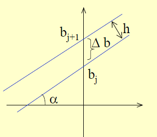

- 计算截距b的取值范围

即`b[max] & b[min]`。过多边形的所有顶点做斜率为k的直线即可得到。

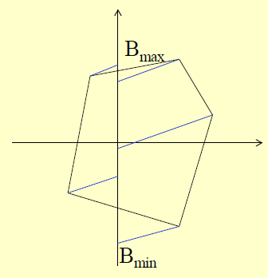

- 计算阴影线与多边形边框的交点

已知某一条边的两个顶点为P和Q。过P和Q分别做斜率为k的直线得到截距`b[P] & b[Q]`。如果当前截距`b[j]`在`b[P] & b[Q]`之间则阴影线与线段PQ有交点，并能够求出交点坐标

为了提升效率，在计算开始之前就计算出所有边框线段的两个端点生成的截距，方便每一次判断，避免重复计算

- 处理交点与孔洞

根据上一步可以得到每条阴影线与所有可能相交的边的交点，则画出**奇数点到偶数点之间的线段**（注意把交点按照X方向或Y方向排序

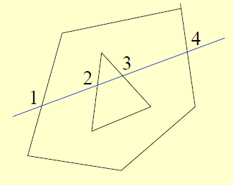

- 算法步骤
  1. 计算每条棱边的两个端点斜率为k时的截距。两个端点的截距中较小者放置在集合`B[1]`中，较大者放置在集合`B[2]`中
  2. 求出`B[min] = min(B[1])` & `B[max] = max(B[2])`
  3. 第一条阴影线的截距为`b[0] = B[min] + delta b`
  4. 计算当前阴影线与各个棱边是否有交点，如果有则存入数组`D`。
  5. 排序数组D，根据交点交替生成阴影线段
  6. `b[j + 1] = b[j] + delta b`，转到4

### 光栅图形的区域填充 - 定义

区域 - 一组相邻、相连且拥有同样属性的像素

区域的**定义方式**：
- 内点定义区域 - 区域内所有像素有相同的颜色/亮度值，需要把它们换成另一个颜色/亮度值
- 边界定义区域 - 边界部分具有相同的颜色/亮度值，区域内的像素具有**不同**于边界的颜色/亮度值。需要把区域内的像素值变为另一个像素值（不一定是边界像素值

区域内的像素的**连通方式**：
- 4连通区域 - 区域内的点可以通过`[上,下,左,右]`四种操作可以达到区域内任意像素的区域
- 8连通区域 - 区域内的点除了上下左右，还要加上四个对角线方向的操作，才能到达区域内任意像素的区域

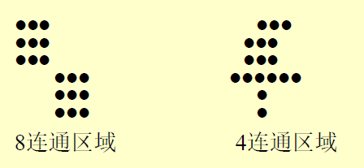

关系：
- 4连通是8连通的特殊情况
- 4连通的边界一定是8连通的
- 8连通的边界一定是4连通的

填充算法：
- 种子填充算法
  - 漫水法（洪泛
  - 边界填充算法（洪泛
  - 扫描线种子填充算法
- 多边形扫描转换算法

### 光栅图形的区域填充 - 漫水法

适用对象 - 内点定义区域

步骤：
1. 选择区域内一个点作为种子。如果点的像素值为变换前的像素值则继续
2. 把此种子的像素值变为目标像素值
3. 选择该种子的4/8连通像素作为种子，回到1

8连通区域填充算法适用于4连通。**反之不然**

### 光栅图形的区域填充 - 边界填充算法

适用对象 - 边界定义区域，把边界包围内的像素值改变

步骤：
1. 选择区域内一个点作为种子。如果**点不在边界上**且像素值不为目标像素值则继续
2. 把此种子的像素值变为目标像素值
3. 选择该种子的4/8连通像素作为种子，回到1

### 光栅图形的区域填充 - 扫描线种子填充算法（略

### 光栅图形的区域填充 - 多边形扫描转换算法

适用对象 - 规则边界的区域

类似于阴影线生成。阴影线取与X轴平行的线，计算交点并填充。**跳过水平线**

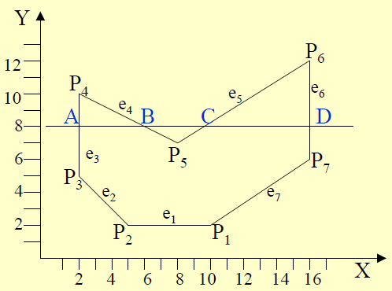

使用**递推公式**简化交点计算 - 已知某条边与扫描线`y = j`的交点为`(x[j], j)`，如果此边与下一条扫描线`y = j + 1`仍然有交点，则交点为`(x[j + 1], j + 1)`，其中`x[j + 1] = x[j] + 1/m`，m为此边的斜率

算法的数据结构：

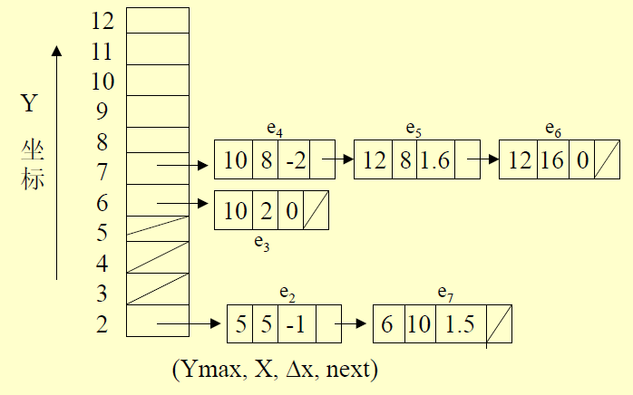

**边的分类表ET**（指针数组），记录多边形的所有棱边（**不包括水平边**），按**下端点Y坐标**分类。有多少水平扫描线就有多少类。同类的边构成一个链。链上的节点包括以下域：
- `y[max]` - 棱边上端点的Y坐标
- `x` - 棱边下端点的x坐标
- `delta x` - 斜率m的倒数，即`1/m`
- `next` - 链表指针

每条链上的元素按X递增的顺序排列。X相同时按delta x递增的顺序排列

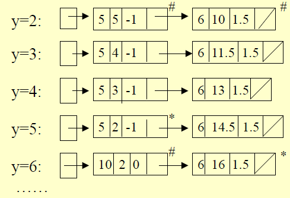

**边的活化链表AEL**，记录**当前**扫描线与棱边的交点序列。初值为空，处理过程中利用ET和求交点的递推关系不断刷新。AEL的节点包括四个域：
- `y[max]` - 棱边上端点的Y坐标
- `x` - **棱边与当前扫描线交点**的x坐标
- `delta x` - 斜率m的倒数，即`1/m`
- `next` - 链表指针

>当扫描线与多边形的交点是多边形的顶点时，则称该交点为奇点。奇点涉及两条棱边，如果把每一奇点简单地计为两个交点，可能会在某些顶点出现异常结果，导致扫描线与图形的交点为奇数个，无法成对确定要填充的像素段。因此，奇点必须按不同情况区别对待。将多边形的奇点分为两类：极值点和非极值点。极值点指该顶点涉及到的两条棱边位于相交扫描线的一侧，这时交点数计为2；非极值点指该顶点涉及到的两条棱边位于相交扫描线的两侧，这时交点数计为1。在实际计算时，可以在求交之前，对多边形顶点中的非极值奇点进行预处理：若Pi是非极值顶点，则将相关两棱边中位于扫描线上方的那条棱边在Pi点处截去一个单位长度，这样可以保证扫描线在非极值奇点Pi处只求得一个交点。

算法步骤：
1. 非极值奇点的预处理（极值奇点=2个交点，非极值奇点=1个交点
2. 建立ET
3. 取初始扫描线y=ET表中最小的y值
4. AEL初始化，取空
5. 如果ET和AEL不全为空，继续，否则结束
6. 把ET表中纵坐标为y的链取下，与AEL表合并，并保证AEL表中的结点按照x升序排列
7. 每次从AEL中读取两个节点，绘制
8. 删除AEL表中`y[max] = y`的元素
9. 其他在AEL中的元素，求下一条扫描线的交点
10. 扫描线y+=1，转到5

算法特点：
- 数据结构与程序结构复杂
- 避免了洪泛中的重复运算，高效
- 边界不必封闭
- 不需种子点

### 图案填充

图案填充 - 使用一个图案模式来填充一个给定的区域。是针对光栅扫描系统的一种填充方式

图案填充的两个主要过程：
- 定义图案
  - 一个图案模式P通常定义为较小的`n*n`像素阵列。`P[i][j]`表示在模式(i, j)处的颜色/亮度值
- 填充区域
  - 在扫描线转换填充算法中增加一个响应的控制机构，使之实际填充像素的颜色、亮度值是从图案模式中提取出来的即可

图案参照点的选择：
- 相对定位方式 - 使用一个矩形包围目标区域，把矩形的左下角视为填充参照点。区域移动时图案不会变化
- 绝对定位方式 - 取屏幕左下角（原点）作为填充参照点。计算效率高。区域移动时图案也会移动