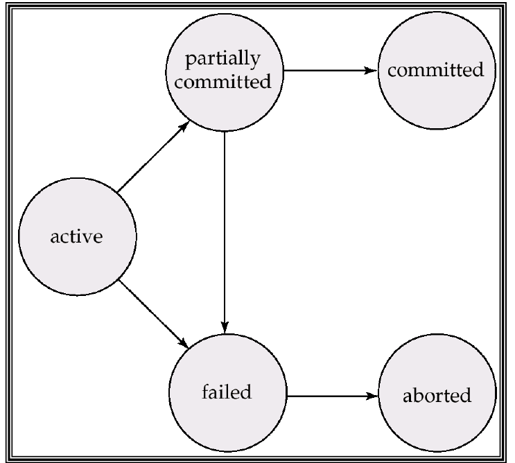
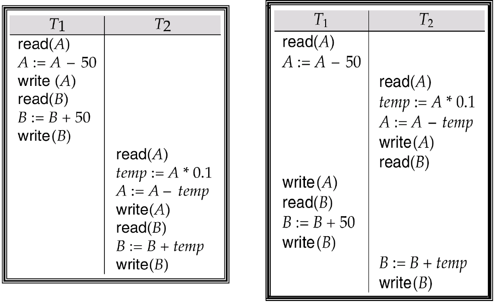
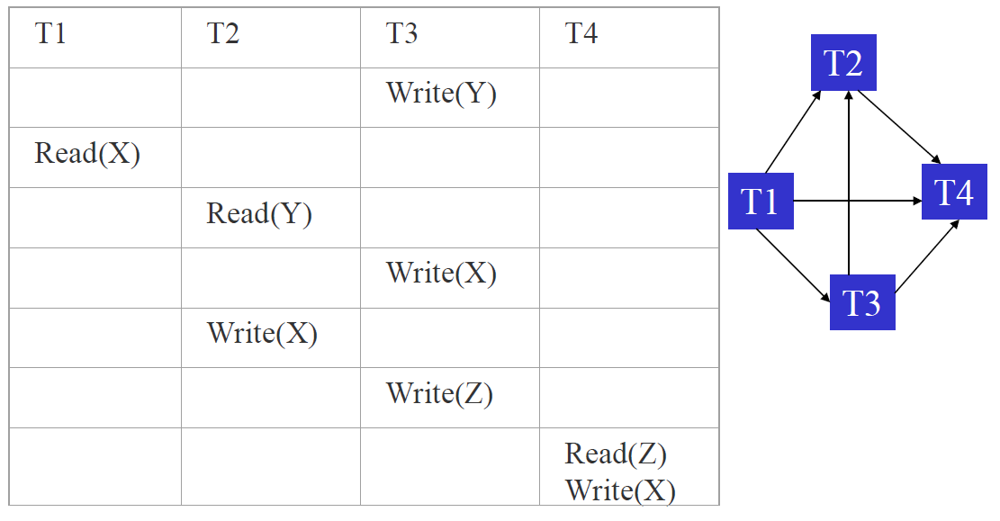
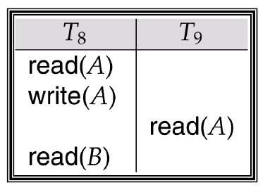
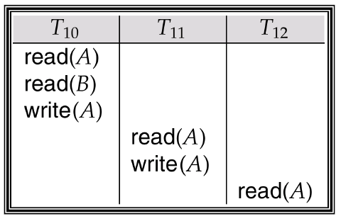

## 概述

事务具有原子性，要么执行要么不执行

主要讨论的问题：
- 事务恢复
- 并行事务

## 事务的特性ACID

- atomicity原子性，要么执行要么不执行
- consistency一致性，事务的结果满足完整性约束
- isolation隔离性，事务之间不相互影响
- durability持久性，事务完成后的结果是持久生效的

## 事务状态

- active - 初始状态，没有被执行
- partially committed - 最后一条语句执行后
- failed - 不能继续执行
- aborted - 已回滚，可能重启事务或放弃事务
- committed - 完成

## 调度schedules

### 种类

- serial schedule串行调度 - 不同事务按顺序分别执行（从上到下），各个事务时间没有交叉，可以某个顺序执行事务（比如先执行T1然后执行T2）（图1
- concurrent schedule并发调度 - 不同的事务并行执行，事务之间有交叉，但是可能可以串行化（图2

### 可串行化serializability

串行调度显然可串行化。

串行化需要考察很多因素，下文仅讨论 **冲突可串行化**

### 冲突可串行化

conflict serializability

考虑两个事务i和j，如果二者同时操作相同的数据，只有二者同时读不冲突，其他都冲突。

- **冲突等价conflict equivalent** - 如果调度S可以经过一系列费冲突指令交换为S'，那么二者是冲突等价的
- **冲突可串行化conflict serializable** - 如果一个调度S与一个串行调度等价，则S是冲突可串行化的

### 检测冲突可串行化

使用 **优先图precedence graph**

顶点是事务，边是调度顺序

构造边的原则（假设构造i -> j）：
- j在读之前i写
- j在写之前i读
- j在写之前i写

即：
- 如果i写了X，在它之后的j无论读写X都有边
- 如果i读了X，在它之后j写X会有边

然后通过拓扑排序检测是否存在串行化事务序列即可

例，存在如下四个事务，实际执行顺序如下表，是否存在一个串行执行序列：

从上往下按时间看这个表
1. T3写了Y，那么下面无论读写Y都要加边。所以有T3 -> T2
2. T1读了X，所以下面写X的时候要加边，所以T1 -> T2/T3/T4
3. T2读了Y，所以下面写Y的时候要加边
4. ...

## 可恢复性recoverability

**可恢复调度recoverable schedule** - 对于每对事务ij，如果j读了在此之前i写的数据，那么i要先于j提交

如上图。9读了8写的数据。如果9先提交，8回滚时9无法回滚（不可恢复）。而如果8先提交，9回滚对8没影响

## 级联回滚

cascading rollback

即使事务可恢复，也可能需要级联回滚。

**无级联调度cascadeless schedule** - 对于每对事务ij，如果j读取了i写的数据，i需要在j读之前提交。

所有无级联调度都是可恢复的
