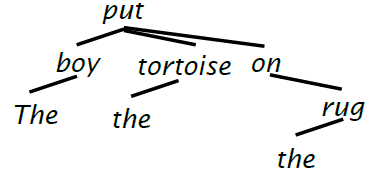
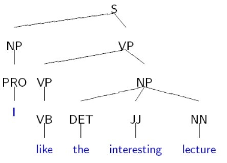
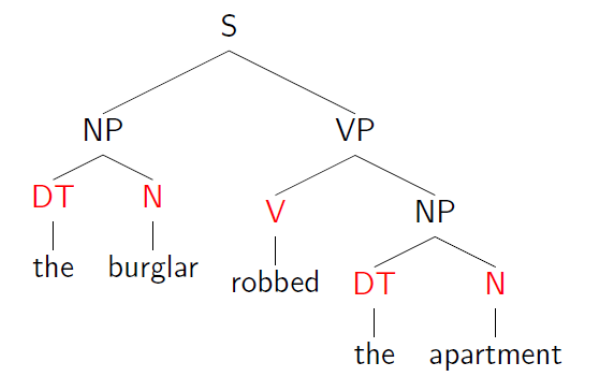
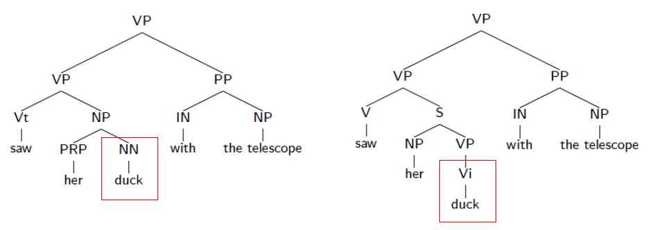
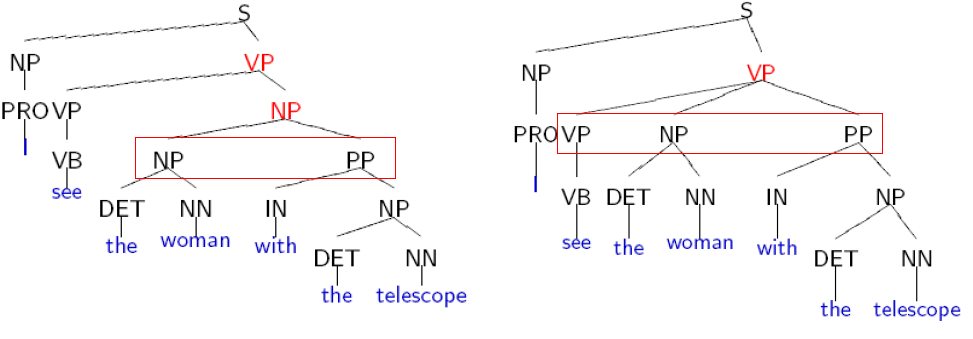
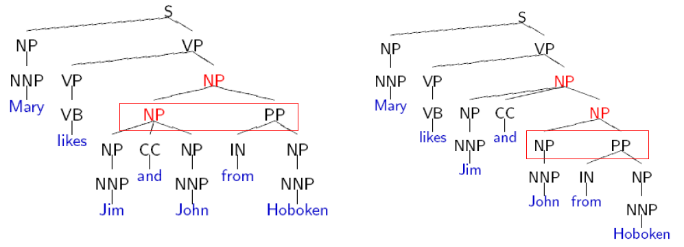
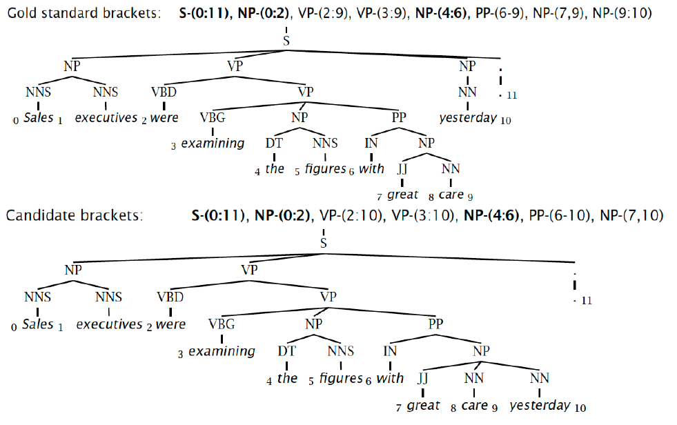

句法分析

## 概述

两种不同的句法结构：
- 依存结构(Dependency structure) - 词和其他词之间之间的依赖关系
  - 表示为依存树(dependency tree)
  - 
- **短语结构**(Phrase structure) - 把句子表示为**嵌套**的**短语成分**
  - 可以表示为句法树
  - 

本章仅针对**短语结构分析**

- 输入 - 句子
- 输出 - 句法树
- 目的
  - 判断输入句子是否合法
  - 根据语法规则生成句法树
- 前置知识
  - 如何形式化描述语言
  - 句法分析算法

## 词性

常见词性：

- N = noun
- V = verb
- DT = determiner
- NP = noun phrase
- VP = verb phrase
- S = sentence

例：

## 形式语法

### 概述

**形式语法**是规定语言中允许出现的结构的形式化说明

几种主要的形式语法：
- CFG(s): context-free grammar(s) 上下文无关文法
- LFG: lexical functional grammar
- HPSG: head-driven phrase-structure grammar
- TAG: tree adjoining grammar
- CCG: combinatory categorical grammar

本章重点讲述上下文无关文法

### 上下文无关文法

生成式左侧有且仅有一个非终结符的文法（详见形式语言与自动机）

因为左侧仅有一个非终结符，所以和上下文无关

### Chomsky范式

生成式右侧仅能出现以下两种情况：
- 两个非终结符
- 一个终结符

详见形式语言与自动机

## CKY Parsing

Cocke-Kasami-Younger Parsing

### 概述

CKY句法分析，使用**自底向上**句法分析算法计算句法树。使用**线图**(chart)存储中间结果

其实就是**逆向递归下降分析**，就称作**递归上升分析**好了（我瞎起的名字

### 算法

首先把词转换成词性标签：

然后从左向右递归穷举，查询是否有这样的有效生成式。。。如果找不到就回退

## 句法分析的问题（常见歧义）

### 词性歧义

### 名词修饰语歧义

### 介词短语修饰语歧义

### 边界歧义

## 概率上下文无关文法

### 概述

试图解决上述歧义问题

PCFGs(Probabilistic context-free grammars) or SCFGs(Stochastic context-free grammars)

基本思想：如果一个非终结符拥有多个不同的生成式，**给这些生成式赋予一个概率值**，如：

则最终**句法树的概率值为所有使用的生成式的概率值的乘积**

### PCFG的假设

- 位置不变性 - 概率不随非终结符在树的位置不同而不同
- 上下文无关 - 概率不随非终结符附近的符号不同而不同
- 祖先节点无关 - 概率不随未来的规约操作不同而不同

### 模型参数

因为PCFG使用Chomsky范式，所以模型的生成式只有如下两种情况：

- 生成式右侧为两个非终结符
  - A -> BC
- 生成式右侧为一个终结符
  - A -> a

令非终结符数量为n，终结符数量为t。模型参数即为所有生成式的概率，所以需要
- 一个`n*n*n`的三维矩阵保存第一种情况的参数
- 一个`n*t`的而为矩阵保存第二种情况的参数

### 如何使用PCFG找到最优句法树

显然也使用**动态规划**

定义动态规划表项`π(i, j, X)`表示由非终结符X推出子串`[wi, ..., wj]`的最大概率

- 初始化
  - 非终结符能直接推出的子串只有一个终结符（Chomsky范式限定）
  - 
- 递推
  - 概率等于【**生成式概率**乘**根据生成式确定的推导子串最大概率**】的最大值
  - 
- 终止
  - 得到`π(1, n, S)`，即初始符号S推出整个串的最大概率
  - 

### 如何得到PCFG（略

句法规则学习

Penn treebank: 由the University of Pennsylvania创建的树库

## 句法分析的评价

例：

注意输出的结果包括了**标签**与**标签的【括号】的位置**（数字表示括号位置，即空白位置）

对比标准结果和系统输出结果，标准结果输出了8个标签，系统输出了7个标签。二者有3个标签相同。

- 标记正确率(LP: labeled precision) = 分析正确的短语个数/分析得到的短语个数
  - 此例中为3/7=42.9%
- 标记召回率(LR: labeled recall) = 分析正确的短语个数/标准结果中的短语个数
  - 此例中为3/8=37.5%
- 正确率和召回率综合指标`F1 = 2 * LP * LR / (LP + LR)`
  - 此例中为40%
- 词性标注准确率(tagging accuracy)
  - 此例中所有词的初始词性均标注正确，即100%

