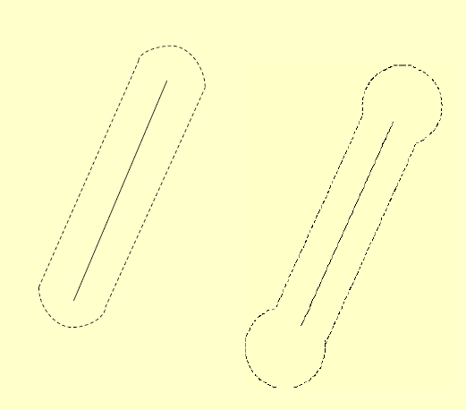

## 交互硬件设备

- 定位设备
  - 在二维或三维坐标系统中定位
  - 鼠标
- 键盘设备
  - 用来输入字母、数字、选择功能
  - 键盘
- 取数设备
  - 可以使用旋转或平移的电位器实现
- 选择设备
  - 用来选择功能或图形元素
- 其他输入设备
  - 语音识别器
  - 数位板
  - ...

## 基本交互任务

- 定位
- 选择
- 数量输入
- 文本输入
- 三维交互任务
  - 三维空间定位、选择、旋转...

## 高级交互技术

### 几何约束

- 定位约束
  - 光标仅能定位到屏幕上的离散点
  - 任何输入都选取最近的网格结点
- 方向约束
  - 如画线只能是水平或垂直的

### 拖动

实时显示子图的位置

用户感觉更直观

### 橡皮筋技术

确定起点后实时显示起点到当前点的路径。

橡皮筋可以使用矩形代替

### 图形变比

把图片的某一部分放大或缩小

### 引力场效果

参考磁吸效果

在目标点或直线（比较小或者比较细，难以选择的对象）周围设置一个香肠或哑铃型区域

### 标尺和导向线

参考ppt的参考线。仅在部分编辑的时候显示

### 坐标显示

直接显示坐标

### 三视图三维输入

输入时输出三视图

### 推移

使用二维图片在三维空间的变换（旋转、平移、放缩等）轨迹形成的三维图形，如三角形旋转轨迹形成圆锥

### 结构平面

选择一个3D物体的一个平面，在平面上选取一个区域进行推移操作。这个平面就是结构平面

## 输入过程基本处理模式

### 请求方式Request mode

应用程序实现输入设备的初始化

当应用程序需要输入时等待用户输入（阻塞

### 取样方式Sample mode

设备立即输入信息，与应用程序的输入命令无关

### 事件方式Event mode

输入设备和程序同时工作（非阻塞）

用户输入后产生一个事件（中断），程序处理输入队列

## 设计人机交互的一般风格及原则

风格：
- 所见即所得what you see is what you get
  - 在屏幕上见到的设计结果和使用硬拷贝得到的输出结果应该是一致的
- 直接操作direct manipulate
  - 能够直观地表现操作的结果，说明这个操作是被正确执行了
- 菜单和图形符号icon
  - 使用设计好的图形符号代表按钮的操作

原则：
- 简单易学
- 提供反馈
- 易于对错误操作进行修正（撤销
- 设计一致性（布局、颜色、代号等应一致