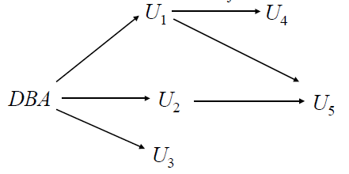

## 连接join

本质是笛卡尔乘积Cartesian product

通常在from中使用

```sql
select * from table_name1 join table_name2 on table_name1.attr1 = table_name2.attr1;
```

### 内连接与自然连接

```sql
select * from table_name1 inner join table_name2 on table_name1.attr1 = table_name2.attr2;

select * from table_name1 natural join table_name2;
```

### 外连接

使用null避免信息丢失的连接

```sql
select * from table_name1 natural left outer join table_name2;
```

有左外连接`left outer join`、右外连接`right outer join`、全外连接`full outer join`

### on & using

使用on指定连接的属性

```sql
select * from T1 join T2 on T1.attr1 = T2.attr2;
```

使用using简化以上语句

```sql
select * from T1 join T2 using(attr1);
```

## VIEW视图

也叫**虚表** - virtual relation

有时不希望某些用户看到整个逻辑模型，所以可以为其设置视图

### 视图定义

```sql
create view view_name as <query>
```

所有视图放在数据字典data dictionary中

定义view的时候不执行query语句。执行其他语句遇到视图时使用视图等价的基表替代

可以使用已有view定义其他view。
- 如果视图v2出现在定义视图v1的表达式中，则说v1是直接依赖(depend directly)v2的
- 如果视图v2被视图v1的定义所引用（直接或间接），则说v1是依赖(depend on)v2的
- 如果视图v依赖于自己，则说v是递归(recursive)的

### 视图的更改alter

使用`alter view view_name as <subquery>`**重新定义**view，不能仅增加column

### 视图的更新update

对视图的更新会转换成对基表的更新。但是不是所有视图都可以更新（比如使用聚集函数得到的视图则无法更新

可以像更新基表一样更新视图，即使用update int语句

### 视图具体化Materialized Views

根据视图创建一个物理基表。这个物理基表不会像视图一样随着元数据的更新而自动更新，需要手动维护

## 事务Transactions

原子操作。要么成功要么失败

成功时commit work，失败时rollback work

默认情况下大多数DBMS在执行每一条SQL语句的时候都会commit一下

## 完整性约束Integrity Constraints

### 单个关系的完整性约束

创建表的时候能够使用以下约束：

- not null
- primary key
- unique(attr1, attr2, ...)
  - 表明一系列属性能够形成候选键
  - 候选键可以为空
- check(P)

例：

```sql
create table section (
	course_id varchar (8),
	sec_id varchar (8),
	semester varchar (6),
	year numeric (4,0),
	building varchar (15),
	room_number varchar (7),
	time slot id varchar (4),
	primary key (course_id, sec_id, semester, year),
	check (semester in ('Fall', 'Winter', 'Spring', 'Summer'))
);
```

### 引用完整性Referential Integrity

外键foreign key只能为一个表的一个元组的主键或null

修改或删除一个元组时，对于外键的三种操作：
- 置空set null
- 重置set default
- 级联删除cascade

例：

```sql
create table t1(
	id integer primary key
);
create table t2(
	id integer,
	foreign key id references t1
		on delete cascade
		on update set null
);
```

### 复杂check（略

大多数DBMS不支持check

可以使用triggers实现check的功能

## SQL数据类型相关

不同的DBMS通常提供不同的内置数据类型

### 时间相关数据类型

- date
  - 年月日
- time
  - 时分秒
- timestamp
  - 年月日时分秒
- interval
  - 时间区间
  - date/time/timestamp进行减法得到interval

### 用户自定义数据类型与域

```sql
create type Dollars as numeric(12, 2) final;

create domain person_name char(20) not null;
```

类型和域相似。域可以包含更多限制（如not null）

```sql
create domain degree_level varchar(10)
constraint degree_level_test
check (value1 in ('123', '234', '345'));
```

### 大型对象类型Large-Object types

- blob - binary large object
  - 存储大量二进制数据
- clob - character large object
  - 存储大量文本数据

查询大型对象时通常返回一个指针而非整个对象

## SQL授权

### 授权图



root用户是DBMS的管理者(DBA: database administrator)

高级用户可以给下级用户授权

如果一个用户的授权被撤销(revoke)，则撤销所有下级用户的授权（如U1被撤销，U4和U5都被撤销，但是U5还有U2的授权所以仍然拥有一定权限

### 权限类型

数据相关权限：
- select(read)
- insert
- update
- delete

schema相关权限：
- index
  - creation and deletion
- resources
  - create new relations
- alteration
  - add/delete attributes in a relation
- drop

### 授权

```sql
grant <privilege_list>
on <relation_name or view_name>
to <user_list>;
```

其中user_list可以是：
- 一个user_id
- public - 所有用户
- 一个role

privilege可以是：
- select
- insert
- update
- delete
- all privileges

### 撤销授权

```sql
revoke <privilege_list>
on <relation_name or view_name>
from <user_list>;
```

同样，privilege_list可以是`all`，user_list可以是`public`

### 角色Roles

```sql
create role instructor;
```

权限可以授给角色

```sql
grant select on table1 to instructor;
```

角色可以相互授权以继承权限

```sql
grant role1 to role2;
```

### 其他授权相关（略

权限转移等

详见课本4.6

## Triggers

Triggers会自动执行语句

triggers由两个部分组成：
- 条件conditions
- 动作actions

### events

event类型：
- insert
- delete
- update

trigger可以before/after一个event的时候触发

```sql
create trigger trigger_name before update on table_name ...
```