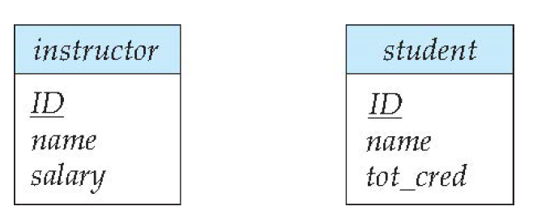
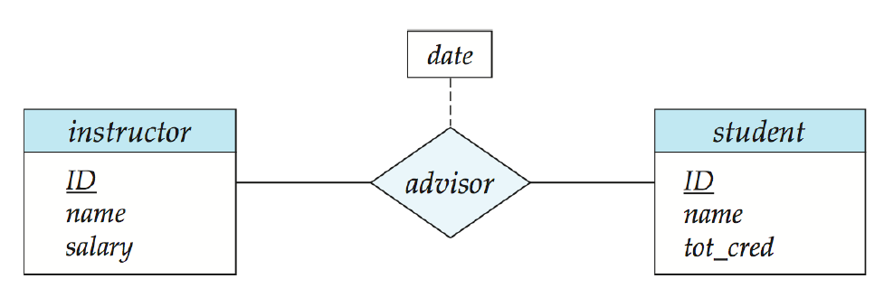
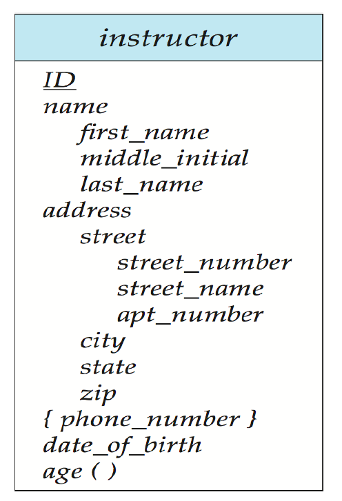
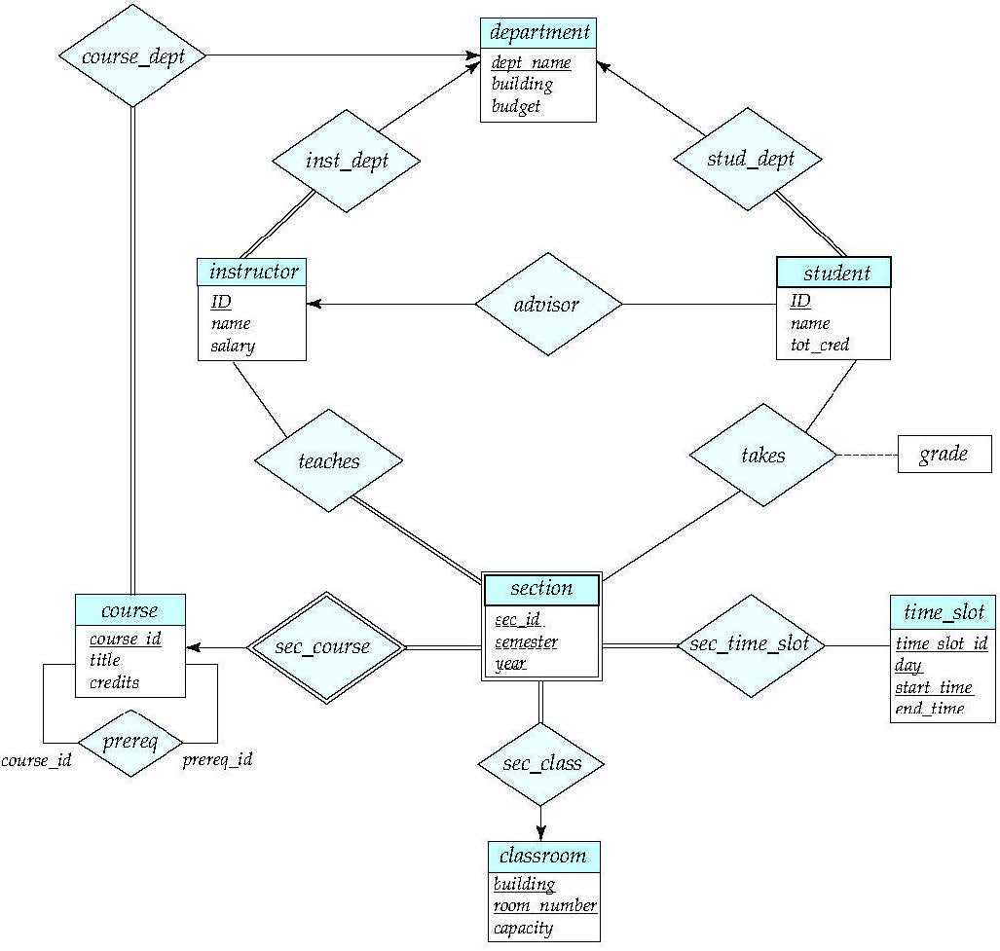
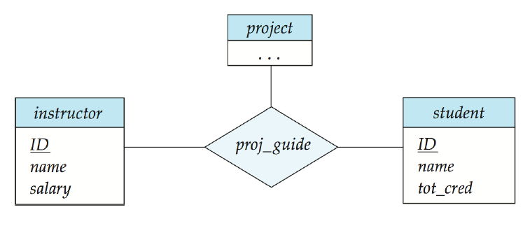
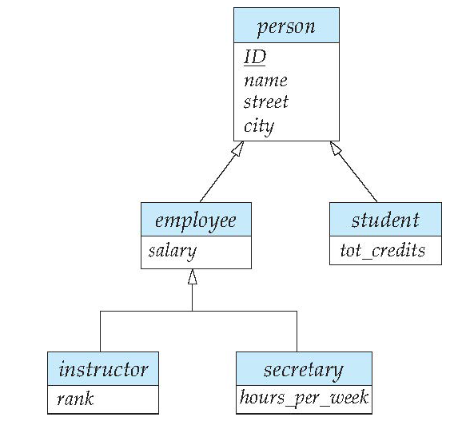
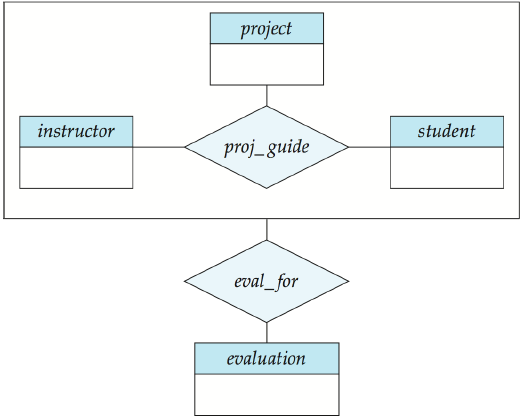
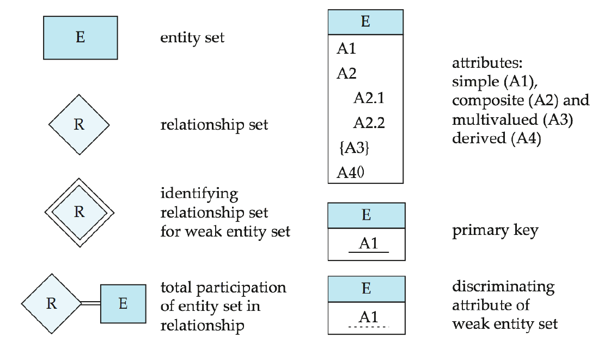
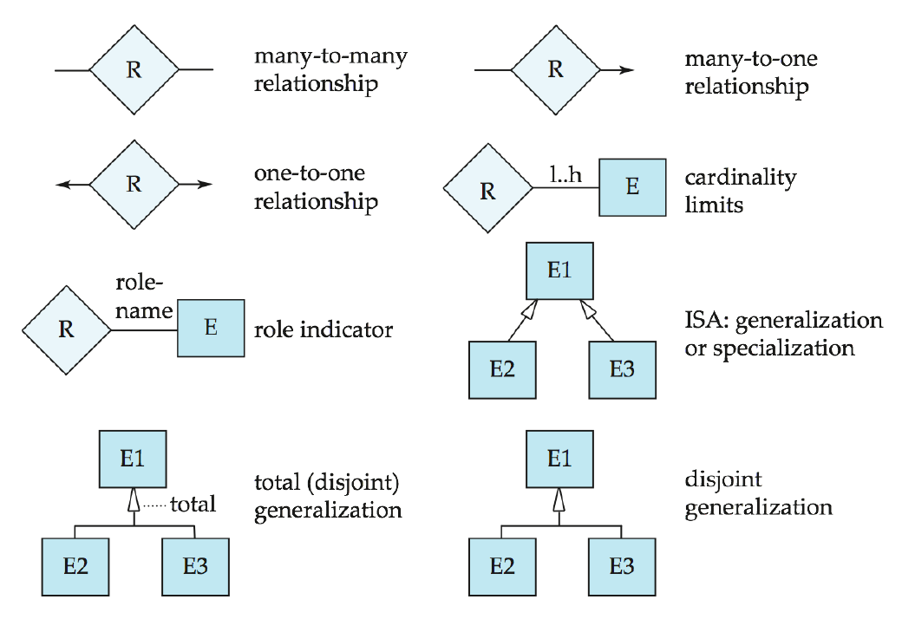

## 概述

基本ER模型包括：
- 实体集entity sets
  - 拥有相同属性的对象的集合
  - 实体集都有主键
- 关系集relation sets
  - 关系集连接多个（通常是两个）实体集
- 属性attributes
  - 属性可以是简单属性也可以是复合属性（由多个子属性构成，如姓名可以分解为姓和名
  - 可以是单值的也可以是多值的（如一个人可以有多个电话号
  - 有些属性可以由其他属性计算出来
  - 有些属性有特定的值域

## 映射基数约束

mapping cardinality constraints

二元关系可以是：
- 一对一
- 一对多
- 多对一
- 多对多

此处的多表示可以为0个

## 弱实体集

weak entity sets

有些实体集没有主键，其主键被蕴含在了与其有关系的实体集或关系的属性中。这样的实体集被称为弱实体集。可以确定弱实体集中的元组的实体集被称为identifying entity

每一个弱实体集必须关联一个identifying entity

弱实体集中有些属性会和弱实体集外面的属性共同组成主键，这些属性称为discriminator判别属性

## ER图

### 基本

实体集，标注下划线的**所有属性**组成主键

关系，只有名字

有属性的关系（注意是虚线

### 角色

### 基数约束

箭头表示1，直线表示多

一对一：

一对多

### 部分参与与全参与

total and partial participation

两条线表示全参与，一条线表示部分参与

### 标记数量

可以使用数字表示数量，使用两个被`..`隔开的数字表示范围，`*`表示任意（可以为0

### 关于属性的表示

- 复合属性name和address（复合属性可以有多层
- 多值属性phone_number
- 可以被计算的属性age

### 弱实体集

使用两层矩形表示弱实体集。关联弱实体集和强势体积的关系使用两层菱形

判别属性使用虚线标注

此例中section的主键是`(course_id, sec_id, semester, year)`

### ER图实例

## 其他ER图相关

### 非二元属性

### 特化（继承

specialization

类似于面向对象设计中的继承概念，继承属性

继承可以分为：
- 正交disjoint - 子类没有重叠部分
- 重叠overlapping - 子类有重叠部分

比如继承“人”得到“男人”和“程序员”就有重叠

继承还可以分为：
- 完全total - 包含了所有父类的情况
- 部分partial - 不包含所有父类的情况

以上两种分类可以组合出四种继承

继承的ER图表示：

### 泛化

generalization

自底向上设计，组合一些属性相同的实体集。在ER图中看起来和继承没什么区别，只是设计时的不同。

### 聚集

聚集多个实体集（和关系）成为一个聚集，聚集可以有聚集的主键（由内部实体集和关系生成）

## 设计问题

### 属性 vs 实体集

通常设计关系的目的是为了描述两个实体之间可能发生的**操作actions**，否则使用属性足矣

### 二元关系 vs 多元关系

尽量使用二元关系取代多元关系

## ER图总结

不同的标准得到的ER图是不一样的（比如形状的表示不通过）。此处是标准之一

## ER图转DB schema

### 实体集

直接变成关系即可

### 弱实体集

要把弱实体集外部的能够组成弱实体集主键的属性包含进弱实体集的关系中。通常是identifying entity的主键

### 属性

- 复合属性变成多个属性
- 多值属性变成一个表（注意命名），表的主键是原实体集的主键
- 忽略衍生属性（如果计算麻烦的话也可以不忽略，视情况而定

### 关系集

- 多对多的关系集 - 需要一个关系保存关系两边的实体集的主键
- 一对多的关系集 - 保存一的主键到多的那一边
- 一对一的关系集 - 任意一边保存另一边的主键即可

完全演绎 & 不完全演绎（部分演绎） - 完全演绎：所有底层实体集的并集等价于高层实体集

