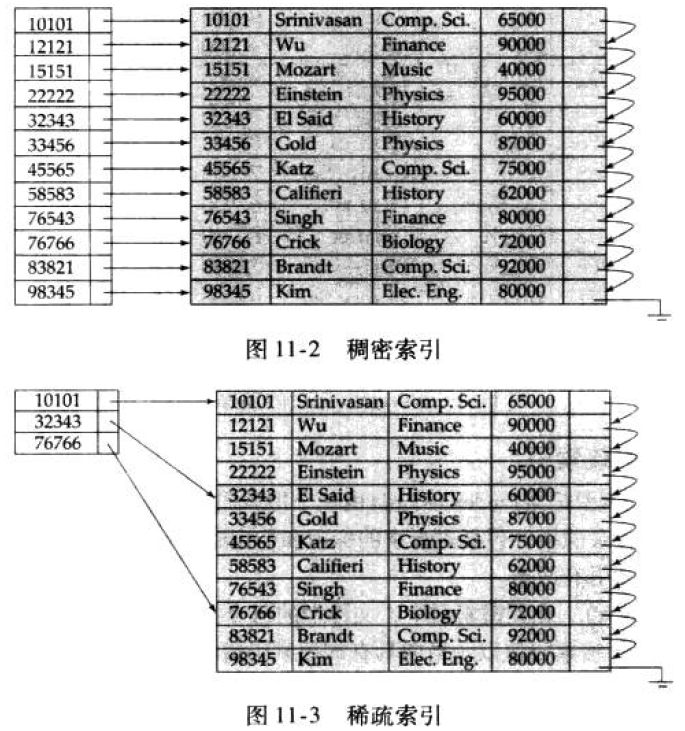
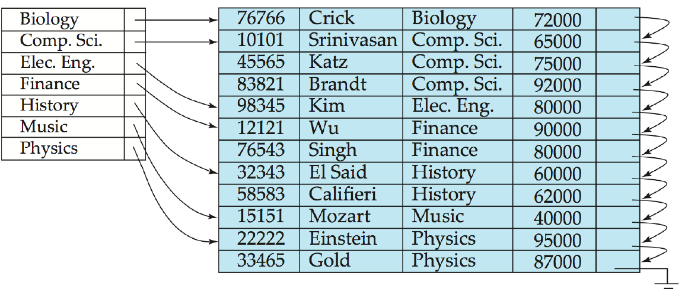
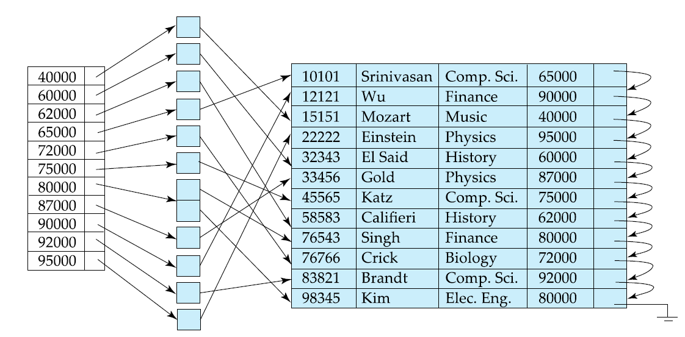
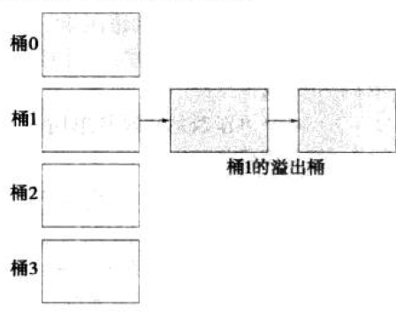
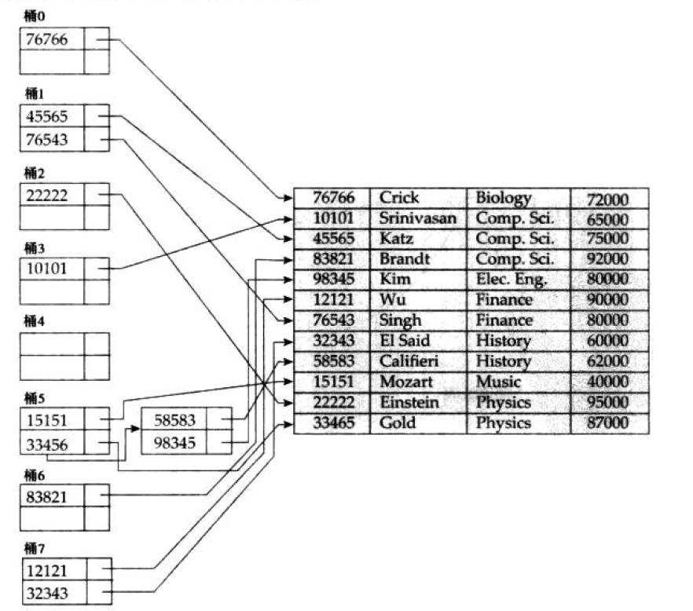

## 基本概念

索引用来加速查询

搜索码search key - 用来寻找记录的一些属性

索引文件index file由索引记录index records(index entries)构成，后者包含两个域：
- 索引值，即search key value
- 记录入口，即record entry或pointer

索引文件通常小于源文件

索引类型：
- 有序索引 - 顺序存储搜索码
- 哈希索引 - 使用哈希函数把目标存储在桶buckets中

索引评估指标：
- 访问类型access type（属性为某个值或者属性为某个范围
- 访问时间access time
- 插入时间insertion time
- 删除时间deletion time
- 空间开销space overhead

索引通常加速查询，可能减速修改。增加额外空间开销

## 顺序索引

- 主索引primary index - 索引顺序和数据顺序一致，也叫聚集索引clustering index。通常主索引选用主键
- 辅助索引secondary index - 也叫非聚集索引non-clustering index。搜索码顺序与文件顺序不同

- 稠密索引dense indices - 索引中包含了所有search key的值
- 稀疏索引sparse indices - 索引中不包含所有search key的值

如下图。如果以ID作为search key，稠密索引必须包含表中search key出现的每一个值



如果选部门作为稠密索引，结果如下：



稀疏索引占空间少，更易于维护，查询更慢

多级索引 - 适用于大量数据。外层索引outer index使用稀疏索引，内层索引inner index使用稠密主索引

## 删除表项时更新索引

如果被删除的记录是唯一拥有其索引值的记录，则删除此索引值

否则
- 单级索引
  - 稠密索引
    - 如果索引项保存的是所有相同码值的指针，则删除目标记录的指针
    - 如果索引项保存的是所有相同码值的记录的首指针，则修改首指针指向下一条记录
  - 稀疏索引
    - 如果目标记录是唯一具有此搜索码值的记录，则系统用下一个搜索码值的索引记录替换相应的索引记录。如果下一个搜索码值已经有索引项，则删除而不是替换当前索引项。
    - 否则修改索引项使指针指向下一个相同搜索码值的记录
- 多级索引略

## 插入表项时更新索引（略

## 辅助索引

辅助索引必须稠密，对每个搜索码值都有一个索引项，且对每个记录都有一个指针



## B+树索引（略

## 哈希索引

### 概念

桶bucket用来保存记录。通常一个桶的大小为一个磁盘块

K为所有可能的码值，B为所有桶。哈希函数把K映射到B

理想的哈希函数：
- 均匀的uniform - 对于所有K，每个B被分配的码值应该是均匀的
- 随机的random - 对于实际K的分布，每个B被分配的记录数量是均匀的

### 处理桶溢出

造成桶溢出：
- 桶数量不足
- 记录分配不均

设置溢出桶overflow bucket



### 哈希索引

通常是辅助索引。如果文件自身就是哈希组织文件，那可以不用哈希索引



### 静态哈希索引缺陷

- 数据增长导致桶溢出
- 初期申请大量空间导致浪费
- 后期删除数据导致空间浪费
- 可以周期性重新组织索引，但是麻烦

## SQL中的索引

```sql
create [unique] index <index-name> on <relation_name> (<attribute-list>)
```

如果搜索键是候选键，就使用`create unique index`

## Multiple-Key Access

假设select语句的where子句中有两个条件A和B，查询策略：
1. 根据条件A得到一个表，在里面找B
2. 根据条件B得到一个表，在里面找A
3. 根据A和B分别得到一个表，求交集

可以使用多属性索引加速，比如设置索引`(A, B)`

多属性索引可以加速处理:
- `A = a and B < b`
- `A = a`

但是不能加速:
- `A < a and B = b`
- `B = b`