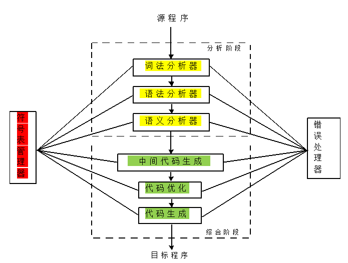

## 概念

- 翻译程序 - 把A语言翻译成B语言的程序
	- 编译程序 - 把高级语言翻译成目标语言（通常为机器语言或汇编语言
	- 汇编程序 - 把汇编语言翻译成目标语言（通常为机器语言
- 解释程序 - 解释执行源程序，**不生成目标程序**而直接输出结果

编译程序和解释程序的**根本区别** - 是否生成**目标代码**
- 编译程序生成目标代码
- 解释程序不生成目标代码

注意：二者都生成**中间代码**，只不过解释器执行结束之后就会丢弃中间代码，而编译器把中间代码转换为目标代码

特例：JAVA语言先把源程序(.java)**编译**为字节码(.class)，然后对字节码**解释**执行，是介于编译型语言和解释型语言的语言

## 编译过程

1. 词法分析
2. 语法分析
3. 语义分析+中间代码生成
4. 中间代码优化
5. 目标代码生成

## 编译程序典型结构

## 错误处理

错误等级自底向上依次为

1. 词法错误
2. 语法错误
3. 语义错误
4. 逻辑错误

### 词法错误

出现非法字符

### 语法错误

语法不符合此语言的文法规则

**关键字拼写错误属于语法错误**

### 语义错误

- 静态语义错误 - 运行前出错
	- 变量未定义
	- 类型不匹配
- 动态语义错误 - 运行时出错
	- 除零错误
	- 空内存访问

## 其他概念

### 前端与后端

- 前端 - 从源语言到中间语言（并优化中间代码
- 后端 - 从中间语言到目标语言（并优化目标代码

**前后端分离使编译器易于移植、代码复用**：不同源语言只需要编译成相同中间语言，然后使用同一个后端即可；相同语言要编译到不同目标语言，可以使用相同的前端，只需要更改后端即可

>拓展知识：有些编译器分为前中后端
>- 前端负责处理源语言文件
>	- 词法分析
>	- 语法分析
>	- 语义分析
>- 中端负责生成中间代码（并优化
>- 后端负责生成目标代码（并优化

### 一遍扫描与多遍扫描

编译程序可以根据扫描源文件的次数分为
- 一遍扫描编译程序
- 多遍扫描编译程序

编译的过程可能需要多遍扫描源文件。比如每个处理过程都扫描一次。**多遍扫描编译需要一个总控制器**

也可能只扫描一次，这时需要把 **语法分析器** 作为主体（总控制器），把词法分析器和语义分析器（和代码生成器）作为子程序调用。

**多遍扫描**的优缺点
- 优点
	- 减少对内存容量的要求
	- 各遍的编译子程序功能独立，相互联系简单，结构清晰
	- 能够实现更充分的优化，获得高质量目标程序
	- 分离前后端，为移植创造条件
- 缺点
	- 增加了不少重复性操作。慢

### 编译程序的伙伴工具

- 预处理器
	- 宏处理
	- 文件包含
	- 语言扩充 - 可以自定义一些源语言没有的操作
- 汇编程序
	- 最简单的汇编程序也要对输入进行两遍扫描
- 连接装配程序

