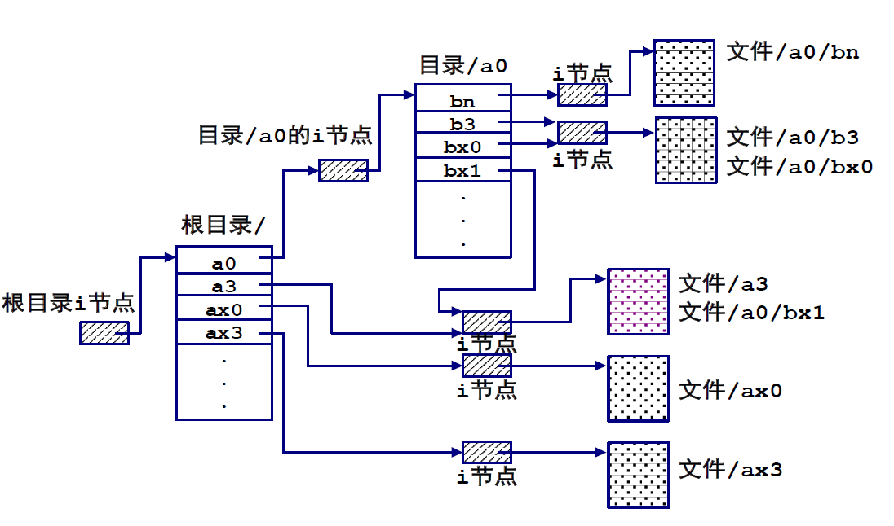
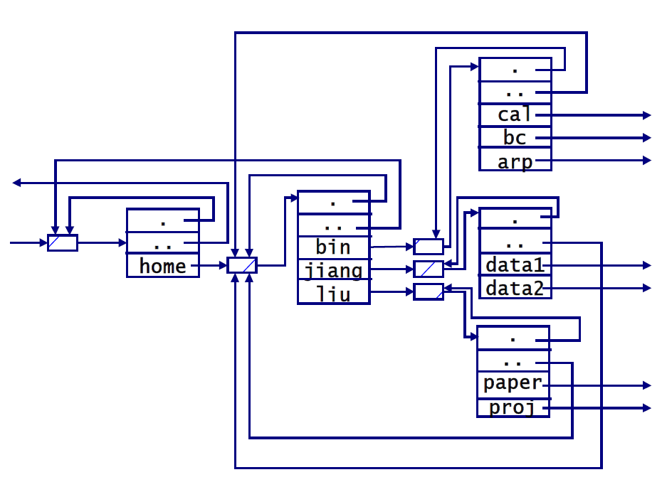
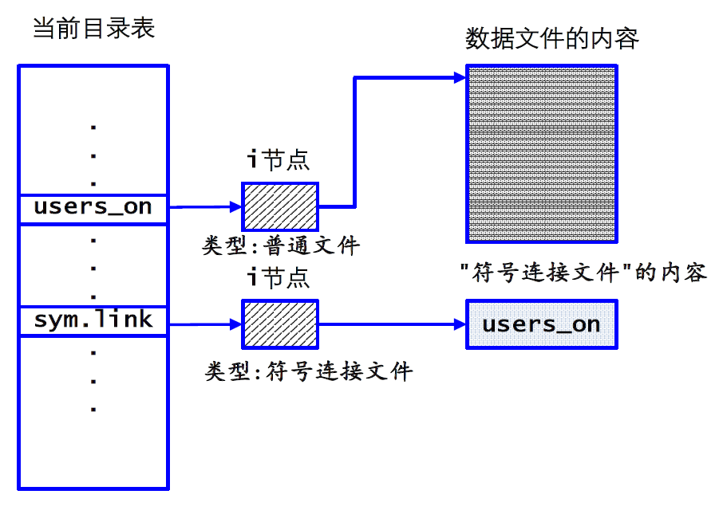

## 文件命名相关

- 长度限制 - 通常1-255
- 合法字符 - 除了`/`其他都是合法字符，不可打印字符也可以作为文件名除了`\0`
- 区分大小写 - linux区分，windows不区分，所以可能两个文件从linux复制到windows变成一个文件

## 系统目录

### 系统配置文件

在`/etc`目录下，类似于windows的注册表文件。内容为文本

在`profile/bash.bashrc`可以设置系统级的bash偏好设置

### 其他目录

`/tmp`存放临时文件。任何用户都有权限在这里创建文件，但是只能删除自己的文件

`/var`存放系统运行时要改变的数据，比如系统日志

`/bin`存放系统命令（程序），如ls/cat之类的

`/usr/bin`存放一些常用命令。其中`usr`的意思是`Unix System Resource`

`/sbin` & `/usr/sbin`存放管理员专用命令

`/dev`存放设备文件

`/usr/include`存放C语言头文件

`/lib` & `/usr/lib`存放各种库文件，如C语言的链接库

>静态链接库的文件为`.a`后缀，意为`archive`存档。动态链接库文件后缀为`.so`，意为`shared objects`。linux广泛使用动态链接库

## 文件通配符

- `*`匹配任意长度的文件名字符串（包括空串
- `?`匹配任意单个字符
- `[]`匹配括号内的任一字符，可以使用`-`指定范围，如`[A-Z]`、`[Mm]akefile`
- `~`波浪线是bash特有的，`~`表示当前用户主目录，`~name`表示用户name的主目录

特殊规则：
- 点字符`.`作为文件名或路径的**第一个字符**时必须**显式匹配**
  - 例：`*file`匹配`file` & `makefile`，但是不匹配`.profile`。`try*c`匹配`try1.c` & `try.basic`
- 斜线`/`也必须**显式匹配**
  - 例：`*/*`匹配一级目录下所有文件

`.`文件与`..`文件分别表示当前目录与上级目录。把`.`解释为当前目录**并不是通配符处理程序完成的**，而是目录的存储结构里面就有这两个文件

windows和linux文件通配符有差异。比如windows中`*.*`匹配所有文件，而linux就要求文件名必须有`.`才能匹配

文件通配符适用于所有命令，因为匹配的过程对命令是透明的

通配符可以用来简化命令的输入，比如可以使用`*`代替长文件名中的一些部分，例：使用`*sna*`匹配`configure-IBM-sna-network.d`

unix下由shell完成对文件通配符的展开，windows下由命令自身处理通配符（即把通配符作为普通字符串传入程序

## 文件操作

### ls

- 没有实参时列出当前目录下所有文件和目录（实参指非命令行选项的参数
- 实参为文件时输出那个文件的相关信息（正常情况仅输出文件名，如果有其他命令行选项则可能输出其他信息
- 实参为目录时列出目录下的所有文件和目录

`ls`命令有几十个选项，控制输出的信息与格式

- `ls -F` - Flag，输出文件名和类型。现在的shell通常以颜色区分文件类型，在写脚本的时候可以用到此选项
  - 如果是普通文件，输出文件名
  - 如果是目录，输出`filename/`
  - 如果是可执行文件，输出`filename*`
  - 如果是符号链接文件，输出`filename@`
- `ls -l` - 长格式输出。如`-rwxr-x--x 1 user1 group1 519 Jul 5 15:02 arg`
  - 首字符为文件类型
    - `-` - 普通文件
    - `b` - 块设备文件block
    - `d` - 目录文件dir
    - `c` - 字符设备文件char
    - `l` - 符号链接文件link
    - `p` - 管道文件pipe
  - 第2-4、5-7、8-10字符为文件访问权限(rwx表示读、写、执行，`-`表示不允许)
    - 2-4为文件主人的权限
    - 5-7为同组用户权限
    - 8-10位其他用户权限
  - 第二列表示文件link数量，后面会讲到
  - 第三列为用户名，第四列为组名
  - 第五列为大小
    - 普通文件 - 字节数
    - 目录 - 列出**目录表的大小**而不是目录下的文件长度之和
    - 符号链接文件 - 列出符号链接文件**自身**的长度
    - 字符设备和块设备文件 - 列出主设备号和次设备号
    - 管道文件 - 列出管道内数据长度
  - 第六列到倒数第二列为文件最后一次被修改的日期时间
  - 最后一列为文件名
- `ls -h` - human-readable，使用便于人类阅读的方式输出（比如不按照字节输出，而是按照K/M/G为单位输出）。很多其他命令也有类似选项
- `ls -d` - directory，显示目录自身的信息
- `ls -a` - all，显示文件名以`.`开头的文件和其他文件（默认以`.`开头的文件是不显示的
- `ls -A` - 和`ls -a`类似。但是不输出`.` & `..`
- `ls -s` - size，显示文件占用磁盘空间
- `ls -i` - i-node，显示文件的i节点号

实例：`ls` & `ls *`的效果分别是？`ls`仅输出当前目录所有文件和目录名。而`ls *`先被shell处理文件通配符，即把所有文件名和目录名传给了`ls`，所以会输出所有当前目录下的文件和一级子目录下的文件

管道文件：程序输入到此文件，另一个程序从此文件读出。不产生实际的文件

符号链接文件 - 相当于windows快捷方式

`/dev`下的文件几乎都是`b`或`c`类型的文件

参数可以简写，如`ls -l -h`可写为`ls -lh`

### cp

两种格式：
- `cp f1 f2`
  - 把f1拷贝到f2。如果f2不存在则创建。如果存在且为文件则覆盖。如果存在且为目录，则按照格式2处理
- `cp f1 f2 ... fn dir`
  - 把文件按照原名拷贝到目标目录下。要求目标目录`dir`已存在而且是目录

举例：假设目录dir1下有1.c和2.c两个文件，则命令`cp dir1/*.c`会被shell解释为`cp dir1/1.c dir1/2.c`，结果为2.c的内容被1.c覆盖。如果是windows下，执行结果为把两个文件拷贝到当前目录。如果在linux下也想拷贝到当前目录，应该写`cp dir1/*.c .`使用`.`指定当前目录

参数：
- `-u` - update增量拷贝，便于备份目录。根据文件的时间戳，拷贝被更新的文件。如果dir1和dir2位置颠倒则会出现灾难性后果。不如用版本管理系统
- `-r` - 递归拷贝文件树
- `-v` - 显示进度

### mv

移动文件，可以用来给文件改名

- `mv f1 f2`
  - 把文件f1移动到f2（把文件f1改名为f2
- `mv f1 f2 ... fn dir`
  - 把文件f1-fn移动到dir里面
- `mv dir1 dir2`
  - 同文件系统 - 把dir1移动到dir2（重命名
  - 不同文件系统 - 拷贝目录dir1到dir2然后删除dir1

### rm

`rm f1 f2 ... fn`

选项：
- `rm -r` - 递归删除目录树recursive
- `rm -i` - 删除文件之前需要操作者确认inform。可以用来删除文件名不易打出来的文件（比如不可见字符
- `rm -f` - 强制删除force。只读文件也可以删除而且没有提示

正在运行的可执行程序文件不能被删除

### touch

把文件的最后一次修改时间改为当前时间。如果文件不存在则创建文件

## 显式区分命令选项和处理对象

文件名除了`/`其他都可以包含，那如果文件名长得和命令行选项一样呢？比如文件名为`-i`

假设目录下存在文件`a.c` & `b.c` & `-i`，那么命令`rm *`会被翻译为`rm -i a.c b.c`导致错误出现

解决方案：`rm -- -i` - `--`表示后面的`-`都是文件名的一部分而非命令行选项

## 目录管理

### 路径

目录表中确实有`.`和`..`这两个文件，由系统进行创建和删除

每个用户都有自己的主目录home directory。可以使用命令env查看环境变量中HOME的值

如果路径第一个字符是`/`则为绝对路径（`/`表示根目录），否则为相对路径。注意是斜线`/`而不是反斜线`\`

### 常用命令

- `pwd` - print working directory显示当前目录
- `cd` - change directory改变当前工作目录
  - cd是shell的一个内部命令，**不是一个可执行文件**，修改的是**当前进程**（bash）的属性。其他命令都是shell的子进程，不能修改shell的属性
- `mkdir` - 创建目录。系统会自动创建目录中的`.` & `..`文件
  - 选项`-p`自动创建路径中不存在的目录
- `rmdir` - 删除目录，只能删除空的目录。通常被`rm -r`取代，因为后者可以删除非空目录
- `find` - 从**指定的查找范围**开始，遍历目录树（递归，深度优先）。满足条件的文件或目录可以**执行规定的动作**
  - 如：`find dir1 dir2 -name '*.c' -print`表示在dir1 & dir2中查询以`.c`后缀结尾的文件并执行动作print
  - 动作可以使用`-exec`来指定任意指令
  - 选项`-ok`需要操作员确认每个文件是否执行指令
  - find指令的命令行选项很多，自行查找
- `tar` - 文件归档Tape ARchive。语法`tar ctxv[f device] file-list`
  - 选项第一列表示执行的操作
    - `c`表示create创建文件从头开始写，覆盖之前内容
    - `t`表示table。列出磁带上的文件名。不指定时输出所有文件名
    - `x`表示extract抽取，表示从磁带中提取指定的文件。不指定文件时提取所欲文件
    - `v`表示verbose冗长，每处理一个文件就打印文件的文件名，并在前面输出功能字母
    - `f`表示file，指定设备文件
    - `z`表示使用gzip压缩算法
    - `j`表示使用bzip2压缩算法

`~`表示用户子目录。可以使用`~username`指定用户

shell中的分号默认是用来分隔指令的。在find中使用时需要`\`转义

gcc
- -O0禁用优化
- -Wall 启用所有警告(warning all)

## 命令如何获取信息

易变性从小到大为：
- 配置文件
- 环境变量
- 命令行参数
- 交互式键盘输入

环境变量可以使用库函数获取，如C中的getenv

### 命令行参数的风格

通常三种风格：
- 使用`param=value`表示参数（不建议
- 使用`-param`表示，减号后面可以接一个长单词
- 有长选项和短选项之分，使用`-`激活短选项，使用`--`激活长选项。短选项通常只有一个字母，是长选项的缩写。如果短选项含有多个字母就表示是多个命令行选项（建议使用

可以使用库函数获取，如C中的getopt_long

## 文件系统

### 概述

根文件系统root filesystem（类似于windows C盘

linux不分逻辑盘，**把不同文件系统作为子目录**

### 常用指令

- 创建文件系统指令`mkfs`，如`mkfs /dev/sdb`在块设备文件`/dev/sdb`上创建文件系统
- 安装文件系统`mount`，如`mount /dev/sdb /mnt`即把文件系统安装到目录`/mnt`上。操作目录`/mnt`就是对文件系统的访问
  - 不加参数的`mount`显示当前已安装的所有文件系统
- 卸载文件系统`umount fs-name`
  - 根文件系统无法被卸载
- `df`显示文件系统信息（如剩余空间
  - 选项`-h`表示human-readable
  - 选项`-i`显示i节点信息

### 文件系统存储结构

逻辑设备按照**块（扇区）**为单位进行划分，从0开始编号。每块512字节或更大的$2^n$字节


- 引导块（0号）
  - 用来启动系统。只有根文件系统的引导块有效
- 专用块（1号）
  - 也叫管理块、超级块，用来存放文件系统的配置信息（文件系统大小、i节点区的大小、空闲空间大小、空闲块链表头等
  - `mkfs`的时候初始化专用块，`df`命令可以读出部分信息
- i节点区（i节点，index node
  - 在`mkfs`的时候初始化
  - 由若干块组成，每个块可以容纳若干个i节点，i节点大小固定（比如64B
  - i节点从0开始编号，根据编号可以索引到指定的磁盘块
  - 每个文件对应一个i节点
  - i节点中的信息包括
    - 指向文件存储区数据块的索引
    - 文件类型、权限、link数、大小、时间戳等信息
    - **i节点不存储文件名**（因为文件名长度易变，而i节点定长。文件名存储在目录文件中
- 文件存储区
  - 存储文件和**目录文件**

目录表，即目录文件。目录文件的内容为**文件名和i节点编号**。这样如果文件名过长，只要继续给目录文件分配块即可。**不把文件名保存在i节点中是为了提高检索效率**（减少磁盘访问次数



### i节点与连接

使用命令`stat`可以读取i节点的信息，如`stat a.txt`

如果两个文件拥有相同的i节点号，那么这两个文件就指向一个i节点。这样的连接称为**硬连接**（因为是在硬件存储结构的层级连接）可以跨目录，但是**不能跨文件系统**

每个目录指定的 文件名-i节点号 映射关系称为一个硬连接。i节点的硬连接数目就是此i节点被引用的数量

可以使用指令`ln`对文件进行连接，如`ln f1 f2`可以链接两个文件，使用`ls -i f1 f2`的时候会发现二者的i结点号是相同的。两个文件同时存在，地位平等，但是删除f1时f2仍然存在，只是i节点的link数量减1（i节点有引用计数器

硬连接只能连接普通文件。**目录表不能被硬连接**

通常来说，目录表的硬连接数为直属子目录数+2（因为子目录的`..`文件指向它，自己的`.`文件指向它，父目录也有一个链接指向它



**软连接**或**符号连接**则是通过软件实现，更像是windows系统的快捷方式。使用**符号连接文件**实现，文件中仅包含路径名。类型为`l`，大小为8B，文件的最后一次写事件以后不再变化。符号连接删除的是符号连接文件，其他操作都将访问目标文件



**符号连接中的相对路径是相对于符号连接文件的相对路径**

硬连接与软连接的比较：
- 硬连接
  - 在数据结构、硬件层次实现
  - 仅适用于文件，不适用于目录
  - 不能跨文件系统
- 软连接
  - 能够做到硬连接能够做到的所有事
  - 软件实现
  - 适用于目录，可以跨文件系统
  - 调用时需要占用操作系统内核的一部分开销

## 系统调用

### 概念

系统调用以C语言函数调用的方式提供。是应用程序与操作系统内核进行交互的**唯一手段**

系统调用在汇编层面是软中断指令INT，而其他函数调用则是CALL指令。库函数只是对系统调用的效率更高或更方便的封装，同时实现可移植性

### 错误处理

系统调用的返回值是一个整数。大于等于0表示成功，小于0表示失败。整型变量errno是标准库中的一个变量，在`#include <errno.h>`之后可以直接使用此变量查询错误

库函数`char * strerror(int errno)`可以把错误代码转换为字符串，printf函数也可以使用`%m`表示message，即上一次的错误代码。如`printf("ERROR %d: %m\n", errno)`

### 使用系统调用访问i节点与目录

库函数`int stat(const char *pathname, struct stat *buf)` & `int fstat(int fd, struct stat *buf)`可以访问目标i节点，把返回值保存在buf中返回

结构体stat：

```c
struct stat {
  dev_t st_dev;/* 存储该文件的块设备的设备号ID */
  ino_t st_ino;/* inode号*/
  mode_t st_mode;/* 访问权限及文件类型*/
  nlink_t st_nlink;/* link数*/
  uid_t st_uid;/* 文件主ID */
  gid_t st_gid;/* 组ID */
  dev_t st_rdev;/* device ID (if special file) */
  off_t st_size;/* 文件大小（字节数）*/
  blksize_t st_blksize;/* blocksizefor filesystemI/O */
  blkcnt_t st_blocks;/* 分配的512字节尺寸块个数*/
  struct timespec st_atim;/* access时间*/
  struct timespec st_mtim;/* modification时间*/
  struct timespec st_ctim;/* change时间*/
};
```

>为什么里面的变量都有`st_`前缀？因为古早C语言的struct里面的变量可以被外界直接访问，为了防止命名冲突，所以在stat结构体里面的变量都使用st前缀表明这是stat里面的变量。现在不需要这么写

- `st_dev` - **设备号** - 包括主设备号和次设备号。如使用stat命令显示某个文件的设备号为`Device: 821h/2081d`，其中821为16进制（H后缀），高字节8H表示主设备号，低字节21H表示次设备号
- `st_mode` - **访问权限与文件类型** - 16比特。潘丹判断文件类型可以使用`st_mode & S_IFMT`，得到如下枚举量：
  - `S_IFREG` - 普通磁盘文件
  - `S_IFDIR` - 目录文件
  - `S_IFCHA` - 字符设备文件
  - `S_IFIFO` - 管道文件
  - `S_IFLNK` - 符号链接文件
- `st_size` & `st_blocks` - 文件的大小（字节）和块数。
  - 通常$st\underline{}size \le st\underline{}blocks * 512$
  - 稀疏文件$st\underline{}size \gt st\underline{}blocks * 512$
- `st_ctim` & `st_atim` & `st_mtim`
  - 精度为纳秒
  - a - 访问，包括读和执行（有些系统为了效率而懒惰处理a时间的更新，但是a时间不会早于m时间
  - m - 修改，是**文件内容的修改**，即写文件内容
  - c - 改变，是**i节点信息的修改**，包括修改权限、写文件（造成i节点时间相关信息改变）、修改link数。m改变时c也变

### 访问目录

早期unix像访问正常文件一样访问目录文件（甚至可以cat目录文件）。现在的系统不这么做了，系统调用也不能简单使用open打开read读取了

目录访问的库函数：

```c
#include <dirent.h>
DIR *opendir(char *dirname);
struct dirent *readdir(DIR *dir);
int closedir(DIT *dir);
```

- 使用opendir打开目录得到句柄（如果返回NULL则表示失败
- 使用readdir获取目录项
  - 返回值指针指向dirent结构体。如果指向NULL则表示读完了
  - dirent结构体保存i节点d_ino和文件名d_name
- 使用closedir关闭不再使用的目录句柄

有了这些系统调用就可以自己写目录访问工具了

## 文件的权限

### 概述

权限 - 用于控制**进程**对文件与目录的访问

权限的三个级别：
- 文件主（唯一
- 同组用户
- 其他用户

普通文件的权限：可读、写、执行

**不可写文件可以被删除**

### 两类可执行文件

程序文件（可执行文件） - 满足操作系统要求的格式的二进制文件

脚本文件（文本文件） - 默认的解释程序为`/bin/sh`。可以在文件第一行自行指定解释程序（必须是第一行并以`#!`开头

解释程序运行时是由解释程序创建了一个进程

解释程序可以是用户自己编写的程序

### 目录权限

- 读(r)
  - 如果没有读权限，则**目录表文件**不许读，ls会失败
- 写(w)
  - 如果没有写权限，则**目录表文件**不许写
  - 创建、删除文件和文件重命名会修改目录文件
  - 修改文件不需要修改目录文件而是修改i节点
  - **目录无写权限不表示目录下所有文件禁止写**
- 执行(x)
  - 有执行权限意味着**分析路径名**的过程中可以检索此目录
  - `cat /a/b/c`需要`/a` & `/a/b`目录有执行权限，`c`文件有读权限
  - `cd ../st8`要求当前目录、`..`目录和`st8`目录都有执行权限

### STICKY权限（粘着位

- STICKY文件 - 早期Unix把具有sticky属性的文件尽量常驻内存以保证访问效率。现代计算机因为cache的存在而忽略文件的sticky属性
- STICKY目录 - 如果用户拥有目录的写权限，则可以删除目录下的只读文件。sticky属性用于解决此问题，如果目录带有sticky属性，则即使用户拥有目录的写权限，也仅文件主可以删除文件

### 权限验证顺序

每个文件都有文件主和组（在i节点中），每个进程也有进程主和组（在PCB中）。都是整数

顺序进行以下判断
- 文件主与进程主相同
  - 使用文件主权限，不再向后查询权限
- 文件主与进程主不同，但是文件主与进程主同组
  - 使用组权限，不再向后查询权限
- 文件主与进程主不同且不同组
  - 使用其他用户权限

超级用户root不受权限限制

### 权限相关命令

使用`ls -l`查看权限

`chmod`修改权限，格式`chmod [ugoa] [+-=] [rwxst] filenames`

用户类别：
- `u` - user
- `g` - group
- `o` - others
- `a` - all

权限类别：
- `r` - read
- `w` - write
- `x` - execute
- `t` - sticky
- `s` - SUID

权限操作：
- `+` - 添加权限
- `-` - 撤销权限
- `=` - 权限赋值

权限也可以使用三个8进制数字表示，如`644`表示`110 100 100`，其中1为允许，0为不允许

如：`chmod 644 filenames`

**只有文件主和超级用户可以修改权限**

如果使用`chmod 000 .`取消所有权限，则使用`chmod 755 .`不能恢复权限，因为目录下的`.`文件不能访问。可以使用绝对路径恢复

### umask

设置文件或目录的初始权限

是shell的命令，非可执行文件

shell关闭后umask设置失效（可以使用批处理文件设置shell的默认行为

使用方法：
- `umask` - 打印当前umask值
- `umask xxx` - 把umask设置为三个八进制数字

掩码值的含义 - 取消对应权限。如022就是取消同组用户和其他用户的写权限。077就是取消文件主以外所有用户的所有权限

创建文件时文件的权限会受到umask的影响，已经存在的文件则不受影响

系统调用`int umask(int mask)`会把umask设置为参数的mask值并返回原本的umask

### SUID

用来访问部分文件

已知一个需要访问的文件a.txt和一个可执行程序query，query访问a.txt来输出部分信息

把a.txt的读权限取消，即无法使用cat读取

给query设置x权限使其可以执行，但是query内部需要访问a.txt，所以query会执行失败

但是给query设置s权限，就可以使用query访问目标文件

**SUID使用户可以使用文件主提供的程序以文件主的权限访问文件**（实现有限的访问