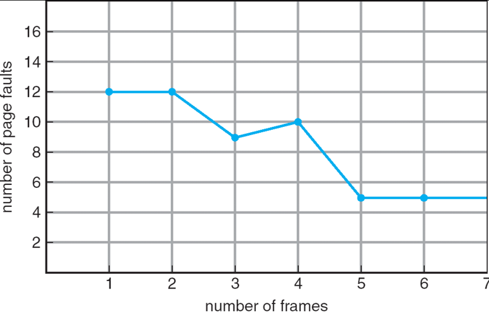

使逻辑地址空间大于物理地址空间

## Demand Paging请求页式管理

### 概述

- 进程逻辑空间按页进行组织
- 进程开始执行之前吧逻辑地址空间中**经常使用的pages**放入内存，其他pages需要dynamic loading
- 执行时如果发现需要的页不在内存，则发生**缺页中断page fault trap**，访问外存调入内存
- 如果把page放入内存时没有free frame则使用页面替换算法page replacement algorithm

page table中包含了valid-invalid bit来区分目标页是否在内存中。
- 如果是1则在内存，可访问
- 如果是0则产生缺页中断
- 初始所有页设置为0

### EAT: Effective Access Time

假设访问内存时间为t1，缺页中断访问外存时间为t2(t2包括查询、交换页的时间，通常远大于t1)，缺页率为p，则

`EAT=t1*(1-p)+t2*p`

### page replacement

over-allocation: 进程需要的页数超过主存页数

- FIFO
  - 设置一个age of page
  - 有Belady's Anomaly
- Optimal Algorithm(OPT or MIN)
  - 淘汰将来不会被使用或最远被访问的页
  - 不存在Belady's Anomaly
  - 难以实现：如何估算哪个页不再被访问？
- LRU: Least Recently Used
  - 最近最少使用
  - 是一个很实用的算法
  - 两种实现方案
    - 计数器
    - 栈

FIFO会导致Belady's Anomaly:

即number of frames提高的时候缺页中断应该一直下降，但是number of frames为4的时候竟然上升了

## Allocation of Frames

如何在OS进程和用户进程之间分配free frames?

如果给一个process的frame少于正常执行需要的最少frame，则进程将陷入无尽的取指令缺页中断中

所以每个进程的frame至少要能够包含操作与操作数

### Fixed allocation

- equal allocation
  - 平均分配
  - 假设有100帧，5个进程，每个进程20帧
- proportional allocation
  - 根据process的size加权分配

### Priority allocation

优先级越高，分配帧越多

## COW: Copy-on-Write写拷贝

多个进程访问同一个资源时，并不拷贝资源而是给他们同一个资源的引用。等待有线程对资源进行更改的时候再真正的拷贝一个资源出来

