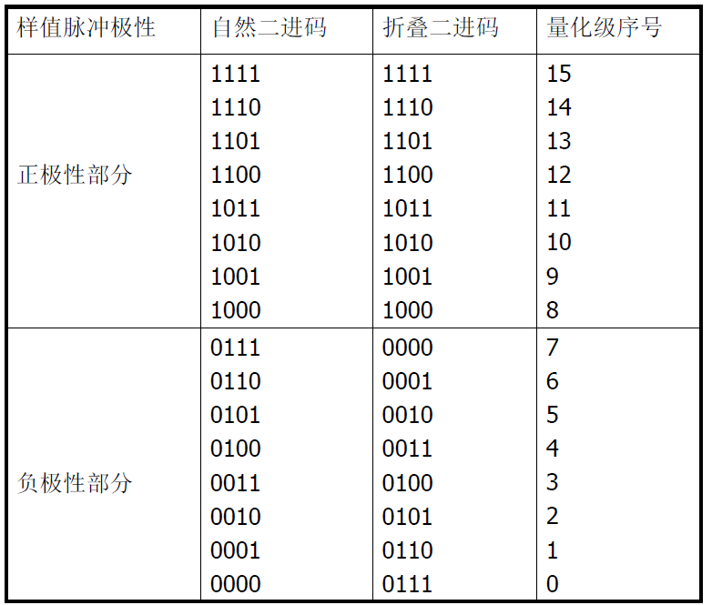
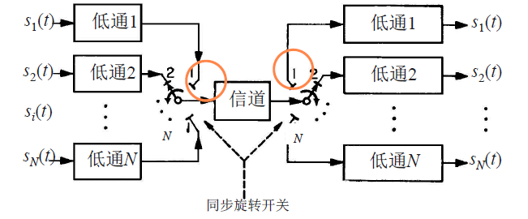

## 模数变换(A/D)

三个步骤：
- 抽样 - 把取值连续、时间连续的模拟信号变为取值离散、时间离散的抽样(PAM)信号
- 量化 - 把PAM信号变换为取值离散、时间离散的量化信号（多电平数字信号
- 编码 - 把量化信号变换为二进制数字信号

## 抽样定理

抽样定理为模拟信号数字化和时分多路复用TDM奠定了理论基础

### 低通抽样定理

最高频率小于fH的模拟信号m(t)可由其等间隔（均匀）的抽样值唯一确定，抽样间隔Ts或抽样速率fs应满足：Ts <= 1/(2fH) 或 fs >= 2fH

通常把最低抽样速率fs=2fH称为奈奎斯特速率，最大抽样间隔Ts=1/(2fH)称为奈奎斯特间隔

### 带通抽样定理

设带通模拟信号m(t)的频率范围在fL和fH内且fL>B，则最小抽样频率为fs=2B(1+k/n)，其中
- B为信号带宽
- n为fH/B的整数部分
- k为fH/B的小数部分，k小于1

对于高频窄带信号，fL >> B，则fs = 2B

## 量化

- 均匀量化
  - 等间隔量化
  - 如果模拟信号取值范围为[a, b]，量化电平数为M，则量化间隔delta v = (b - a)/M
- 非均匀量化
  - 提高小信号的信号量噪比

## 编码

常用二进制码：
- 自然二进制码
  - 从小到大
- 折叠二进制码
  - 对称
- 格雷二进制码

第一位表示符号，1为正

量化级M越多，抗噪性能越强

## 时分复用TDM

时间分片，每帧时间等于抽样周期，每一帧分成不同时隙，每个时隙分配给不同的信号

