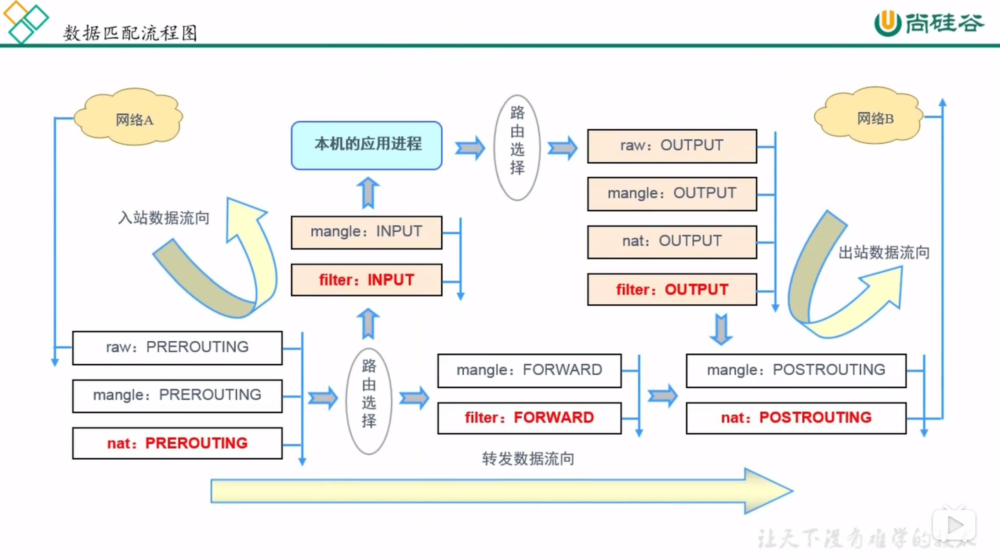

## 概述

本文是观看[此视频](https://www.bilibili.com/video/BV1Db411G7pf)时的笔记

## 安全防御概述

常见攻击方式：

- 拒绝服务(DoS: Deny of Service)
  - 恶意流量耗尽服务器资源使正常流量无法被服务
  - 可以使用云厂商的流量清洗服务解决
- 口令破解
  - 比如暴力破解
- 已知漏洞
  - 没有完美的代码
- 欺骗用户
  - 社会工程学攻击、钓鱼网站、钓鱼邮件等

常见防御手段：

- 基础防火墙
  - 基于规则过滤网络流量
- IDS（入侵检测系统）
  - 无法防御入侵，但是入侵之后可以检测到
- IPS（入侵防御系统）
  - 分析数据包内容并过滤流量
- 主动安全（可以理解为IPS的子类，专精于某个领域）
  - WAF/DAF（WEB防火墙/数据库防火墙）

Linux防御机制：

- iptables包过滤
- acl文件系统管理
- selinux
- tcp wrappers基于库的访问控制

## 防火墙分类

分类：

- 构造
  - 硬件
    - 深信服
    - 网御
  - 软件
    - Windows防火墙
    - Linux iptables
- 工作机制
  - 包过滤（4层）
  - 应用层防火墙（7层）
- 模块
  - 用户态
    - iptables
  - 内核态
    - netfilter

## iptables

> iptables是CentOS 6自带的防火墙，工作在用户态，用来操作内核态的netfilter。CentOS 7里面管理netfilter的用户态程序为firewalld

### iptables概念与规则

5链(chain)：

- INPUT
  - 入站数据包
- OUTPUT
  - 出站数据包
- FORWARD
  - 转发数据包
- PREROUTING
  - 路由前数据包
- POSTROUTING
  - 路由后数据包

4表(table)：

- raw
  - 确定是否对数据包进行状态跟踪（默认会跟踪）
  - PREROUTING, OUTPUT
- mangle
  - 为数据包设置标记
  - PREROUTING, POSTROUTING, INPUT, OUTPUT, FORWARD
- **nat**
  - 修改数据包的源、目标IP地址或端口
  - **PREROUTING**, **POSTROUTING**, OUTPUT
- **filter**
  - 数据包过滤
  - **INPUT**, **FORWARD**, **OUTPUT**

数据包经过表的顺序：raw->mangle->nat->filter。不同的表有不同的链，链上面会有规则

数据包经过链的顺序：

- 入站请求（目标地址为本机）
  - PREROUTING->INPUT
- 出站请求（源地址为本机）
  - OUTPUT->POSTROUTING
- 转发（目标和源都不是本机）
  - PREROUTING->FORWARD->POSTROUTING

结合上述表和链的顺序，可以得到如下数据流向图：



链上面的规则匹配顺序：自上而下依次匹配，如果有`LOG`以外的操作则直接处理而不继续匹配；如果没有匹配的规则，则使用默认规则

对iptables的修改都是临时的。使用`service iptables save`可以保存修改到`/etc/sysconfig/iptables`

### iptables语法

`iptables [-t table] [options] [chain] [condition] [-j action]`

- 默认表为filter
- 默认链为表的所有链
- chain/target使用大写字母
- options
  - `-A`在链的末尾添加规则
  - `-I`在指定序号处插入规则（默认位置是链的开头）
  - `-L`列出所有规则
  - `-n`以数字形式显示地址、端口等信息
  - `-v`详细输出
  - `--line-numbers`显示规则序号
  - `-D`删除指定序号或内容的一条规则
  - `-F`清空规则
  - `-P`设置链的默认规则
- action
  - ACCEPT
    - 允许通过
  - DROP
    - 直接丢弃，不回复
  - REJECT
    - 拒绝，必要时回复
  - LOG
    - 记录，然后继续匹配规则
  - SNAT
    - 修改源地址
  - DNAT
    - 修改目标地址
  - REDIRECT
    - 重定向
- condition
  - 通用匹配
    - 可直接使用，不依赖于其他条件或扩展
    - `-p`指定协议
    - `-s/-d`指定源/目标地址
    - `-i/-o`指定入站/出站网卡
  - 隐含匹配
    - 以特定的协议匹配作为前提
    - `--sport/--dport`源/目标端口
    - `--icmp-type`ICMP类型
  - 显式匹配
    - 以`-m module`的形式明确指出类型
    - `-m multiport --sport/dport`多端口匹配
      - 为什么使用多端口？多端口在同一条规则里面可以减少匹配的规则数量，从而优化访问速度
    - `-m iprange --src-range`IP范围
    - `-m mac --mac-source`MAC地址
    - `-m state --state`连接状态
      - NEW
      - ESTABLISHED
      - RELATED
    - 包括多端口、MAC地址、IP范围、数据包状态等条件
  - 条件取反：加`!`，比如`-p ! icmp`

例：

- `iptables -t filter -A INPUT -p tcp -j ACCEPT`
- `iptables -I INPUT -p udp -j ACCEPT`
- `iptables -I INPUT 2 -p icmp -j ACCEPT`
- `iptables -L INPUT --line-numbers`
- `iptables -D INPUT 3`
- `iptables -n -L INPUT`
- `iptables -t filter -P FORWARD DROP`
- `iptables -P OUTPUT ACCEPT`
- `iptables -A FORWARD -s 10.20.30.0/24 -j DROP`

### 实现SNAT

> 主要用途：局域网主机使用网关的公网IP访问互联网

- `iptables -t nat -A POSTROUTING -s 192.168.1.0/24 -j SNAT --to-source 218.29.30.31`
  - 路由后对源地址为内网地址的数据包执行SNAT操作，把源地址改为静态公网地址（219.29.30.31）
- `iptables -t nat -A POSTROUTING -s 192.168.1.0/24 -j MASQUERADE`
  - 动态公网地址伪装。适用于公网IP不固定的场景，自动判断公网地址

回包的时候会自动把目标地址从公网地址改回私网地址

### 实现DNAT

> 主要用途：端口映射，使公网可以访问局域网的服务

`iptables -t nat -A PREROUTING -d 218.29.30.31 -p tcp --dport 80 -j DNAT --to-destination 192.168.1.6`

路由前把目标地址为网关地址且目标端口为tcp 80的数据包的目标地址改写为私网地址，然后再路由

### iptables备份和还原

命令：

- `iptables-save`输出规则。可以结合重定向使用
- `iptables-restore`输入规则。可以结合重定向使用
- `service iptables save`保存规则到规则文件。如果不保存，规则就是临时的，重启iptables后失效

文件：

- 启动脚本：`/etc/init.d/iptables`
- 规则文件：`/etc/sysconfig/iptables`

## SeLinux

### SeLinux概述

由美国国家安全局(NSA: National Security Agency)开发

设计：任何【主体】访问【客体】的时候都要经过一个【规则库】，实现【防篡改】、【无旁路】、【可验证】

是基于令牌（安全上下文）的访问控制。所有客体（文件、socket、主机等）和主体（进程）都有关联的安全上下文

文件的安全上下文：`用户:角色:类型:等级`。在`target`模式下，通常把文件的`类型`设置为进程对应的类型就够了

### 配置文件与命令

`/etc/selinux/config`:

```
SELINUX=disabled # 禁用SELinux
	# permissive 仅警告
	# enforcing 启用SELinux
SELINUXTYPE=targeted # 基础防护，保护目标进程
	# mls 多级保护
```

修改后需要重启生效。重启会很慢，因为需要把模块加载到内核

命令：

- `getenforce`查看SELinux状态
- `setenforce`临时修改.只能在permissive/enforcing之间切换，如果要disable，需要修改配置文件并重启
  - `setenforce Enforcing/1`
  - `setenforce Permissive/0`
- `ll -Z`可以查看文件的安全上下文
- `chcon [-R] [-t type] [-u user] [-r role] filename`修改文件的安全上下文
  - `-R`递归修改子目录
  - `-t`修改类型
  - `-u`修改身份，比如`system_u`
  - `-r`修改角色，比如`system_r`
- `restorecon [-Rv] file/folder`还原文件的安全上下文中的类型字段
  - `-R`递归
  - `-v`详细输出

### 布尔值

是很多功能开关。有些软件会提供这些开关，只需要使用开关即可实现复杂的功能，而不用自己实现

- `getsebool`查看目前所有布尔值
  - 通常会需要过滤，比如`getsebool -a | grep samba`
- `setsebool`修改布尔值
  - `-P`持久化到配置文件永久生效
  - `setsebool -P samva_enable_home_dirs=1`使用`k=v`的语法赋值
  - `setsebool samba_export_all_ro on`使用`k v`的语法赋值
