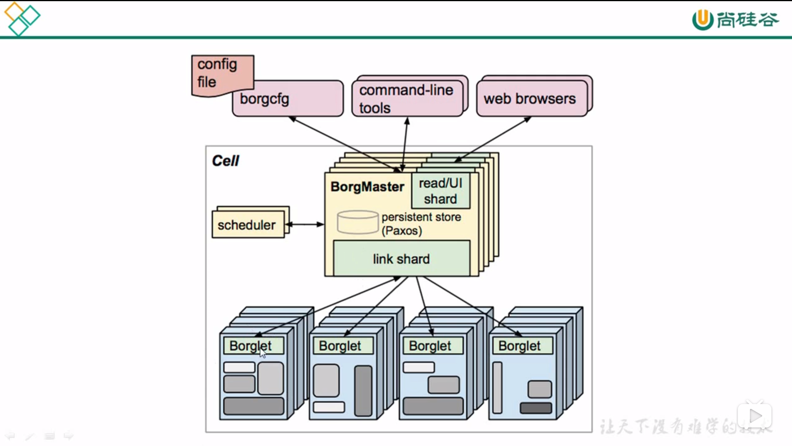
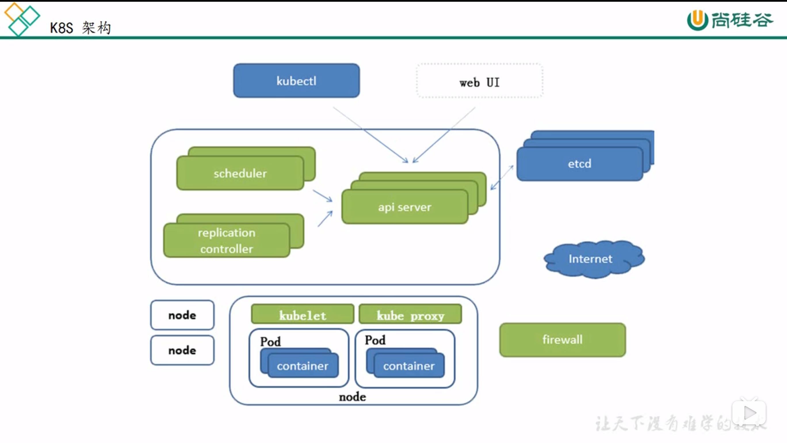
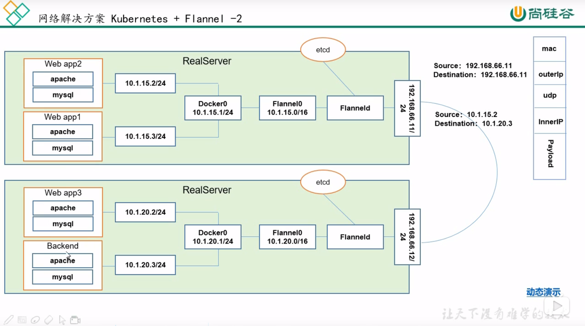
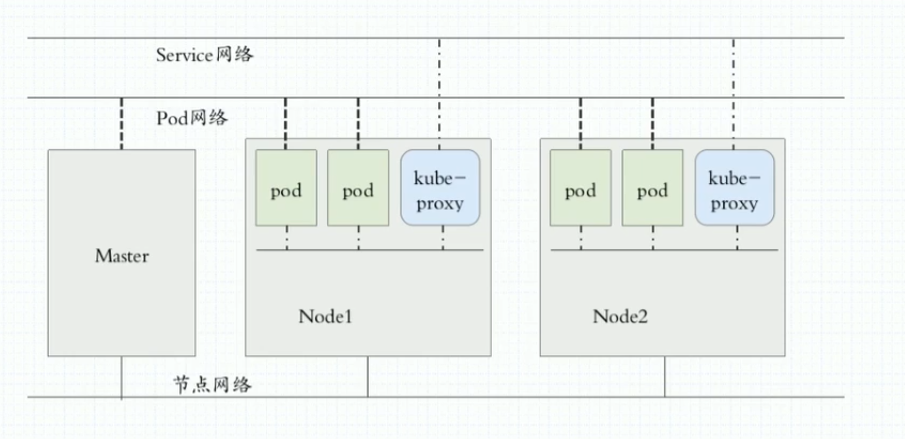

## 概述

本文是观看[此视频](https://www.bilibili.com/video/bv1w4411y7Go)和[此视频](https://www.bilibili.com/video/bv1PJ411h7Sw)时的笔记（建议先看后者，获得感性的认知，然后看前者了解原理）

## Kubernetes

### 历史

#### 为什么需要容器编排

Docker的好处：

- 抹平了基础设施环境的差异，几乎任何硬件、操作系统都可以用
- 抹平了应用程序打包的差异、运行时的差异
- 抹平了应用程序部署的差异，都是`docker run`

Docker自身无法实现：

- 难以管理集群
- 难以容灾/自愈
- 难以大规模调度、快速反应
- 没有统一配置管理中心
- 没有容器声明周期管理
- 没有图形化运维工具

#### 容器管理框架

- docker compose
  - docker母公司推出的
  - 单机编排
- Apache MESOS
  - 开源，分布式资源管理框架
  - 不仅可以管理容器。通常结合Marathon使用，Marathon负责管理容器
  - k8s的前辈。被k8s取代后推出新功能，表示可以管理k8s（但是为什么要再加一层。。）
    - 2019年5月，最大的使用者twitter宣布改用k8s
- docker swarm
  - docker母公司推出的
  - 被集成到了docker中，原生被docker支持
  - 功能相比于k8s非常少
  - 非常轻量。本机可能仅消耗几十MB。虽然也可以用于大型集群，但是通常还是小型集群可能会用（因为功能少）
	- 2019年7月，阿里云宣布不再支持docker swarm，仅支持k8s
- Kubernetes
  - 功能全面，很稳定
  - 开源，用go编写，效率高，消耗资源少（不像一些java程序，需要解释执行）
  - 弹性，热扩缩容
  - 内置模块间负载均衡（基于ipvs）

k8s是谷歌的开源产品。谷歌10年前就把容器化作为基础架构，并使用内部的borg系统进行容器管理。k8s是borg用go语言重构的开源版本

#### Borg



组件：

- BorgMaster
  - 对外暴露服务并负责请求的分发
  - 需要高可用，且节点数量通常为奇数，防止脑裂
  - Paxos
    - 一个持久化存储，键值数据库
- Borglet
  - 工作节点
  - 每个工作节点持续监听BorgMaster的Paxos，如果被分配了请求，Borglet就会消费这个请求
- Scheduler
  - 分发任务
  - 不直接和Borglet交互，而是修改BorgMaster的Paxos

交互方式：

- 浏览器
- 命令行工具
- 配置文件(borgcfg)

k8s的组件结构和Borg比较类似

### 组件

#### 组件概述



k8s宏观来说使用C/S结构

- Master，负责管理集群。建议部署3份
  - api server
    - 一切访问的入口，包括kubectl、scheduler、RC、etcd、浏览器、kubelet、kube proxy
  - scheduler
    - 调度请求，然后交给api server，api server把请求写到etcd
  - controller manager(replication controller(RC), etc..)
    - 管理各种控制器（比如副本控制器）
- Node，负责执行任务
  - kubelet
    - 可以理解为安装在工作节点上的agent
    - 负责控制docker创建容器，管理Pod和容器的生命周期，汇报状态
  - kube proxy
    - 实现Node内Pod之间的负载均衡
    - 默认通过操作防火墙iptables配置Pod的映射来实现，也可以使用ipvs实现映射（推荐ipvs，因为如果使用iptables会导致iptables规则过于复杂，不易维护且影响性能）
  - Pod
    - 最小的调度单元，一个Pod可以包含多个容器
- etcd
  - 键值对数据库，go语言编写，用来实现k8s持久化。所有需要持久化的数据都在这里，恢复etcd即可恢复k8s集群
  - 天生支持集群化
  - 通常部署在master node里面。也可以部署在外面
  - 由于其自带的高可用机制，建议部署3份
  - v2把数据写到内存，v3把数据写到本地数据库。建议用v3
  - 内部架构
    - HTTP Server
    - Raft
    - Store
    - WAL
      - Entry
      - Snapshot

交互方式：

- kubectl
- 浏览器

常见插件：

- CoreDNS
  - 为集群中的服务创建A记录，直接使用private域名即可访问服务
- Ingress Controller
  - 官方k8s只能实现4层代理，Ingress Controller能够提供7层代理，使用域名进行负载均衡
- Prometheus
  - 监控集群
- Dashboard
  - 给k8s提供B/S管理的能力
- Federation
  - 跨k8s管理，即管理多个k8s集群

#### Pod

##### Pod概述

- Pod是一个虚拟概念。里面可以有多个容器
  - 容器被划分为Init容器(initContainer, Init C)和Main容器(Container, Main C)
    - Init阶段可以用来初始化环境，比如安装一些Main容器不需要安装的包，执行完毕之后，Init容器就可以退出，释放资源给Main容器
    - Init容器可以有和Main容器不同的权限
    - Init容器可以用来阻塞Pod的初始化，直到满足某个条件
- 每个Pod里面都默认有一个叫pause的容器
- 单个Pod中的所有容器都会共用pause容器的网络栈和存储卷
  - 不同容器之间使用`localhost`就能够互相访问
  - 通过共享存储实现文件共享

##### Pod生命周期

0. kubectl向API Server发出请求，任务被分发到kubelet
1. kubelet进行Pod环境初始化，启动`pause`容器（包括初始化网络和数据卷）
2. 如果Pod中存在Init容器，则这些Init容器顺序启动（前一个退出了后一个才启动）
3. 所有Main容器开始启动
   1. 最开始是`START`阶段。可以作为生命周期钩子
   2. 准备就绪后容器变为`readiness` & `liveness`。Pod状态变为RUNNING
   3. Pod会持续检测内部容器是否正常，并持续更新`liveness` & `readiness`
   4. 容器停止后是`STOP`阶段，可以作为生命周期钩子

start/stop可以在资源清单中使用`lifecycle`指定钩子函数

Pod的状态的可能值：

- pending
- running
- succeeded
- failed
- unknown

##### 探针

探针是kubelet对容器的定期诊断

三种处理程序：

- ExecAction
  - 在容器执行特定的命令，如果返回0则表示正常
- TCPSocketAction
  - 如果端口开放则正常
- HTTPGetAction
  - 如果HTTP GET请求的响应状态码不小于200且小于400则正常

每次探测都会得到三种结果之一：

- 成功
- 失败
- 未知

探测方式：

- livenessProbe
  - 存活探测
  - 表示容器是否在运行。如果探测失败，则kubelet会杀死容器，并根据策略重启
  - 如果容器不提供存活探针，则默认success
- readinessProbe
  - 就绪探测
  - 表示容器中的服务是否正在运行
  - 如果服务不可用，则从Service中删除此Pod的IP地址
  - 容器初始化时为failure。如果容器不提供就绪探针，则默认success

##### Pod控制器

- ReplicationController(RC)（淘汰）
  - 用来确保容器的副本数量始终保持在用户定义的副本数量上
  - 如果有容器异常退出，RC会创建新的。如果有异常多出来的容器，RC也会回收
  - 新版本k8s中建议使用ReplicaSet代替ReplicationController
- ReplicaSet(RS)
  - 基本和RC相同
  - 相比于RC，支持基于标签的选择器(selector)来发现Pods
    - 创建Pod的时候可以打标签，比如`app=apache`、`version=1`
  - 仅用来控制Pod的数量
- Deployment(DP)
  - 用来自动管理RS。即用户创建Deployment，Deployment创建RS，RS创建Pod
  - 用来实现扩缩容、滚动更新和回滚
    - 扩缩容会直接修改RS的副本数
    - 滚动更新时，会创建新的RS，并逐渐删除旧的RS
- DaemonSet(DS)
  - 用来确保一些（或所有）Node上都至少运行某个daemon Pod
  - 有新Node加入集群的时候会在这个Node上面创建这些daemon Pod
  - 删除Node时也会回收daemon Pod
  - 删除DaemonSet会删除所有它创建的daemon Pod
  - 通常用来安装监控、日志收集、共享存储服务
  - 在Node上只能有一个相同的daemon Pod
  - 如果Pod意外退出，DS也会尝试重启
- Job
  - 批处理任务，执行完毕后退出（可以指定执行多次）
  - 比如把备份数据库的任务放到一个Pod里面
  - 相比于linux的cron，Job可以在任务失败的时候重试
- CronJob
  - 周期性执行任务
- StatefulSet
  - 用来解决有状态服务的问题，比如MongoDB（Deployment和RS针对无状态服务）（MySQL目前还没有稳定的部署k8s方案）
  - 提供稳定的持久化存储，重新调度Pod后（比如删了重开），还是能访问到相同的持久化数据（数据不会丢失）
    - 基于PVC实现，根据`volumeClaimTemplates`为每个Pod创建PVC，名字是`<PVC-name>-<PodName>`
  - 稳定的网络标识，重新调度Pod后PodName和HostName不变
    - PodName为`<statefulSet-name>-<index>`
    - 基于Headless Service来实现（即没有Cluster IP的Service）
    - 每个Pod都有一个DNS名。即使Pod被替换，DNS名也不会变
  - 有序部署 & 扩缩容
    - 只有前一个Pod是Running或Ready状态，下一个Pod才会开始启动。即使Pod模板是相同的
    - 基于init containers来实现
- Horizontal Pod Autoscaling(HPA)
  - 用来管理Deployment和RS
  - 自动扩展，基于CPU、内存、用户自定义指标

### 其他概念

#### 名称与名称空间

k8s中所有对象都是【资源】。所有资源都可以由自己的名称(Name)。资源的名称通常在其元数据中，详见下文资源清单

为了进行资源隔离，可以使用名称空间(Namespace)。每个名称空间中都不能有重名的资源

k8s中默认存在的的名称空间：

- `default`
- `kube-system`
- `kube-public`

查询k8s中资源的时候通常都需要先指明名称空间

#### 标签

每个资源可以有多个标签(label)（当然一个标签可以对应多个资源）。标签是键值对

可以使用标签选择器(label selector)基于标签进行资源的选择

#### Service & Ingress

- 服务(service)
  - 是k8s在内部提供服务的接口（比如每个SVC都是一个微服务）
  - Service通过标签来选择Pod进行服务发现
  - Service仅提供一个LB算法：RR
  - 类型
    - ClusterIP(默认)
      - 自动分配一个仅集群内部可以访问的IP
    - NodePort
      - 把服务的端口映射到Node
      - 每个有此模式服务的Node都需要暴露同一个端口
      - 同一个Node中的多个Pod会基于RR负载均衡。不同Node之间负载均衡需要外部LB
      - 可以用来向集群外暴露服务
    - LoadBalancer
      - 在NodePort的基础上使用云厂商的LB实现Node之间的负载均衡
    - ExternalName
      - 通过指定集群外部的IP和端口，把集群外部的服务引入集群内部
      - 这样Pods只需要访问这个SVC就好了。如果外部服务被更新（比如修改了IP），只需要更新SVC即可，不需要修改所有Pod
  - 代理模式
    - userspace（淘汰）
    - iptables（即将淘汰。过于复杂的iptables难以维护且影响性能）
    - ipvs

Service使用4层网络调度，暴露IP+port。而Ingress是7层网络调度（不过底层还是Service）

所以4层的服务使用Service暴露，7层的服务使用Ingress

#### 资源

k8s中所有内容都被抽象为资源。资源被实例化之后称为对象

- 名称空间级别
  - 工作负载型资源(Workload)
    - Pod
    - ReplicaSet
    - Deployment
    - StatefulSet
    - DaemonSet
    - Job
    - CronJob
  - 服务发现与负载均衡型资源(Service Discovery & Load Balancing)，用来暴露服务
    - Service(Svc)
    - Ingress
  - 配置与存储型资源
    - Volume
    - CSI（容器存储接口，用来连接第三方存储卷）
  - 特殊存储卷
    - ConfigMap（存储配置文件实现热更新）
    - Secret（敏感数据）
    - DownwardAPI
- 集群级别的资源
  - Namespace
  - Node
  - Role
  - ClusterRole
  - RoleBinding
  - ClusterRoleBinding
- 元数据
  - HPA
  - PodTemplate
  - LimitRange

#### 资源清单常用字段

资源清单文件格式为YAML/JSON

以下为示例。具体资源清单内容建议参考官方文档

##### Pod资源清单

```yaml
apiVersion: v1 # k8s API version. 可以使用kubectl api-versions命令查看
kind: Pod # 资源类型
metadata: # 元数据
  name: my-pod # 元数据名称
  namespace: default # 元数据名称空间
  labels: {} # 自定义标签
spec: # 详情
  initContainers:
    - name: xxx
      image: xxx
      command: []
  containers:
    - name: xxx
      image: xxx
      imagePullPolicy: Always | Never | IfNotPresent # 默认Always
        # 每次都重新拉取镜像 | 仅使用本地镜像 | 如果本地没有则拉取
      command: [] # 容器的启动命令（会覆盖镜像的启动命令）。默认是镜像的启动命令
      args: [] # 启动命令参数
      workingDir: xxx # 容器工作目录
      volumes: # 定义卷
        - name: xxx
          emptyDir: {}
      volumeMounts: # 定义如何挂载上述卷
        - name: xxx # 引用volume的name
          mountPath: xxx
          readOnly: true
      ports: # 容器会用到的端口列表
        - name: xxx
          containerPort: xxx # 容器端口
          hostPort: xxx # 主机端口，默认值和容器端口相同
          protocol: TCP | UDP # 默认TCP
      env: # 环境变量
        - name: xxx
          value: xxx
      resources: # 容器资源相关配置
        limits: # 容器资源限制
          cpu: xxx # 相当于docker run --cpu-shares
          memory: xxx
        requests:
          cpu: xxx
          memory: xxx
      readinessProbe: # 就绪探针
        httpGet:
          port: http
          path: /index.html
        initialDelaySeconds: 1
        periodSeconds: 3
      livenessProbe: # 存活探针
        exec:
          command: []
        initialDelaySeconds: 1
        periodSeconds: 3
      lifecycle:
        postStart:
          exec:
            command: []
        preStop:
          exec:
            command: []
  restartPolicy: Always | OnFailure | Never # 默认Always
    # Always: 不论Pod因何种原因被终止，kubelet都会重启Pod
    # OnFailure: 只有Pod以非0代码退出时重启
  nodeSelector: {} # 通过key-value的形式指定node
  imagePullSecrets: {} # 使用name-secretKey的形式指定
  hostNetwork: false # true表示使用宿主机网络而不是docker网桥
```

##### RS资源清单

```yaml
apiVersion: extensions/v1beta1
kind: ReplicaSet
metadata:
  name: xxx
spec:
  replicas: 3 # 副本数量
  selector: # 选择器，用来发现Pods
    matchLabels:
      key: value
  template: # Pod模板
    metadata:
      labels: # Pod的标签
        key: value
    spec: {} # Pod详细信息
```

##### DP资源清单

```yaml
apiVersion: extensions/v1beta1
kind: Deployment
metadata:
  name: xxx
spec:
  replicas: 3
  template:
    metadata: # Pod标签
      labels:
        key: value
    spec: {} # Pod详情
```

##### DS资源清单

```yaml
apiVersion: apps/v1
kind: DaemonSet
metadata:
  name: xxx
  labels:
    key: value
spec:
  selector:
    matchLabels:
      key: value
  template:
    metadata:
      labels: # Pod标签
        key: value
    spec: {} # Pod详情
```

##### Job资源清单

```yaml
apiVersion: batch/v1
kind: Job
metadata:
  name: xxx
spec:
  template: {}
```

##### Opaque Secret

```yaml
apiVersion: v1
kind: Secret
metadata:
  name: xxx
type: Opaque
data:
  key: value after base64 encode
```

##### PV卷

```yaml
apiVersion: v1
kind: PersistentVolume
metadata:
  name: xxx
spec:
  capacity:
    storage: 5Gi
  volumeMode: Filesystem
  accessModes:
    - ReadWriteOnce
  persistentVolumeReclaimPolicy: Recycle
  storageClassName: slow
  mountOptions:
    - hard
    - nfsvers=4.1
  nfs:
    path: /xxx
    server: 123.123.123.123
```

##### StatefulSet

```yaml
apiVersion: v1
kind: Service
metadata:
  name: xxx
  labels:
    key: value
spec:
  ports:
    - port: 80
      name: web
  clusterIP: None # 无头服务(Headless Service)，没有ClusterIP
  selector:
    key: value
---
apiVersion: apps/v1
kind: StatefulSet
metadata:
  name: xxx
spec:
  selector:
    matchLabels:
      key: value
  serviceName: xxx # 选中上文的无头服务
  replicas: 3
  template: # Pod template
    metadata: {}
    spec: {}
  volumeClaimTemplates: # PVC
    - metadata:
        name: xxx
      spec:
        accessModes: 
          - ReadWriteOnce
        storageClassName: nfs
        resources:
          requests:
            storage: 1Gi
```

#### Role

```yaml
apiVersion: rbac.authorization.k8s.io/v1beta1
kind: Role
metadata:
  namespace: default # 如果是ClusterRole，不需要指定namespace
  name: readonly
rules:
  - apiGroups: [""] # "" 表示core API group
    resources: ["pods"]
    verbs:
      - get
      - watch
      - list
```

#### RoleBinding

```yaml
apiVersion: rbac.authorization.k8s.io/v1beta1
kind: RoleBinding
metadata:
  name: xxx
  namespace: default # 如果是ClusterRoleBinding，不需要指定namespace
subjects:
  - kind: User
    name: xxx
    apiGroup: rbac.authorization.k8s.io
roleRef:
  kind: Role
  name: xxx
  apiGroup: rbac.authorization.k8s.io
```

#### k8s的安装方式

- Minikube
  - 单节点微型k8s，适用于学习
- 二进制安装
  - 超级复杂
  - 推荐新手学习基础原理时使用
  - 生产环境如果需要极致性能，可以考虑二进制安装
- 使用kubeadmin安装
  - 一个跑在k8s里的k8s安装工具
  - 相对简单，推荐使用

### 网络通信

#### 组件互通与网络层级

k8s假定所有Pod都在一个可以直接联通的扁平网络空间中（所有Pod可以通过IP互相访问）。谷歌云里面的网络模型默认就是扁平的，如果在其他云平台或自建，就需要先满足网络打通的问题

Flannel是一个针对k8s设计的网络规划服务，可以使不同Node上的所有Docker容器都有全集群唯一的虚拟IP地址，并在这些IP地址直接创建一个覆盖网络(Overlay Network)，通过这个网络可以把数据包原封不动地传递到目标容器内。Flannel使用etcd保存状态，通过修改主机路由表实现功能。可以使用`route`命令查看本机路由

**安装Flannel之后记得修改iptables规则**，修改docker的SNAT，这样pod之间的通信使用的才是pod的IP地址而不是宿主机的地址



组件互通：

- 同一个Pod内的多个容器
  - 使用localhost访问，即`lo`网卡
  - 基于pause容器实现
- 不同Pod之间
  - 使用Overlay Network
- Pod与Service之间的通信
  - 使用Node的iptables规则或ipvs
- Pod向公网发请求
  - 利用物理机实现NAT

网络层级：

- Service网络
  - 基于iptables或ipvs互通
- Pod网络
  - 基于Flannel实现所有Pod互通
- Node网络
  - 真实物理网络



#### CNI插件

k8s只是设计了上述扁平网络模型，实际的实现由网络插件完成

常见CNI网络插件：

- **Flannel**
  - host-gateway模型（常用）
    - 静态路由
    - 适用于桥接的网络（可以直接寻址）
    - 基于内核转发，效率最高
  - VxLAN模型
    - 虚拟网卡隧道
    - 适用于使用路由器的网络（即主机在不同的网络，需要路由器作为网关而不能直接寻址）
    - 需要封包解包，效率较低
    - 如果开启`Directrouting`，则如果flannel发现主机位于相同网络时仍然使用host-gw模型
- Calico
  - 支持网络限制
  - 支持BGP，在大型网络环境会比较好管理
- Canal
  - 是Calico和Flannel的结合
  - 在Flannel的基础上添加了Calico的网络限制
  - 然而实际生产中，为了满足审计，可能还是一个业务一个集群
- Contiv
  - Cisco开源的
- OpenContrail
  - Juniper开源的
- NSX-T
  - Vmware开源的
- Kube-router
  - CNCF开源的

#### 服务发现

以`Cluster IP`的形式创建的Service会有一个固定的IP作为服务的接入点。Service根据标签选择器进行服务的发现

如果要使用域名而不是IP进行服务访问，需要使用DNS服务发现插件：

- kube-dns（淘汰）
- coredns
  - 仅负责维护`服务名->集群网络IP`的映射
  - 部署在k8s集群中
  - 使用FQDN进行访问：`<service>.<namespace>.svc.cluster.local`
  - 如果从集群内进行访问，可以简写FQDN：`<service>.<namespace>`
    - 因为集群内的DNS在`/etc/resolv.conf`里面配置了`search`字段。可能需要手动配置此字段

#### 服务暴露

使服务可以从k8s集群外访问，有以下两个方式：

- 使用NodePort类型的Service（不推荐）
  - 基于kube-proxy实现端口映射
  - 缺点：无法使用kube-proxy的ipvs模型，只能使用iptables模型
- 使用Ingress资源
  - 只能暴露7层应用
  - 基于域名+路径，把请求转发到指定的Service
    - 类似于nginx
  - Ingress控制器的实现软件
    - Ingress-nginx
    - HAProxy
    - **Traefik**
      - 部署在k8s中

### 存储

- ConfigMap
  - 存储配置（类似于配置文件注册中心）
  - 可以向容器注入配置信息，在Pod资源清单里面可以引用ConfigMap中的值。且ConfigMap的值被修改时Pod中的配置（比如环境变量）会自动修改（但是Pod中的软件不一定能自动检测到环境变量的修改从而应用修改，可能需要手动触发）
  - 创建方式
    - 指定目录/文件：`kubectl create configmap <name> --from-file=<path>`
      - 键为文件名，值为文件的内容
      - 如果指定目录，则会把目录下面的文件都作为配置信息
      - 可以多次使用`--from-file`参数指定多个文件/目录
    - 字面值：`kubectl create configmap <name> --from-literal=<key>=<value>`
  - 查看配置：`kubectl get configmaps <name> -o yaml`
- Secret
  - 存储加密信息
  - 三种类型
    - 服务账户Service Account(SA)
      - 用来访问k8s API
      - 自动挂载到Pod的`/run/secrets/kubernetes.io/serviceaccount`目录下
    - Opaque
      - k-v格式，value被base64编码，用来保存密码/密钥（可解密）
      - 使用方式
        - 挂载为卷
          - key为卷下面的文件名，文件内容为解密后的value
        - 环境变量
    - kubernetes.io/dockerconfigjson
      - 存储docker registry的认证信息
      - 创建：`kubectl create secret docker-registry <name> --docker-server=xxx --docker-username=xxx --docker-password=xxx --docker-email=xxx`
      - 在Pod资源清单中使用`imagePullSecrets`引用此secret
- Volume
  - 是`pause`容器的存储卷。给Pod中的其他容器提供共享存储卷
  - 支持很多卷的类型，包括各种云厂商的卷
  - 常用类型：
    - emptyDir
      - 空目录
      - 仅用来在所有容器之间共享存储
      - Pod被删除时，emptyDir中的数据被永久删除
      - 容器的崩溃可能不会导致pod被删除，所以emptyDir在容器崩溃时是安全的
      - 用途
        - 暂存空间，比如基于磁盘的合并排序
        - 保存长时间计算负载的检查点，以便崩溃恢复
        - web服务器静态文件的统一存储
    - hostPath
      - 把宿主机的目录挂载到Pod
      - 用途：
        - 宿主机和容器通信。宿主机可以访问到容器里面的内容
      - 可以显式指定目标类型从而进行类型检查（如果不指定，则不进行类型检查）
        - Directory
        - DirectoryOrCreate
        - File
        - FileOrCreate
        - Socket
        - CharDevice
        - BlockDevice
- Persistent Volume(PV/PVC)
  - PV
    - 持久卷，是一种资源类型
    - 生命周期独立于Pod
    - 类别
      - 静态PV
        - Pod申请PV资源时就可以直接使用的存储
      - 动态PV
        - Pod提出申请后，集群尝试动态地创建PV卷
    - 访问模式
      - ReadWriteOnce(RWO)
        - 只能被单个节点以读写模式挂载
      - ReadOnlyMany(ROX)
        - 可以被多个节点只读挂载
      - ReadWriteMany(RWX)
        - 可以被多个节点以读写模式挂载
    - 回收策略
      - Retain
        - 不能被再次利用，等待管理员手动释放
      - Recycle
        - 删除卷中的所有文件，可以被再次利用
      - Delete
        - 删除对应的云存储资源
    - 状态
      - Available
        - 空闲，可以被绑定
      - Bound
        - 已经被Pod绑定
      - Released
        - 已经被释放，正在进行回收，目前仍不可用
      - Failed
        - 自动回收失败
  - PVC(Persistent Volume Claim)
    - 是对PV资源的请求
    - 一个PVC只能绑定一个PV
    - 申请资源失败时，Pod会处于Pending状态
    - PVC会选择能够满足需求的最小PV进行绑定
    - 删除Pod不会删除其PVC，手动删除PVC才会释放PV

### kubectl

以下是常用命令：

- `kubectl get`
  - 命令
    - `all`所有资源
    - `pod`查看pod列表
    - `pods -l key=value`根据标签查看pods
    - `node`查看节点列表
    - `svc`/`service`查看服务
    - `ns`/`namespaces`查看命名空间
    - `rs`查看replica set
    - `deploy`/`deployments`
    - 其他资源类型也可以类似地查看
  - 选项
    - `-n <namespace>`指定命名空间。默认`default`
    - `--all-namespaces`所有资源
    - `-o wide`输出更多信息。比如可以查看Pod在哪个node上，以及它的IP
    - `-o yaml|json`输出指定格式资源清单
    - `--show-labels`查看标签
- `kubectl create`创建资源
  - `ns <ns-name>`创建名称空间
  - `-f <file>`根据资源清单创建
- `kubectl describe`查看详情
- `kubectl delete`
  - `-f <file>`删除YAML文件对应的资源（但是并不会删除文件）
  - `--force`强制删除
  - 或者直接指定资源名称，比如`kubectl delete ns app`
  - 删除Pod的时候，如果设置了一些带有重启规则的控制器，则Pod会被重新拉起。所以此命令可以用来重启Pod
- `kubectl exec -it <pod-name> <command>`执行命令
  - 类似于`docker exec`
- `kubectl run <container-name> --image=xxx [--env="key=value"] [--port=80] [--replicas=3] [--dry-run=false] [--overrides=inline-json] [--command] -- [COMMAND] [args]`
  - 不使用资源清单，而是直接创建容器。不建议使用
- `kubectl expose`用来创建服务
  - 例：`kubectl expose deployment <dp-name> --port=80`
  - 创建之后会得到一个固定的私有IP。即使Pod的IP变了，或者添加了新的Pod，这个服务IP也不会变，是唯一向外暴露的接口
  - Service会根据标签选择器实现服务发现
  - 基于ipvs，是4层代理。相当于一个负载均衡器
- `kubectl scale`扩展
  - 例：`kubectl scale deploy <dp-name> --replicas=2`
- `kubectl explain`解释资源清单中的fields的含义
  - 例：`kubectl explain service.metadata`
- `kubectl apply -f <file>`应用某个资源清单的修改。也可以用来创建资源
- `kubectl edit`在线修改资源清单，保存后立即生效
- `kubectl set image deployment/<dp-name> <image>`滚动更新DP（会创建新的RS）
- `kubectl rollout undo deployment/<dp-name>`回滚
  - `kubectl rollout status deploy/<dp-name>`查看回滚状态
  - `kubectl rollout history deploy/<dp-name>`查看历史版本
  - `kubectl rollout pause deploy/<dp-name>`暂停更新
- `kubectl autoscale deployment <dp-name> --min=1 --max=10 --cpu-percent=80`设置DP自动扩展

### 权限

主要是保护API Server的安全

#### 三个步骤

- 认证(Authentication)，保证通信是可信的
  - 认证方式
    - HTTP Token
    - HTTP Base Auth
      - 用户名+密码
    - HTTPS证书双向认证（最安全，建议使用）
  - Controller Manager, Scheduler和API Server在同一台机器，可以使用HTTP直接访问（k8s通常默认配置`--insecure-bind-address=127.0.0.1`）。而kubelet, kube-proxy, kubectl等组件就需要HTTPS双向认证
    - kubelet首次访问API Server的时候使用Token认证，通过后Controller Manager会为kubelet颁发一个证书，以后访问都是证书认证
  - 认证信息通常保存在`~/.kube/config`文件中
- 鉴权(Authorization)，确认权限
  - 支持的授权策略（启动API Server时使用`--authorization-mode`设置）
    - AlwaysDeny
      - 拒绝一切请求。仅用于测试
    - AlwaysAllow
      - 允许所有
    - ABAC(Attribute Based Access Control)（淘汰）
      - 基于属性的控制
      - 如果用户有某个属性则可以控制哪些资源
      - 修改之后需要重启API Server
    - Webhook
      - 调用外部REST服务进行授权
    - RBAC(Role Based Access Control)（默认）
      - 基于角色的访问控制
      - 修改之后不需要重启API Server，直接生效
- 准入控制(Admission Control)
  - 通过添加插件(Admission Controller)实现额外的准入控制
  - 常见插件
    - NamespaceLifecycle
      - 防止在不存在的namespace上面创建对象
      - 防止删除系统预置的namespace
      - 删除namespace的时候删除其下所有资源
    - LimitRanger
      - 确保请求的资源不会超过所在namespace的LimitRange限制（可以在名称空间级别限制资源）
    - ServiceAccount
      - 自动化添加SA
    - ResourceQuota
      - 确保请求的资源不会超过资源的ResourceQuota的限制

#### RBAC

- 资源的权限(Rule)
  - rule的组成
    - verb
      - get
      - write
      - update
      - list
      - watch
      - ...
    - resource
      - 集群中的资源使用RESTful的路径来表示，比如`/api/v1/namespaces/{{namespace}}/pods/{{name}}/log`。在rule里面resource只需要指定`{{namespace}}`后面的资源即可，比如`pods/log`
      - 如果授权到某个路径`/xxx/yyy`则其子资源都可以被访问
    - apiGroups
- 账户
  - 用户账户
    - 比如kubelet
  - 服务账户(SA)
    - 所有Pod都必须有一个SA。默认为`default`
    - 因为Pod会频繁地创建与销毁，使用SA会比签发/销毁证书效率高
- 角色
  - Role
    - 只能作用在特定的名称空间，是名称空间级别的资源
  - ClusterRole
    - 作用于整个集群
    - 集群有很多默认的ClusterRole
- subject
  - 绑定的目标，可以是User/Group/SA
- 绑定
  - RoleBinding
    - 把Role绑定给subject
    - 也可以把ClusterRole绑定给subject，让他只能在某个名称空间执行操作
  - ClusterRoleBinding
    - 把ClusterRole绑定给subject
    - 不能用来绑定Role

账户通过绑定角色获得角色的权限。不能直接给账户授予权限

【角色】和【绑定】也是资源，可以使用资源清单创建

k8s自身并不提供用户管理。API Server会把客户端证书的`CN`字段作为User，把`names.O`字段作为Group

> 可以设置一个ClusterRole，拥有所有namespace的只读权限。然后使用RoleBinding（注意不是ClusterRoleBinding）把它绑定给用户并指定名称空间，这样就可以使用一个Role使不同的用户访问不同的名称空间

### 调度

scheduler是k8s的调度器，作为单独的程序运行在master node，和api server交互

#### 调度过程

1. 过滤掉不满足条件的节点(predicate，预选)
2. 对节点进行优先级排序(priority，优选)
3. 选择优先级最高的节点。如果没有满足条件的节点，则pod处于pending阶段

#### 预选调度算法

- PodFitsResources
  - 节点剩余资源大于Pod请求的资源
- PodFitsHost
  - 如果pod指定了NodeName，则检查节点名是否和NodeName匹配
- PodFitsHostPorts
  - 节点已经使用的port是否和pod申请的port冲突
- PodSelectorMatches
  - 过滤掉和pod指定的label不匹配的节点
- NoDiskConflict
  - 节点上已经被mount的volume是否和pod请求mount的volume冲突，除非这些pod都是只读mount

#### 优先级

- LeastRequestPriority
  - 计算CPU和内存的空闲程度。Pod被优先调度到空闲资源多的节点
- BalancedResourceAllocation
  - CPU的利用率和内存利用率越接近（节点资源的利用比较平衡），优先级越高
  - 可以和LeastRequestPriority结合使用
- ImageLocalityPriority
  - 节点上面已经有pod所需的镜像，且这些镜像的大小越大，节点优先级越高
  - 减少镜像下载时间

#### 亲和性

亲和性策略举例：

```yaml
# pod template
spec:
  affinity:
    nodeAffinity: # 节点亲和性
      requiredDuringSchedulingIgnoreDuringExecution: # 硬策略
        nodeSelectorTerms:
          - matchExpressions:
            - key: kubernetes.io/hostname
              operator: NotIn
              values:
                - xxx
      preferredDuringSchedulingIgnoreDuringExecution: # 软策略
        - weight: 1 # 策略可以有多个，每个可以有权重
          preference:
            matchExpressions:
              - key: xxx
                operator: In
                values:
                  - xxx
    podAffinity: # Pod亲和性
      requiredDuringSchedulingIgnoreDuringExecution: {} # 硬策略
      preferredDuringSchedulingIgnoreDuringExecution: [] # 软策略
    podAntiAffinity: # Pod反亲和性
      requiredDuringSchedulingIgnoreDuringExecution: {} # 硬策略
      preferredDuringSchedulingIgnoreDuringExecution: [] # 软策略
```

#### 污点

- Node可以设置污点来标记此Node不适合启动Pods
- 使用kubectl
  - 给Node设置污点：`kubectl taint nodes <name> <key>=<value>:<effect>`
  - 删除污点：`kubectl taint nodes <name> <key>:<effect>-`
- 支持的effect
  - NoSchedule
    - k8s不会把Pod调度到有这个污点的Node上
    - master节点默认就有这个污点
  - PreferNoSchedule
    - k8s尽量不把Pod调度到有这个污点的Node上
  - NoExecute
    - k8s不会把Pod调度到有这个污点的Node上，且会把已经在此Node上的Pod驱逐

#### 容忍污点

```yaml
# pod template
spec:
  tolerations:
    - key: xxx # 不指定key时表示所有key
      operator: Equal
      value: xxx
      effect: NoSchedule # 不指定effect时表示所有effect
      tolerationSeconds: 3000
        # 被驱逐时，此Pod仍然可以在当然Node运行的时间
```

#### 固定节点

```yaml
# pod template
spec:
  nodeName: xxx # 通过节点名选择
  # nodeSelector: {} # 通过选择器选择
```

### Helm

- 用来管理服务的安装。类似于centos的yum
- 可以根据参数动态生成YAML资源清单
- 概念
  - chart
    - 是应用的信息集合，包括资源清单、参数定义、依赖关系、文档
  - release
    - 是chart的运行实例，表示正在运行的应用
    - chart被安装到k8s集群中后会生成一个release
    - chart可以被多次安装，每次都生成一个release
- 组件
  - Client客户端
    - 使用gRPC协议和Tiller交互
  - Tiller服务端
    - 运行在k8s master node
    - 处理客户端的请求，和API Server交互

自定义Chart的工作流：

1. 创建文件夹
   1. `mkdir test & cd test`
2. 创建自描述文件，里面必须有`name`和`version`
   1. `echo "name: xxx" > Chart.yml`
   2. `echo "version: 1.0.0" >> Chart.yml`
3. 创建模板文件目录，用来生成资源清单(manifests)
   1. `mkdir template`
   2. `echo xxx > template/xxx.yml`
4. 安装
   1. `helm install .`