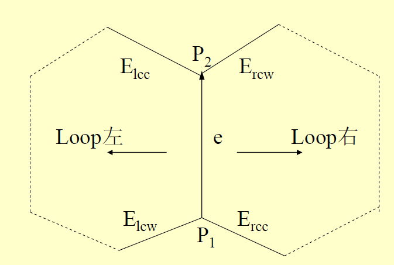
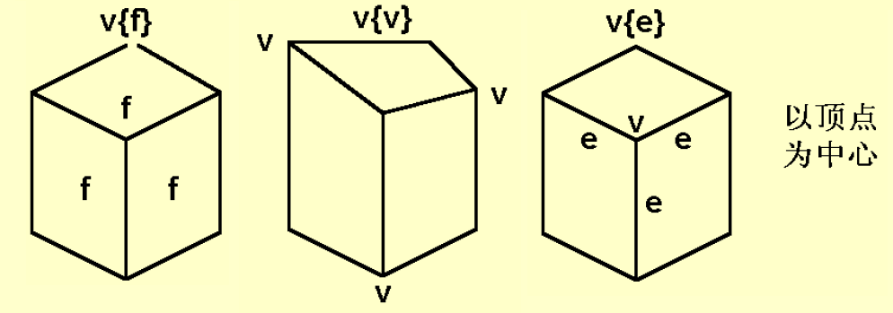
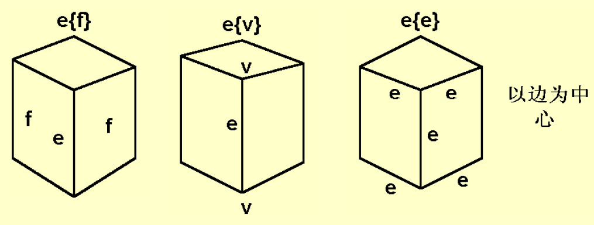
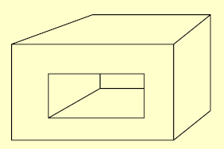
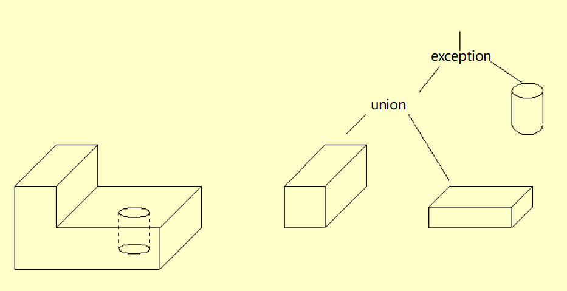
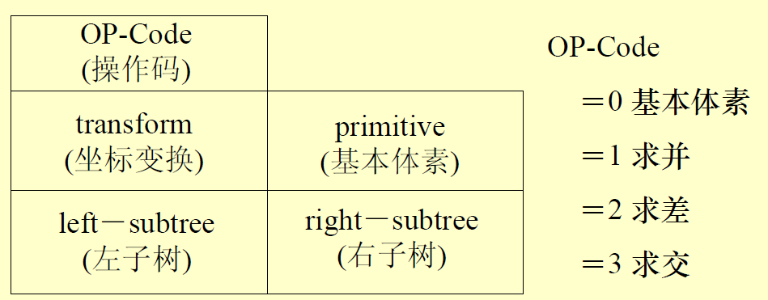

## 概述

三维实体的表示法需要考虑的两点：
- 表示法的覆盖域，即这种表示法能够定义的物体的大小
- 表示法蕴含的信息的完整性

## 边界表示法

### 概述

使用顶点、棱边、表面表示物体。

特点：
- 包含两方面信息
  - 几何信息 - 物体大小、尺寸、位置、形状等
  - 拓扑信息 - 顶点、边、面的连接关系
- 集合信息和拓扑信息分离表示

优点：
- 便于查询物体中的元素以获取信息
- 容易支持各种局部操作
- 对于具有相同拓扑结构、仅大小、尺寸不同的物体，可以使用统一的数据结构加以表示
- 便于在数据结构上附加各种非几何信息

### 翼边结构

边界表示法的一种存储结构

对于每条棱边e，保存：
- e的两个顶点P1和P2
- e邻接的两个表面的环Loop1和Loop2
- 四条相邻棱边
  - $E_{rcc}$ - 右环逆时针第一条边(right counter-clockwise)
  - $E_{rcw}$ - 右环顺时针第一条边(right clockwise)
  - $E_{lcw}$ - 左环顺时针第一条边
  - $E_{lcc}$ - 左环逆时针第一条边

### 描述拓扑关系

以面为中心，三种方案：
- 保存与目标面相邻的面
- 保存目标面的顶点
- 保存目标面的边

以顶点为中心，三种方案：
- 保存与目标顶点相关的面
- 保存相邻顶点
- 保存相关的边

同理，以边为中心，三种方案：

以上九种关系可以通过数学计算转换

### 使用欧拉运算构造体

用户先输入点，然后建立边，左后构成面，形成体

要求点、边、面满足拓扑一致性和几何一致性

**拓扑一致性欧拉公式**：$v-e+f-r=2(s-h)$

- v - 顶点数
- e - 棱边数
- f - 面数
- r - 物体表面边界内环数
- s - 不相连的物体个数
- h - 物体上通孔数

例：如下几何体

它的属性：
- v=16
- e=24
- f=10
- r=2
- s=1
- h=1

6个变量满足的关系可以在高维空间中定义一个面。任何三维物体比如是此高维面上的一个网格点

造型的过程：从高维空间原点触发，一步一步走到目标点，以构造所需的立体

## 体素构造表示法

### 概述

把物体定义为三维空间中点的正则集合$rX=kiX$，其中
- X为三维点集
- r为正则化算子
- k/i表示点集的闭包和内部

- bX表示X的边界
- cX表示X的外部

**正则化** - 取点集的内部，并使用一张边界把它包围起来

限制：
- 物体必须是封闭的，有一定的体积
- 物体中不允许存在孤立点、悬挂的线或面

### 正则集合运算

- 正则并 $A\bigcup ^*B=r(A\bigcup B)$
- 正则交 $A\bigcap ^*B=r(A\bigcap B)$
- 正则差 $A- ^*B=r(A-B)$

其中r表示正则化算子。正则物体经过正则运算结果仍然是正则物体

正则集合运算后产生的新物体边界是原两个物体边界并集的一个子集，即$b(A ? B) \subset (bA \bigcup bB)$，其中`?`表示任意操作

已知A、B两个物体，因为他们是正则点集，所以:
- $A = bA \bigcup iA$
- $B = bB \bigcup iB$

边界公式：
- $b(A \bigcap^* B) = (bA \bigcap iB) \bigcup (bB \bigcup iA) \bigcup (bA \bigcap bB \bigcap k(iA \bigcap iB))$
- $b(A \bigcup^* B) = (bA \bigcap cB) \bigcup (bB \bigcup cA) \bigcup (bA \bigcap bB \bigcap k(cA \bigcap cB))$
- $b(A -^* B) = (bA \bigcap cB) \bigcup (bB \bigcup iA) \bigcup (bA \bigcap bB \bigcap k(iA \bigcap cB))$

### CSG树

Constructive Solid Geometry树

复杂物体可以由简单、规则物体通过布尔运算得到，从而构成一棵树。树的叶节点为基本体素（立方体、圆柱、圆锥等），中间节点为正则集合运算

CSG树的结点数据结构：

CSG树的特点：
- 仅定义物体构造方式，不保存点、边、面等边界信息，也没有拓扑关系
- 易于表达复杂物体
- 适合采用分治算法（因为是二叉树），递归即可生成图形

## 八叉树表示法

### 空间位置枚举法

使用此方法需要把空间分割为均匀立方体网格（把物体三维离散化

使用的数据结构为三维数组

$$
s(i, j, k) = 
\begin{cases}
1, & \text{位置(i, j, k)被物体占据}\\
0, & \text{otherwise}
\end{cases}
$$

数组的大小取决于空间分辨率

优点 - 适用于所有形状。易于实现物体的并交差运算与整体性质运算（基于数组运算

缺点 - 没有明确的边界信息。存储量大

使用八叉树可以有效实现空间位置枚举

### 八叉树概述

1. 定义一个能够包含所表示物体的立方体，边长为$2^n$（因为等会需要二等分
2. 如果立方体空间没有被目标物体完全占据，则把立方体等分为8份，编号为0-7
3. 如果子立方体也没有被完全占据，继续分。如果完全没有被占据，标记为EMPTY，如果完全被占据，标记FULL。被部分占据，标记PARTIAL
4. 数据结构不存在PARTIAL时分割结束

优点：
- 集合运算简单，遍历即可
- 简化了隐藏线与隐藏面的消除（通过排序实现，优先显示最靠近摄像机的子立方体
- 计算体积、质量简单

缺点：
- 存储量大，物体表示复杂
  - 每个节点有10个域：8个子树域、一个父节点域、一个自身信息域
- 以存储空间换算法效率

### 线性八叉树

为了**减少八叉树的存储量**，使用长度可变的一维数组保存八叉树（仅保存终结点）

每个节点在八叉树中的位置可以使用一个八进制数表示：$Q = q_{m-1}8^{m-1} + q_{m-2}8^{m-2} + \cdots + q_08^0$，其中$q_0$是该节点在兄弟之间的序号（0-7），$q_1$是父节点在同辈之间的序号

## 其他立体造型方案

### 基本体例表示法

使用参数描述形状类似大小不同的物体，比如描述一个圆柱体，使用半径和高两个参数描述

只能描述已有的内置物体

适用于工业上已经定型的标准件。局限性大

### 单元分解法

克服空间枚举法的缺点，允许将物体表示成形状相同大小不同的体积单元（不一定是立方体

节省了存储量，但是数据结构更复杂了

### 推移法

又称**扫移法**

根据二维或三维物体按照某种规则移动时的轮廓定义另一物体

适合生成工业旋转体