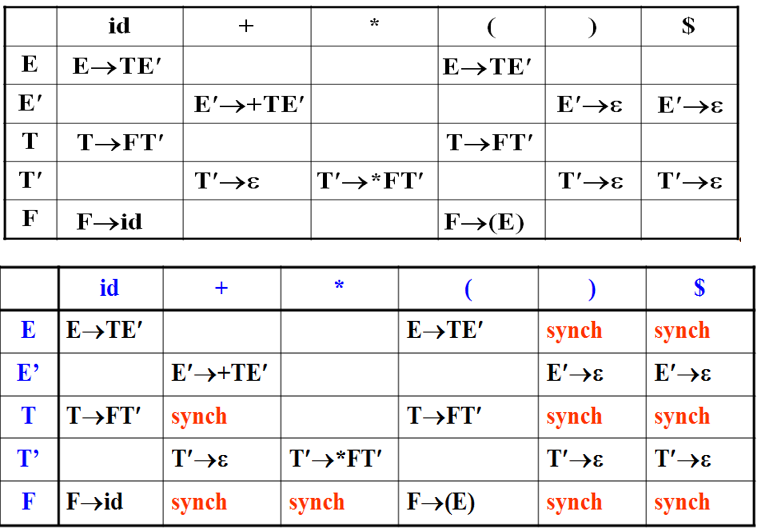

## 预备知识

- 上下文无关文法
	- 生成式左侧为一个非终结符，右侧为任意
	- 因为生成式左侧只有一个非终结符，不和上下文相关，故被称为上下文无关文法
- 句型与句子
	- 句型 - 从初始符号开始能够推导出来的**符号串（包括非终结符**
	- 句子 - 从初始符号开始能够推导出来的**终结符号串**
	- 仅包含终结符的句型就是句子
- 推导与归约
	- 推导 - 从初始符号推出句子
		- 最左推导 - 每次都替换最左边的非终结符
		- 最右推导 - 也称为**规范推导**
	- 归约 - 从句子归纳为初始符号
  	- 最右规约 - 每次都规约最右边的符号串。最左推导的逆过程。
  	- 最左归约 - 每次都归约最左边的符号串。**最右推导的逆过程**，也称为**规范归约**

推导相关的符号：
- 一步推导（下文中使用`=>`表示
  - 
- n步推导（下文中使用`=n>`表示
  - 
- 至少一步推导（下文中使用`=+>`表示
  - 
- 0或n步推导（下文中使用`=*>`表示
  - 
- 最左推导
  - 
  - 
- 最右推导
  - 
  - 

自顶向下分析，这里的**顶**和**下**分别对应**分析树**的**根**和**叶**。自顶向下即从树根分析到树叶，也就是**从文法开始符号生成目标串的过程**

## 语法分析器目标

- 判断输入是否合法
- 输出所使用的生成式

## 自顶向下分析方法

### 递归下降分析

从文法的开始符号向下一直**推导试探**，试图建立一个**最左推导**。

如：把各个生成式编号，然后遍历看此生成式能不能被使用（即使生成式的第一个符号为非终结符

**为什么使用最左推导** - 因为对输入串的扫描是从左至右的

缺点：
- **不能存在左递归** - 会死循环，引起**无穷推导**
- 如果文法存在**回溯**则会导致工作重复、效率低（详见后文

### 递归调用预测分析（特殊的递归下降分析

一种确定的、不带回溯的递归下降分析方法

思想：消除文法的左递归和回溯

#### 左递归消除技术

**消除直接左递归**（**转换为右递归**）：把左递归式`A -> Aa | b`转换为`A -> bA'`和`A' -> aA' | ε`，二者的正则式都是`ba*`

**消除间接左递归**思想：先给非终结符排序，然后通过一些操作使**大索引非终结符无法生成小索引非终结符开头的候选式**，这样即使存在小索引非终结符生成大索引非终结符开头的候选式也不会构成间接左递归

消除间接左递归**算法**：

```cpp
//要求输入为无环无ε产生式的文法，所以要先消空
把文法G中的所有非终结符号排序为A1, A2, ..., An
for (i = 1; i <= n; ++i){
	消除Ai产生式中的直接左递归
	for (j = 1; j <= i - 1; ++j){
		if (Aj -> δ1 | δ2 | ... | δn是当前关于Aj的所有产生式){
			if (存在形如Ai -> Ajγ的生成式){
				把每个形如Ai -> Ajγ的产生式改写为Ai -> δ1γ | δ2γ | ... | δnγ
			}
			消除Ai产生式中的直接左递归
		}
	}
}
化简文法，去除无用的非终结符和产生式
```

#### 回溯问题的尝试解决

考虑文法`A -> aA | aB`，当试探`aA`失败时会试探`aB`，这时因为两个**候选式左侧有相同的成分**所以在`a`被匹配时，如果`aA`**失配**了要**回来匹配**`aB`，这就是**回溯**。

我们希望生成没有回溯的文法，即**面对一个输入的符号，可以确定使用当前符号的哪个候选式**

避免回溯，对文法的要求：
- 不含左递归（所以要先消左递归
- 同一个非终结符的任意两个候选式的FIRST集不相交（FIRST集详见后文非递归预测分析表的构造

例：判断下面的文法是否存在回溯：

```
A -> aB | BA
B -> aA
```

答案是存在回溯的，因为FIRST(aB)和FIRST(BC)存在交集{a}，所以判断是否存在回溯**不能只看公共前缀**

解决方法：**提取左公因子**（只能减少，不能完全消除）。思路：使文法每个候选式都有**不同的前缀**，根据此前缀就可以**一次性确定使用哪个候选式**而不用回溯。即生成类似这样的文法：`A -> aA | bB`，通过匹配`a`或者`b`，我们就可以选定使用候选式`aA`还是`bB`，**失配即为出错而不需要回溯**

#### 递归调用预测分析程序的构造

1. 消除左递归，使用提取左公因子方案尽量消除回溯（**切记勿忘**（如果没有完全消除回溯就会产生冲突而无法分析
2. 为**每个终结符号**建立状态转换图，如`F -> (E) | id`


可以看到图中允许出现非终结符

3. 合并状态，化简状态转换图
4. 根据状态转换图，构造预测分析程序的各个函数（每个非终结符一个状态转换图，一个函数）

如上述的`F -> (E) | id`对应的C语言代码（建议对照着上面的状态转换图看下面的代码）：

```cpp
void procF(){
	if (c == '('){
		指针前移;
		procE();
		if (c == ')'){
			指针前移;
			因为识别了完整的生成式，输出生成式;
		} else {
			error();
		}
	} else if (c == 'id'){
		指针前移;
		因为识别了完整的生成式，输出生成式;
	} else {
		error();
	}
}
```

可以看到处理终结符就是指针前移的过程，处理非终结符就是调用对应函数的过程。总体来说是一个递归的过程。

如果产生回溯冲突，即存在两个候选式的FIRST集相交的情况，那么在函数中就不知道该调用哪个函数，所以**自顶向下分析严禁出现回溯**

### 非递归预测分析

非递归预测分析在选定一个候选式后**不再考虑回溯**的情况，直接试图匹配此候选式（类似于尾递归

分析所需材料：
- 一个**分析表**
- 一个**分析栈**

举例：考虑如下文法

```
E -> TE'
E' -> +TE'
E' -> ε
T -> FT'
T' -> ε
F -> id
```

构造分析表：


分析表和分析栈的使用：
- 如果分析栈的栈顶为终结符
	- 如果输入的下一个字符为正确的终结符则匹配成功，弹栈
	- 如果输入的下一个字符为错误的终结符则匹配失败
- 如果分析栈的栈顶为非终结符，使用分析表，把对应的分析表项**逆向**（从右向左）压栈

#### 使用分析表和分析栈解析输入串

使用上述文法和分析表分析输入串`id+id*id`解题过程：

首先把输入串的结束符`$`压入栈底（这样匹配结束的标志就是栈底`$`和输入的`$`消除），然后把初始非终结符压入栈。

注意把候选式压栈时候要逆向压栈

输出行为或使用的生成式

| 分析栈 | 输入 | 输出 |
| --- | --- | --- |
| `$E` | `id+id*id$` | `E -> TE'` |
| `$E'T` | `id+id*id$` | `T -> FT'` |
| `$E'T'F` | `id+id*id$` | `F -> id` |
| `$E'T'id` | `id+id*id$` | `match id` |
| `$E'T'` | `+id*id$` | `T' -> ε` |
| `$E'` | `+id*id$` | `E' -> +TE'` |
| `$E'T+` | `+id*id$` | `match +` |
| `$E'T` | `id*id$` | `T -> FT'` |
| `$E'T'F` | `id*id$` | `F -> id` |
| ... | ... | ... |
| `$E'T'id` | `id$` | `match id` |
| `$E'T'` | `$` | `T' -> ε` |
| `$E'` | `$` | `E' -> ε` |
| `$` | `$` | `accept` |

#### 分析表的构造

定义两个重要集合（构造方法略）：
- 句型α的FIRST集（FIRST(α)） - 此句型能推出的所有句子的首终结符的集合（可以包含ε
- 非终结符A的FOLLOW集（FOLLOW(A)） - 此非终结符后面的句型的FIRST集（不可以包含ε，可以包含`$`（输入符号串的结束符

分析表的构造思想：当栈顶为非终结符A且输入为终结符a时，应使用一个唯一的（多步）推导`A =+> axxx`来推出a，也就是把`xxxa`压入栈（逆向压栈），这样栈顶a和输入a就可以匹配。所以
- 如果存在生成式`A -> ω`且FIRST(ω)（即FIRST(A)）中存在a，那么表项`[A, a]`中应该放入生成式`A -> ω`
- 如果经过（多步）推导得到`A =+> ε`（即ε在FIRST(A)中），则A可能推出空串，由A后面的符号匹配a，也就是用A的FOLLOW集中的元素匹配a，所以如果FOLLOW(A)中包含a则表示A后面的句型能够匹配a，则把`A => ε`过程中的第一次推导使用的生成式放到表项[A, a]中

分析表构造举例：


如果同一个非终结符的多个候选式的FIRST集有交集，则**同一个分析表项需要填超过一个候选式，也就是产生了冲突**。如果一个候选式为空串`ε`，则表明此符号可能被跳过，所以调用空串候选式时后面出现的第一个终结符应该为此非终结符的FOLLOW集，所以此时还要看FOLLOW集。（详见下文LL(1)文法

## 错误处理

### 基础（应急式）错误处理方式

- 栈顶为终结符，输入失配（视为程序员**少写**了），**弹出栈顶**
- 栈顶为非终结符，分析表项为空（视为程序员**多写**了），**跳过输入符号**

### 使用同步信息(synch)

假设分析表中的没有表项[A, a]，但是a在FOLLOW(A)中，即视为程序员**少写**了A能够生成的部分，所以应该弹出A

所以在分析表内符合条件的表项加入synch符号如下图



错误处理方式改为：
- 栈顶为终结符，输入失配（视为程序员**少写**了），**弹出栈顶**
- 栈顶为非终结符
	- 分析表项为空（视为程序员**多写**了），**跳过输入符号**
	- 分析表项为synch（视为程序员**少写**了），**弹出栈顶**

使用带有synch的分析表**更有可能在出现错误时成功匹配到最后**（即两个`$`匹配）从而结束分析程序（防止程序崩溃）

## LL(1)文法

所有无左递归、无左公因子的上下文无关文法都可以使用非递归预测分析法吗？

**不能**，如果文法有二义性，那么分析表的单个表项会存在两个生成式


导致语法分析程序不知道该使用哪个生成式（虽然可以使用回溯解决，但是这违背了我们的初衷

### 定义

**定义LL(1)文法**：如果一个文法的分析表**不含多重定义**的表项则称文法为LL(1)文法

显然LL(1)文法一定可以使用非递归预测分析。所以**使用LL(1)文法的非递归预测分析**称为**LL(1)分析法**

LL(1)的含义：
- 第一个L - 从左至右输入
- 第二个L - 生成输入串的最左推导
- 1 - 分析的时候**向前看一个符号**，根据此符号确定分析动作

### 判定

根据定义，首先此文法能够生成分析表，这就需要文法**不含左递归和左公因子**

其次，需要判断**二义性**。如果非终结符A能够推出ε且A的某个非空候选式的FIRST集和FOLLOW(A)中包含相同终结符a，那么当输入a时无法判断应该直接匹配对应非空生成式还是使用ε缺席匹配。

### 结论

**LL(1)文法是无左递归、无回溯、无二义性的文法**

