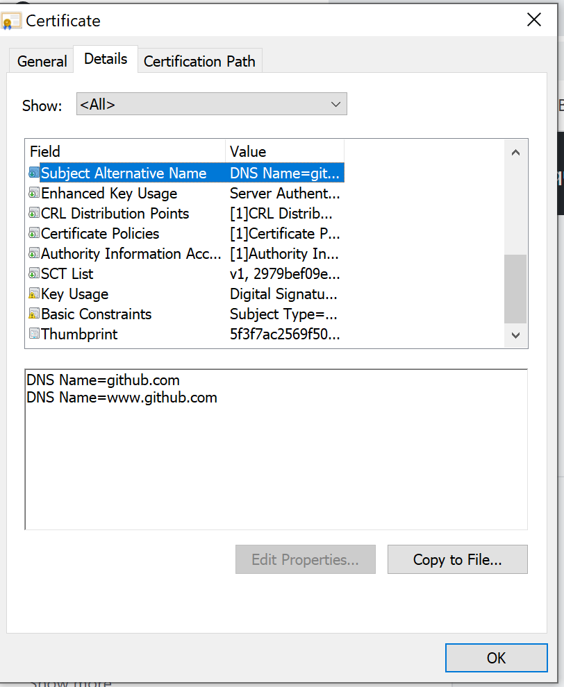

> 下文中TLS和SSL指代相同的含义

## SSL流程

> Ref: https://ruanyifeng.com/blog/2014/02/ssl_tls.html

1. 客户端向服务器发起加密通信的请求(ClientHello)
   1. 包括：支持的TLS协议版本、加密方法、压缩方法，客户端生成的随机数
   2. 注意：如果没有使用SNI，则此请求不包含目标域名
2. 服务器响应(ServerHello)
   1. 包括：确定使用的TLS协议、加密方法，服务器的证书、服务器生成的随机数
   2. 如果使用了双向验证（即客户端也有客户端证书），则此响应会包含一个请求，要求客户端提供客户端证书
3. 客户端验证服务端证书
   1. 如果验证通过，则向服务器发送：一个随机数、编码改变通知（密文的加密方法）、前面所有内容的哈希作为校验值
   2. 如果服务器需要客户端证书，则客户端上传客户端证书
4. 服务器生成会话密钥
   1. 服务器会把上述三个随机数作为会话密钥
   2. 向客户端发送编码确认消息和校验和
5. 加密通信阶段
   1. 双方使用其他应用层协议（如HTTP）进行通信，使用会话密钥加密内容

## SAN

> Ref: https://digicert.com/subject-alternative-name.htm

SAN(Subject Alternative Names)是SSL证书的一个域，它可以使 **单个** SSL证书拥有保护 **多个** 域名的能力。

比如访问github的时候，它的证书中SAN的值为：

在SAN出现之前，假设我需要保护`example.com`和它的所有一级子域名，我需要分别为`example.com`和`*.example.com`申请证书。在SAN出现之后，我可以使用一个证书，同时保护`example.com`和`*.example.com`，也可以继续添加其他域名，比如`example.net`，`*.example.net`等等。简化了HTTP服务器的证书管理工作。

## SNI

> Refs:
> - https://en.wikipedia.org/wiki/Server_Name_Indication
> - https://ruanyifeng.com/blog/2014/02/ssl_tls.html
> - https://aws.amazon.com/blogs/aws/new-application-load-balancer-sni/

SNI(Server Name Indication)是SSL协议的一个扩展，它可以使 **单个** HTTP服务器支持 **多个** SSL证书。

从上文【SSL流程】可以看出，交换密钥时，服务器并不知道客户端请求的是哪个域名，因为HTTP请求根本还没有发出来。直到密钥交换完毕，HTTP请求才会被发出来。

使用了SNI扩展后，客户端在第一步请求服务器证书的时候，就会带上自己请求的目标域名，服务器就可以根据域名返回对应的证书。

示例场景：电商独立站托管，可能开一台大机器，把若干个小网站托管在一台机器上，每个网站都有自己的域名。使用SNI就可以方便地管理这些域名的证书。（当然，从架构的可扩展性上说，这么设计风险很大）

目前主流浏览器（如Chrome/FireFox/IE/Safari）、编程语言库（如Go/Python/Java）、命令行工具（如curl/wget）、HTTP服务端（如Nginx/Apache HTTP Server/Tomcat/IIS）都已支持SNI，详细列表可以查看[wiki](https://en.wikipedia.org/wiki/Server_Name_Indication)。
