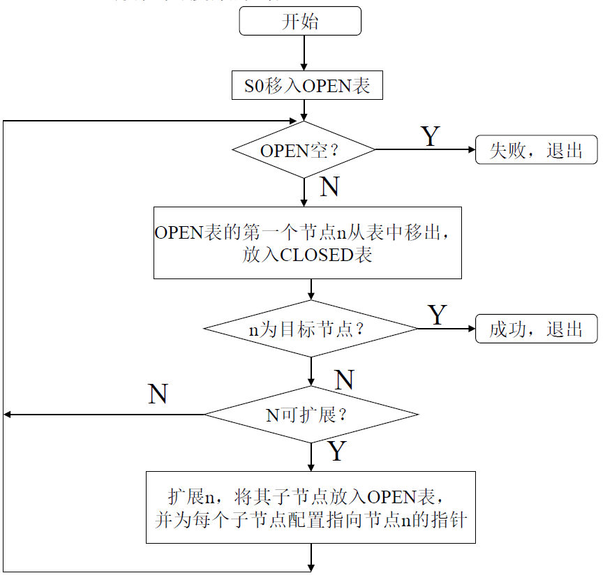

## 概述

推理方法：
- 图搜索 - 基于图结构
  - 深度优先
  - 广度优先
  - ...
- 逻辑论证 - 基于谓词逻辑
- ...

非单调推理 - 后来推出的结论可能会推翻前面的结论

求解需要以下之一：
- 推理算法 - 给出能够求解的算法，一定可解
- 推理步骤 - 仅给出过程，不一定可解（无限图深度优先搜索

是否加入启发性知识：
- 启发推理 - 已有方法的基础上加入针对特定问题的经验或知识，加快搜索效率与推理过程
- 非启发推理 - 仅使用一般的逻辑法则

## 一般搜索

通用，非启发

盲目搜索

寻找目标路径（不仅是目标节点

相关数据结构与概念：
- OPEN表 - 记录被扩展出来的需要被访问的结点
- CLOSED表 - 记录已经扩展的结点的访问过的结点
- 扩展 - 用已知结点生成子节点
- 指针 - 反向指向父节点，用来生成路径
- 搜索图 - 搜索得到的图
- 搜索树 - 搜索图中的所有节点和反向指针构成的集合

算法步骤：

OPEN表的顺序决定了搜索的顺序

- 广度优先搜索 - 扩展子节点放在OPEN表尾部
- 深度优先搜索 - 扩展子节点放在OPEN表头部
- 有界深度优先搜索（迭代加深
- 代价树搜索：
  - 代价树广度优先搜索 - 选择OPEN表中代价最小的结点（全局最优
  - 代价树深度优先搜索 - 选择刚扩展的结点中代价最小的结点

搜索时也可以使用相同结点名，找到更优路径时直接改变父节点指针

## 启发式搜索

### 概述

有信息搜索

把最有希望的结点放在OPEN表第一个位置

如何评判最有希望？

### 估价函数

`f(x) = g(x) + h(x)`

- f(x)为估价函数，表示结点x的估价
- g(x)为初始节点到x已付出的代价
- h(x)是节点x到目标节点的估计代价

使用f的值对OPEN表的结点进行排序，每次选择f值最优的结点（可能是最大f也可能是最小f

如果估价函数过于复杂或正确性差则启发式搜索可能比深度/广度效率还低

### 有序搜索

最好优先搜索

例：八数码棋

`f(n) = d(n) + w(n)`

- d(n)表示结点n的深度（初始节点深度为0
- w(n)表示结点n对应于目标状态错放的棋子数（如图中错放数为4

### A*算法

f\*(n)是经过节点n的最优路径

- g(n) >= g*(n)
- h(n)与h*(n)的大小关系无法确定，因为估价不一定准确

如果`h(n) <= h*(n)`则算法为A\*算法（即h(x)为h\*(x)的下界

A*算法特性（已经被证明）：
- 收敛，在有限步内终止
- 能够找到最优解

## 与或树搜索

### 概述

因为与逻辑的存在，**解是一棵解树**而不仅是路径

自下向上标记节点可解或不可解

启发式搜索，与节点的估算可以使用求和，也可以使用最大值（通常使用求和），不同的估算方案得到的解树可能不同

可以每次向下延伸多层。延伸后需要重新判断希望树

### 博弈树

与或节点交替出现：自己下的时候应该是或节点（选择对自己最优的）。对方下的时候是与节点（对方选择最优的，即对我方最坏的

#### 极大极小分析法

以一字棋(bingo)为例，估价函数=A成一线数目-B成一线数目，这样可以抵消空白一字

对方下棋的时候一定选择最优值，所以选择估价最小值的情况，自己下棋的时候一定选择最优值，所以选择估价最大的情况

等对方进行实际操作后再选择自己的下一步操作。

估价函数的设计很重要

缺点 - 穷举，计算量大

#### α-β剪枝技术

优化极大极小分析法

使用前提：
- 己方与对方使用相同的估价函数
- 双方选择最大估价作为最优

基本思想 - 倒推，或中取大，与中取小。剪枝

定义：
- α值 - 有或后继的结点，取**已计算子节点**最大倒推值为下界，称为α值
- β值 - 有与后继的结点，取**已计算子节点**最小倒推值为上界，称为β值
- α剪枝 - 节点x的β值不能升高其父节点的α值（不能优化己方最坏结果）。停止搜索x以下的分支，且x的倒推值为β
- β剪枝 - 节点x的α值不能降低其父节点的β值（不能优化敌方最坏结果）。停止搜索x以下的分支，且x的倒推值为α

深度优先搜索，遍历子节点，对不必要计算的结点进行剪枝

## 归结/消解演绎推理

### 逻辑推理

推理方式：
- **演绎推理**
  - 从一般到个别
  - 三段论 
- 归纳推理
  - 从个别到一般
- 缺省推理
  - 默认/假设某一条件成立，然后进行推理

控制策略：
- 正向推理 - 已知条件推结果
- 反向推理 - 已知结果推条件
- 混合推理
- 双向推理 - 已知条件和结果推过程

常用过程：模式匹配 - 两个知识模式（即知识的表达方法）完全一致或近似一致，称为可匹配

### 置换与合一

置换 - 项对变元的替换。即使用变元、常量或函数替换变元。目的是使两个公式一致

一阶谓词中不能再次出现谓词，所以f(y)表示函数f和参数y，小写字母表示变量，大写字母表示常量

S1={z/x, w/y}意为使用z置换x，使用w置换y

通常常量为已经确定的值，不应该被置换

复合置换 - **置换操作满足结合律，不满足交换律**

置换的目的是合一。合一的目的是模式匹配。两个模式置换之后是一致的则说明两个模式是匹配的

使两个谓词合一的置换**不唯一**，例：为了合一P(x) & P(y)，可以使用置换`{x/y}`，也可以使用`{a/x, a/y}`

合一不唯一但是存在最简合一，即**最一般合一**

求最一般合一需要计算**差异集**。合一的过程就是把差异消除的过程

析取 - 逻辑或

P与~P归结得到空子句

子句内部析取，子句之间合取。子句集存在P于~P两个子句时永假

使用谓词Answer表示L，如L为$P(x)\land Q(w)$时可以表示为Answer(x, w)

**Answer中的变元需和L一致**

如果存在仅包含Answer的子句，则Answer的变量即为结果

### 与或形演绎推理（略

基于一阶谓词逻辑

## 不确定性推理

P85，如果先结合E2和E3，结果会不一样

条件出现的顺序会影响结果可信度

## 非单调推理

后来推出的结论可能会推翻前面的结论

例：骑车问题。第一次发现没气->打气，第二次发现没气->补胎

**需要保存命题表**