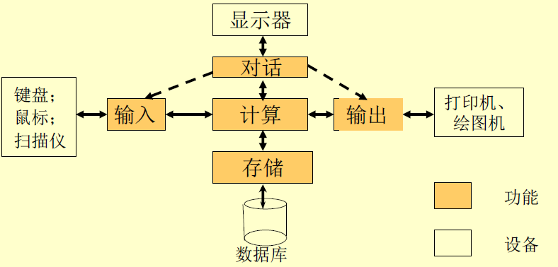
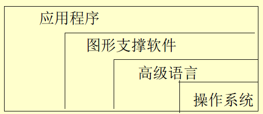
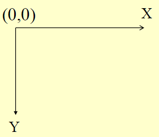
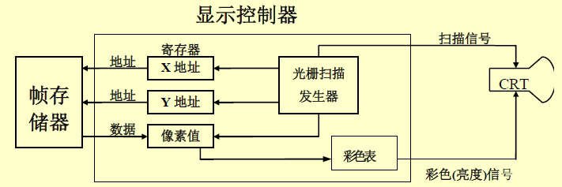

## 计算机图形系统构成

### 概述

- 计算机图形系统与一般计算机系统**最主要的差别** - 具有图形输入输出设备与交互手段
- 计算机图形系统运算速度和存储容量要求更高
- 计算机图形系统是有关软件与硬件的集合

### 硬件设备

- 交互设备
- 输入输出设备
- 存储设备

### 系统结构

### 软件配置

通常包含四个层次的支撑：

### 图形软件开发途径

- 以某种高级语言为基础，加上扩充处理图形功能的子程序包（如C/GKS/GL
- 专用图形开发工具（如AutoCAD

## 图形输入输出设备

### 输入

将用户的图形数据、命令等转换成电信号传送给计算机

分类：
1. 定位设备locator - 指定一个坐标点（鼠标器、键盘方向键、数字化仪、触摸屏
2. 笔划stroke - 指定一系列坐标点（数字化仪
3. 送值valuator - 输入一个数值（键盘数字键
4. 字符串string - 输入一个字符串（键盘数字字母键
5. 拾取pick - 选中目标（各种定位设备
6. 选择choice - 在可选项中进行选择（鼠标器、数字化仪、键盘功能键

常用设备：
- 键盘keyboard
  - 数字键、字母键、控制键、光标移动键、功能键等
- 鼠标器mouse
- 图像扫描仪image scanner
- 数字化仪digitizer
  - （触摸笔+显示器
  - 使用**特殊记录笔**画图写字
- 触摸屏touch panel
  - 直接使用手指或其他物体在屏幕定位与选择
  - 分类：
    - 电子触摸屏
      - 电阻式
      - 电容式
    - 光学触摸屏
    - 声波触摸屏
- 数据手套data glove

### 输出

两大类：
- 软拷贝设备
  - 显示器
- 硬拷贝设备
  - 打印机
    - 点阵式 - 使用点阵打印头扫描打印，是光栅输出设备
    - 喷墨 - 使用电场控制喷射的墨水
    - 激光
  - 绘图仪
    - 笔式
    - 静电
  - 摄像机

## 光栅扫描显示技术

### 概述

- 像素 - 显示屏上可以编址控制的最小单元
- 分辨率 - 水平像素数量X垂直像素数量
- 屏幕坐标 - 左上角为`(0,0)`

### 光栅扫描显示器的组成

原理图：

工作流程：
- 光栅扫描发生器提供周期性XY地址
- 使用地址向帧存储器查询像素值
- 把地址（坐标）和像素值发送至CRT

组成：
- 显示存储器（位存储器、帧缓冲存储器）
  - 存储二维矩阵像素值
  - 显示存储器的分页处理（常用）
    - 存储区划分为若干页
    - 可见页 - 正在显示的页
    - 活动页 - 正在进行读写操作的页
- 彩色表
  - RGB颜色值与数字代号一一对应

### 图形生成原理

1. 计算机执行GUI程序，图像生成系统把图形的矢量转换成像素表示，然后存入显示存储器
2. 图像生成系统直接把图形输入设备（摄像机等）的输入直接（或经过主存间接）地存放到显示存储器

### 光栅扫描显示器主要性能参数

- 分辨率
- 颜色或亮度等级数目
- FPS
- 屏幕尺寸
- 刷新频率
- 屏幕纵横比

## 计算机图形系统标准化

### 概述

**标准化的目的** - 在不同图形设备之间移植

已制定或正在制定的标准都是**接口标准**，旨在使图形系统中两部分之间的接口标准化，包括：
- 数据接口标准
- 子程序接口标准

### 常见图形软件系统标准

- 图形核心系统GKS - Graphics Kernel System
  - 第一个计算机图形ISO国际标准（二维）
  - 是子程序接口标准
- 计算机图形元文件CGM - Computer Graphics Metafile
  - 数据接口标准
- 计算机图形设备接口CGI - COmputer Graphics Interface
  - 子程序接口标准
- 程序员层次结构图形系统PHIGS - Programmer's Hierarchical Interactive Graphics System
  - 子程序接口标准
- OPEN GL
  - 上述几种标准并未得到真正推广
  - 目前三维图形软件库OPEN GL成为事实上的 **图形开发标准**