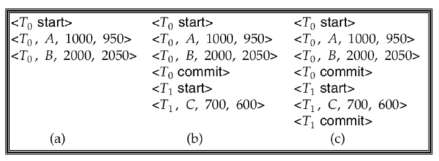
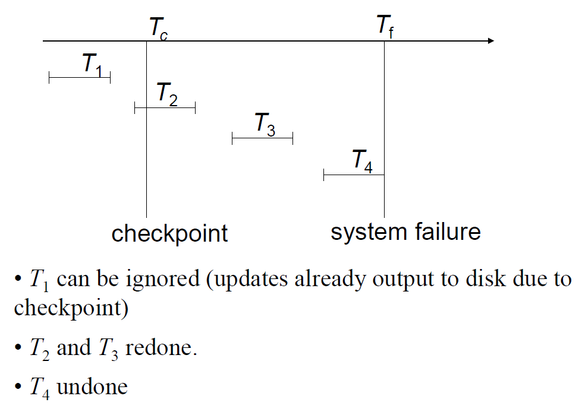

## 基于日志恢复

log-based recovery

### 概述

日志log是一系列日志记录log records。

格式：

```
<Ti start>
<Ti X, V1, V2> 把X的值从V1改为V2
<Ti commit>
<Ti abort>
```

### 数据库修改时间

事务修改了数据库，可能仅保留在主存而没有写回外存

- **延迟修改deferred-modification**
  - 事务提交时还没有修改数据库
  - 日志记录所有操作，在提交时执行
  - 修改数据时不需要记录原始值，即`<Ti X, V1, V2>`可以写为`<Ti X, V2>`
  - 数据库崩溃时，如果`<Ti start>`和`<Ti commit>`都在日志中，只需要重新按照日志执行一遍即可
  - 重做的幂等性 - 重做1次和重做无数次效果相同
- **立即修改immediate-modification**
  - 事务还在活跃时就修改数据库
  - 没有commit时就执行，需要记录原始值，以便回滚
  - 在修改数据库之前更新Log

### 数据库恢复操作

- undo - 把数据变为旧值
- redo - 把数据变为新值

两个操作都是幂等的

如果日志没有commit或abort则undo。如果有则redo



如上图
- a没有commit/abort，撤销T0
- b需要先撤销T1，然后重做T0
- c需要先重做T0，然后重做T1

## 检查点checkpoints

解决一次恢复一整个事务太多的问题

引入检查点之后，系统崩溃时从后往前寻找检查点最后一个检查点，然后再往前寻找倒数第一个事务的开始即可



检查点表示方法：`<checkpoint {T1, T2, ..., Tn}>`表示当前正在执行的事务是T1...Tn

## 并发恢复算法

整个算法分为两个阶段：
1. redo phase
2. undo phase

算法：
1. 找到最后一个checkpoint，把undo-list设置为此checkpoint正在执行的事务
2. (redo phase)从这个checkpoint向后查询，如果事务Ti被修改则重做此事务。如果有事务start则重做并加入undo-list。如果有事务commit或abort则移出undo-list
3. (undo phase)从日志为向前扫描，把undo-list里面的事务undo了，并记录日志`<Ti, Xj, Vm>`（Vm为原来的值）。如果遇到事务start，写日志`<Ti abort>`并把此事务移出undo-list。直到undo-list为空

可以使用上面的图进行算法验证