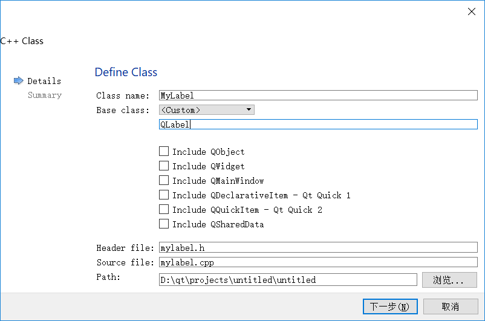
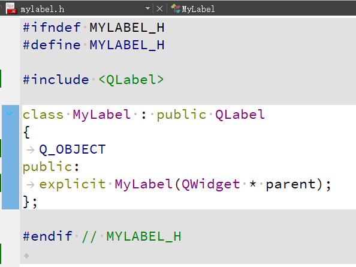
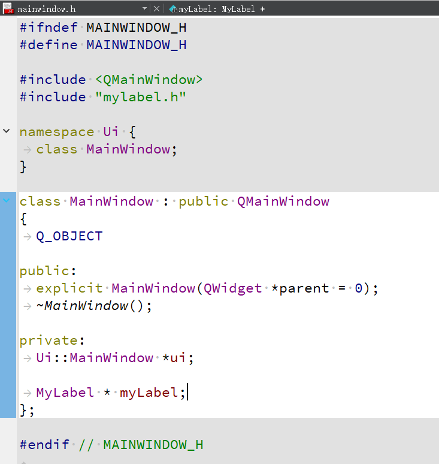
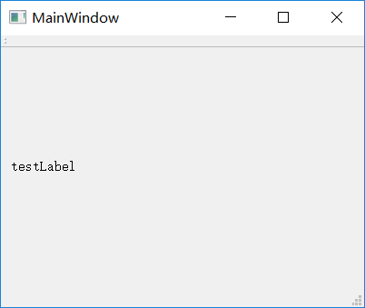

## 新建控件

添加新文件 - C++ Class


为了方便展示效果，此处以QLabel作为父类

- Class name 设置为 MyLabel
- Base Class 选择 Custom 并填写 QLabel



- 在mylabel.h文件中添加父类的头文件<QLabel>
- 添加Qt的Object标识 Q_OBJECT
- 构造函数参数增加父指针

效果如下




因为在本来没有Q_OBJECT标识的类里面添加了Q_OBJECT标识，所以要执行一次qmake，否则会报错 "qt undefined reference to vtable for xxx"


在MainWindow中包含此控件




运行以测试效果



## 获取焦点

一个控件在获取焦点之后才会对键盘操作进行响应

在MyLabel的构造函数中添加如下代码

```c++
setFocusPolicy(Qt::ClickFocus);
```

此代码的作用为设置此控件的焦点获取策略为鼠标点击

如果想要测试效果 可以在MyLabel类中添加如下protected方法

```c++
//需要#include <QFocusEvent>
void focusInEvent(QFocusEvent * ev);//获取焦点时的操作
void focusOutEvent(QFocusEvent * ev);//失去焦点时的操作
```

然后在cpp文件内添加

```c++
void MyLabel::focusInEvent(QFocusEvent * ev)
{
	setText(tr("focusIn"));
}

void MyLabel::focusOutEvent(QFocusEvent * ev)
{
	setText(tr("FocusOut"));
}
```

运行程序 点击控件后控件的内容会发生改变

## 支持英文输入

在MyLabel中添加如下protected方法

```c++
//需要#include <QKeyEvent>
void keyPressEvent(QKeyEvent * ev);
```
此方法将响应键盘的按键操作

在cpp文件中添加函数定义

```c++
void MyLabel::keyPressEvent(QKeyEvent * ev)
{
	QString str = text();//获取原字符串

	if (ev->key() == Qt::Key_Backspace){
		//如果按键是Backspace
		str.chop(1);//删除原字符串最后一个字符
		setText(str);//显示新字符串
	} else {
		//不是Backspace
		str += ev->text();//在原字符串后添加新输入的字符
		setText(str);//显示新字符串
	}
}
```

这里的代码功能比较简单 只实现了简单的输入操作和删除最后一个字符的操作 读者可以根据自己的需要自行编辑

如果此时尝试输入中文 会发现不能简单地使用输入法中英文切换键(如shift)切换中英文 而且输入汉字也无响应

## 支持中文输入

输入法在中文状态下是无法响应KeyPressEvent的

首先在MyLabel的构造函数中添加如下代码

```c++
setAttribute(Qt::WA_InputMethodEnabled, true);
```

Qt是这么介绍WA_InputMethodEnabled的:

> Enables input methods for Asian languages. Must be set when creating custom text editing widgets.

此时再次尝试输入中文 发现已经可以使用输入法自带中英文切换键切换中英文 但是仍然无法获得输入的字符

因为不是使用KeyPressEvent来获取事件 我们需要一个新的获取事件的方法

在MyLabel类中添加如下protected方法

```c++
//需要#include <QInputMethodEvent>
void inputMethodEvent(QInputMethodEvent * ev);
```

然后在cpp文件添加函数定义

```c++
void MyLabel::inputMethodEvent(QInputMethodEvent * ev)
{
	QString str = text();//获取原字符串

	str += ev->commitString();//原字符串后接上输入的中文字符串
	setText(str);//显示新字符串
}
```

解释: 输入法返回的事件被inputMethodEvent响应 通过commitString方法获得此事件中包含的中文字符串 然后接到原字符串的末尾

至此 实现中文输入

## 其他

按照网上的说法 除了

```c++
setAttribute(Qt::WA_InputMethodEnabled, true);
```

之外 还要有一条语句

```c++
setAttribute(Qt::WA_KeyCompression, true);
```

但是我看了一下文档似乎并不需要 注释掉这条语句之后程序也没有出错 如果未来程序遇到了问题也许可以尝试加上这条语句解决:)

参考:
- [ [Qt解错篇]报错：error: undefined reference to vtable for ClassName](https://blog.csdn.net/u013686019/article/details/38712563)
- [Qt中焦点策略FocusPolicy的使用](https://jingyan.baidu.com/article/d621e8da0c25032865913f87.html)
- [Qt有接收输入法字符串的事件么，keyPressEvent行不行？](https://bbs.csdn.net/topics/390154489)
- [QT中文输入法状态下获取键盘输入事件](https://blog.csdn.net/dongpanshan/article/details/78251556)
